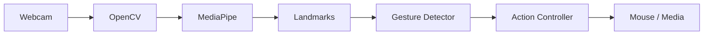

# AGENTS.md — HGI (Hand Gesture Interface)

## 1. Missão

Construa, teste, documente e deixe executável um projeto de portfólio chamado **HGI (Hand Gesture Interface)**: uma aplicação local de visão computacional que usa a webcam para detectar uma mão em tempo real e transformar gestos em ações no computador.

O projeto deve ser simples o suficiente para ser entendido por uma pessoa estudando visão computacional, mas organizado e apresentável o suficiente para GitHub, demonstração em vídeo/GIF e publicação no LinkedIn.

O objetivo principal não é treinar um modelo do zero. Use um detector de landmarks de mão pronto e implemente a interpretação dos gestos com lógica geométrica e regras claras.

---

## 2. Modo de trabalho do agente

Você é responsável por conduzir o projeto do início ao fim.

### Regras de autonomia

1. Antes de alterar código, inspecione o repositório e monte um plano curto de execução.
2. Não interrompa o fluxo para pedir confirmação sobre decisões técnicas pequenas ou reversíveis.
3. Quando houver ambiguidade, escolha a solução mais simples, portátil, testável e fácil de explicar no README.
4. Se uma biblioteca ou API tiver mudado, consulte a documentação oficial atual antes de implementar.
5. Trabalhe em incrementos pequenos e verificáveis.
6. Após cada etapa relevante, execute os testes e verificações aplicáveis.
7. Se algo falhar, investigue a causa, corrija e teste novamente antes de avançar.
8. Não esconda falhas com `try/except` genérico ou valores falsos apenas para fazer o programa parecer funcionar.
9. Não desative mecanismos de segurança de bibliotecas de automação do mouse/teclado.
10. Nunca inclua chaves, tokens, senhas ou credenciais no repositório.
11. Não publique, faça push, crie release ou altere recursos externos sem autorização explícita do usuário.
12. Commits locais são permitidos quando o repositório Git estiver configurado; use commits pequenos e descritivos.
13. Evite feature creep. Termine o MVP antes de implementar extras.
14. Ao finalizar, o repositório deve estar utilizável por outra pessoa seguindo apenas o README.

### Ciclo de execução recomendado

Use este ciclo durante todo o desenvolvimento:

`planejar -> testar -> implementar -> revisar -> verificar -> documentar`

Quando ECC estiver disponível, prefira os workflows equivalentes de planejamento, TDD, code review, build-fix e verification loop.

### Protocolo ECC obrigatório

Quando este projeto estiver sendo executado por Codex com o plugin ECC instalado, trate as skills do ECC como o processo de engenharia padrão do repositório.

Para cada fase de implementação relevante:

1. **Planejar:** use `/plan` ou a skill de planejamento para decompor a fase em passos pequenos e verificáveis.
2. **Pesquisar antes de inventar:** use `documentation-lookup`/`search-first` quando houver dúvida sobre MediaPipe, OpenCV, PyAutoGUI ou APIs atuais.
3. **TDD:** use `tdd-workflow` para lógica pura e bugs. Escreva o teste que falha antes da implementação quando a funcionalidade for testável sem hardware.
4. **Implementar:** faça a menor alteração que satisfaz os critérios da fase. Não avance para funcionalidades de fase posterior.
5. **Revisar:** use `python-reviewer` e/ou `code-reviewer` após alterações relevantes. Corrija problemas CRITICAL/HIGH antes de prosseguir.
6. **Segurança:** use `security-review` quando houver permissões do sistema operacional, automação de entrada, configuração, arquivos externos ou segredos.
7. **Verificar:** use `verification-loop` ao concluir cada milestone e antes de considerar o MVP pronto.
8. **Quality gate:** no fechamento do MVP, execute `/quality-gate . --strict` se disponível no harness atual, além dos comandos locais de lint/teste/cobertura.
9. **Documentar:** atualize `README.md`, `docs/IMPLEMENTATION_PLAN.md` e documentação de arquitetura quando a implementação mudar decisões relevantes.

### Skills ECC prioritárias para o HGI

Use prioritariamente:

- `tdd-workflow` — testes antes da implementação;
- `python-reviewer` — revisão específica de Python;
- `code-reviewer` — revisão geral de manutenibilidade;
- `verification-loop` — prova final de lint, testes, cobertura e diff;
- `security-review` — permissões, automação e exposição de dados;
- `documentation-lookup` — APIs atuais de dependências;
- `search-first` — procurar soluções existentes antes de criar abstrações novas;
- `terminal-ops` — executar verificações reais e reportar evidências;
- `build-error-resolver` — somente quando lint/build/imports falharem;
- `doc-updater` — fechamento da documentação;
- `continuous-agent-loop` somente para tarefas bem limitadas e com critério de parada claro.

### Regras para autonomia

O agente pode executar de forma autônoma decisões locais e reversíveis, mas deve respeitar estes limites:

- não fazer `git push`;
- não abrir PR;
- não publicar release;
- não instalar dependências globais sem necessidade;
- não desabilitar mecanismos de segurança do sistema;
- não controlar mouse/teclado fora de um modo explicitamente opt-in;
- não capturar, salvar ou transmitir vídeo da webcam sem requisito explícito;
- não perseguir features extras enquanto houver item pendente na Definition of Done do MVP.

### Evidência por milestone

Ao terminar cada fase, registre no relatório da sessão:

- arquivos alterados;
- testes adicionados;
- comandos executados;
- resultado de lint/testes;
- limitações ou itens que dependem de teste manual;
- próxima fase autorizada pelo plano.

---

## 3. Escopo funcional

### MVP obrigatório

A aplicação deve:

- abrir a webcam;
- detectar pelo menos uma mão em tempo real;
- obter e desenhar os landmarks da mão;
- identificar a mão rastreada quando a API fornecer essa informação;
- reconhecer quais dedos estão estendidos;
- reconhecer gestos básicos usando regras geométricas;
- mover o cursor usando a ponta do dedo indicador;
- executar um clique com gesto de pinça entre polegar e indicador;
- aplicar suavização ao movimento do cursor para reduzir jitter;
- evitar múltiplos cliques involuntários enquanto a pinça permanece fechada;
- exibir na imagem informações úteis de debug;
- possuir um modo seguro `dry-run` que detecta gestos sem controlar o computador;
- funcionar sem depender da API da OpenAI em runtime.

### Funcionalidades de segunda prioridade

Implemente somente após o MVP estar estável:

- controle de volume;
- play/pause de mídia;
- gesto para próximo/anterior;
- configuração de gestos via arquivo;
- calibração de sensibilidade;
- escolha da câmera;
- espelhamento opcional da imagem;
- contador de FPS;
- persistência simples das configurações.

### Fora do escopo inicial

Não implemente antes do MVP:

- treinamento de CNN do zero;
- dataset próprio;
- reconhecimento de dezenas de gestos;
- interface web;
- backend remoto;
- banco de dados;
- autenticação;
- aplicação mobile;
- dependência de serviços pagos;
- arquitetura distribuída.

---

## 4. Stack preferencial

Use Python.

Dependências esperadas:

- `opencv-python` — captura e renderização dos frames;
- `mediapipe` — detecção/landmarks da mão;
- `numpy` — operações numéricas;
- `pyautogui` — automação simples do cursor/teclas, quando suportado;
- `pytest` — testes;
- `pytest-cov` — cobertura;
- `ruff` — lint e formatação/verificações de qualidade.

Se a API atual do MediaPipe tiver mudado, adapte a implementação à API oficial disponível no momento da execução. Não copie código legado sem verificar compatibilidade.

Prefira uma versão estável do Python compatível com todas as dependências. Se o ambiente permitir escolha, dê preferência a Python 3.11, mas valide compatibilidade antes de fixar a versão.

---

## 5. Estrutura desejada do repositório

Organize o projeto aproximadamente assim:

```text
HGI/
├── src/
│   └── hgi/
│       ├── __init__.py
│       ├── app.py
│       ├── config.py
│       ├── geometry.py
│       ├── hand_tracker.py
│       ├── gesture_detector.py
│       ├── smoothing.py
│       ├── action_controller.py
│       └── overlay.py
├── tests/
│   ├── test_geometry.py
│   ├── test_gesture_detector.py
│   ├── test_smoothing.py
│   └── test_action_controller.py
├── assets/
│   └── .gitkeep
├── docs/
│   ├── ARCHITECTURE.md
│   └── TESTING.md
├── .gitignore
├── AGENTS.md
├── LICENSE
├── README.md
├── pyproject.toml
└── requirements.txt
```

É permitido ajustar a estrutura se houver uma justificativa clara, mas mantenha separadas as responsabilidades de captura, detecção, interpretação dos gestos e execução das ações.

---

## 6. Arquitetura

A aplicação deve seguir este fluxo:

```text
Webcam
  ↓
OpenCV
  ↓
HandTracker / MediaPipe
  ↓
Landmarks normalizados
  ↓
GestureDetector
  ↓
Estado do gesto
  ↓
ActionController
  ↓
Mouse / teclado / mídia
```

Paralelamente:

```text
Landmarks + gesto + métricas
  ↓
Overlay
  ↓
Janela OpenCV
```

### Separação de responsabilidades

#### `hand_tracker.py`

Responsável por:

- inicializar o detector de mãos;
- receber frames;
- processar a imagem;
- retornar landmarks em uma representação simples;
- retornar handedness quando disponível;
- não executar ações de mouse ou teclado.

#### `geometry.py`

Funções puras para:

- distância euclidiana 2D;
- cálculo de ângulo quando necessário;
- normalização de distâncias;
- conversão de coordenadas;
- outras operações geométricas pequenas.

Este módulo deve ser fortemente testado.

#### `gesture_detector.py`

Responsável por:

- detectar dedos estendidos;
- reconhecer pinça;
- reconhecer os gestos suportados;
- controlar estados temporais de gesto quando necessário;
- expor resultados sem acionar o sistema operacional.

#### `smoothing.py`

Responsável por:

- suavizar coordenadas do cursor;
- manter o estado mínimo necessário;
- permitir reset.

Comece com suavização exponencial:

```text
smoothed = previous + alpha * (current - previous)
```

O parâmetro `alpha` deve ser configurável.

#### `action_controller.py`

Responsável por:

- converter eventos de gesto em ações;
- respeitar cooldown/debounce;
- suportar `dry-run`;
- encapsular qualquer dependência do sistema operacional;
- preservar os mecanismos de fail-safe da biblioteca de automação.

#### `overlay.py`

Responsável por desenhar:

- landmarks;
- gesto atual;
- modo atual (`LIVE` ou `DRY-RUN`);
- FPS, se implementado;
- indicadores de clique/volume;
- instruções mínimas de encerramento.

#### `app.py`

Responsável por orquestrar os módulos e manter o loop principal simples.

---

## 7. Representação dos landmarks

Não espalhe índices mágicos pelo código.

Defina nomes ou constantes para landmarks importantes, por exemplo:

- wrist;
- thumb tip;
- index MCP/PIP/DIP/tip;
- middle MCP/PIP/DIP/tip;
- ring MCP/PIP/DIP/tip;
- pinky MCP/PIP/DIP/tip.

Converta a saída do MediaPipe para uma representação interna simples antes de executar a lógica dos gestos.

Quando possível, trabalhe com coordenadas normalizadas para tornar os thresholds menos dependentes da resolução da webcam.

---

## 8. Gestos obrigatórios

### 8.1 Movimento do cursor

Condição inicial recomendada:

- indicador estendido;
- dedos médio, anelar e mindinho recolhidos;
- pinça não ativa.

Use a posição da ponta do indicador como referência.

Mapeie a área útil da câmera para a resolução da tela. Evite utilizar as bordas extremas do frame; use uma margem configurável para melhorar a ergonomia.

Aplique suavização antes de mover o cursor.

### 8.2 Clique por pinça

Reconheça pinça pela distância entre a ponta do polegar e a ponta do indicador.

Não use apenas uma distância absoluta em pixels se for possível normalizar pela escala da mão.

Uma opção recomendada é:

```text
pinch_ratio = distance(thumb_tip, index_tip) / palm_reference_distance
```

Escolha `palm_reference_distance` usando dois landmarks estáveis da mão.

Implemente histerese ou thresholds separados para fechar e abrir a pinça, quando isso melhorar a estabilidade.

O clique deve ser disparado somente na transição:

```text
OPEN -> PINCHED
```

Não execute cliques repetidamente em todos os frames enquanto o gesto continua fechado.

Também aplique um pequeno cooldown configurável.

### 8.3 Controle de volume — fase 2

Implemente atrás de uma interface de ações para não contaminar a lógica de visão computacional.

Preferência:

- usar a distância normalizada entre polegar e indicador como intensidade;
- converter para uma faixa de `0..100` apenas para exibição;
- usar um backend compatível com o sistema operacional quando houver suporte confiável;
- caso não seja possível controlar o volume no ambiente atual, manter o recurso em `dry-run` e documentar a limitação em vez de quebrar a aplicação.

---

## 9. Máquina de estados e debounce

Gestos em vídeo são ruidosos. Não trate cada frame como um comando independente.

Mantenha um pequeno estado temporal contendo, quando necessário:

- gesto anterior;
- número de frames consecutivos;
- timestamp da última ação;
- estado da pinça;
- cooldown restante.

Ações discretas como clique, play/pause ou próximo devem ser disparadas por transição ou após confirmação por alguns frames.

Ações contínuas como movimento do cursor podem ser atualizadas a cada frame.

---

## 10. Segurança e UX

### Obrigatório

- iniciar em `dry-run` quando houver dúvida sobre permissões do ambiente;
- disponibilizar argumento de linha de comando ou configuração para ativar controle real;
- manter o fail-safe do PyAutoGUI habilitado;
- permitir encerrar rapidamente com `q` ou `Esc`;
- liberar webcam e destruir janelas do OpenCV no encerramento, inclusive quando houver exceção;
- não capturar nem salvar imagens da webcam por padrão;
- não transmitir vídeo para serviços externos;
- não exigir chave da OpenAI para executar o aplicativo.

### Plataformas

Considere diferenças entre Windows, Linux e macOS.

Em ambientes onde controle de cursor/teclas seja bloqueado por permissões — especialmente sessões Linux/Wayland ou permissões de acessibilidade do macOS — o detector deve continuar funcionando em `dry-run` e o README deve explicar a limitação.

Nunca implemente hacks inseguros para contornar permissões do sistema operacional.

---

## 11. Configuração

Centralize parâmetros ajustáveis.

Exemplos:

```text
camera_index
frame_width
frame_height
max_hands
min_detection_confidence
min_tracking_confidence
cursor_margin
smoothing_alpha
pinch_close_threshold
pinch_open_threshold
click_cooldown_ms
gesture_confirm_frames
dry_run
show_landmarks
show_fps
mirror_frame
```

Não espalhe esses números por diferentes módulos.

---

## 12. CLI mínima

Forneça um modo simples de execução.

Exemplos desejados:

```bash
python -m hgi --dry-run
```

```bash
python -m hgi --control
```

Opcionalmente:

```bash
python -m hgi --camera 1
```

Use `argparse` ou solução igualmente simples. Não adicione um framework de CLI desnecessário.

---

## 13. Estratégia de implementação

Execute as fases abaixo na ordem.

### Fase 0 — inspeção e plano

1. Inspecione todos os arquivos existentes.
2. Detecte versão do Python e sistema operacional.
3. Verifique se Git está configurado.
4. Verifique documentação atual das bibliotecas quando necessário.
5. Crie ou atualize um plano em `docs/IMPLEMENTATION_PLAN.md`.
6. Liste riscos técnicos, principalmente webcam, MediaPipe e controle do sistema operacional.

**Critério de conclusão:** plano pequeno, executável e consistente com este documento.

### Fase 1 — bootstrap

1. Crie a estrutura do projeto.
2. Configure ambiente e dependências.
3. Crie `.gitignore` adequado para Python.
4. Configure `pyproject.toml`.
5. Configure pytest e Ruff.
6. Crie um entrypoint mínimo que possa ser importado sem abrir a webcam automaticamente.

Execute:

```bash
python -m compileall src
pytest
ruff check .
```

**Critério de conclusão:** projeto importa, lint passa e suíte de testes vazia/mínima executa corretamente.

### Fase 2 — geometria e smoothing

Implemente primeiro módulos puros:

- distância;
- normalização;
- mapeamento de coordenadas;
- suavização exponencial.

Escreva testes antes ou junto da implementação.

Casos mínimos:

- distância zero;
- distância conhecida 3-4-5;
- mapeamento dos limites;
- clipping;
- alpha nos limites aceitos;
- sequência de suavização previsível.

**Critério de conclusão:** testes determinísticos e sem necessidade de webcam.

### Fase 3 — HandTracker

1. Inicialize MediaPipe.
2. Capture um frame da webcam.
3. Detecte mão.
4. Converta landmarks para a representação interna.
5. Desenhe landmarks no frame.
6. Garanta encerramento limpo.

Crie um modo de diagnóstico.

**Critério de conclusão:** uma execução manual mostra a mão e os landmarks de forma estável.

### Fase 4 — dedos e gestos

1. Implemente detecção de dedos estendidos.
2. Implemente pinça normalizada.
3. Adicione estado da pinça.
4. Adicione confirmação/debounce.
5. Teste a lógica usando landmarks sintéticos ou fixtures sem webcam.

Não baseie toda a suíte em testes visuais manuais.

**Critério de conclusão:** gestos básicos têm testes automatizados e debug visual.

### Fase 5 — cursor em dry-run

1. Calcule posição alvo do cursor.
2. Aplique margem de controle.
3. Aplique transformação para coordenadas da tela.
4. Aplique suavização.
5. Mostre na tela o ponto/posição que seria enviada ao cursor.
6. Ainda não execute controle real automaticamente.

**Critério de conclusão:** movimento virtual suave e previsível.

### Fase 6 — controle real do mouse

1. Encapsule PyAutoGUI no `ActionController`.
2. Mantenha fail-safe ligado.
3. Adicione flag explícita `--control`.
4. Mova o cursor somente no modo de controle.
5. Implemente clique por transição de pinça.
6. Implemente cooldown.
7. Capture exceções específicas do backend e volte para comportamento seguro quando necessário.

**Critério de conclusão:** cursor movimenta, pinça gera um único clique e aplicação pode ser encerrada imediatamente.

### Fase 7 — overlay e ergonomia

Exiba informações suficientes para a demo:

```text
HGI — Hand Gesture Interface
Hand: Right
Gesture: MOVE
Mode: CONTROL
FPS: 30
```

Quando pinça estiver ativa, dê feedback visual claro.

Não polua a tela com dezenas de métricas.

**Critério de conclusão:** uma pessoa entende o que está acontecendo apenas assistindo à tela.

### Fase 8 — volume e ações extras

Somente agora implemente volume/play-pause se o MVP estiver funcionando.

Mantenha backends separados e comportamento degradável.

**Critério de conclusão:** recursos extras não prejudicam cursor/clique nem quebram plataformas sem suporte.

### Fase 9 — documentação

Crie um README forte para portfólio contendo:

1. nome e descrição curta;
2. GIF ou espaço reservado para GIF da demo;
3. funcionalidades;
4. arquitetura;
5. stack;
6. como instalar;
7. como executar em dry-run;
8. como habilitar controle real;
9. tabela de gestos;
10. como o reconhecimento funciona;
11. explicação da suavização;
12. explicação do debounce/histerese;
13. limitações por sistema operacional;
14. testes;
15. roadmap;
16. aprendizado técnico do projeto.

Inclua um diagrama Mermaid simples:



**Critério de conclusão:** uma pessoa nova consegue clonar, instalar e executar usando apenas o README.

### Fase 10 — QA final

Execute, no mínimo:

```bash
ruff check .
pytest -q
pytest --cov=hgi --cov-report=term-missing
python -m compileall src
```

Também faça revisão manual de:

- imports;
- código morto;
- comentários desnecessários;
- thresholds duplicados;
- tratamento de erro;
- liberação da webcam;
- documentação;
- segredos acidentais;
- arquivos grandes ou vídeos adicionados por engano;
- diferenças entre `dry-run` e `control`.

Se ECC estiver disponível, execute também um code review e verification loop antes de considerar o trabalho finalizado.

---

## 14. Testes

A suíte automatizada deve priorizar a lógica que não depende de hardware.

### Testar automaticamente

- geometria;
- thresholds;
- normalização;
- smoothing;
- detecção de pinça;
- transições de estado;
- debounce/cooldown;
- mapeamento webcam -> tela;
- controlador em dry-run usando mocks.

### Testar manualmente

- abertura real da câmera;
- qualidade de tracking;
- ergonomia;
- movimento real do cursor;
- permissões do sistema operacional;
- ações de mídia/volume.

Não crie testes que realmente movam o cursor durante a execução normal da suíte.

Meta de cobertura: **80% ou mais nos módulos de lógica pura**, sem perseguir cobertura artificial em integração de webcam/hardware.

---

## 15. Qualidade de código

- funções pequenas;
- nomes explícitos;
- type hints nas interfaces importantes;
- docstrings em APIs públicas e lógica não óbvia;
- nenhuma função gigante contendo captura, MediaPipe, gestos e automação ao mesmo tempo;
- nenhuma constante mágica repetida;
- sem duplicação desnecessária;
- sem abstrações prematuras;
- sem padrão de projeto apenas por estética.

Priorize legibilidade sobre esperteza.

---

## 16. Performance

O aplicativo deve ser utilizável em tempo real em um computador comum.

Boas práticas:

- não copie frames desnecessariamente;
- não faça I/O em disco dentro do loop principal;
- não faça chamadas de rede durante processamento da webcam;
- evite recriar objetos pesados a cada frame;
- calcule FPS de forma leve;
- permita reduzir resolução da captura se necessário.

Não faça micro-otimização antes de medir.

---

## 17. Tratamento de falhas

Forneça mensagens compreensíveis para:

- webcam indisponível;
- índice de câmera inválido;
- MediaPipe não inicializado;
- backend de automação não suportado;
- falta de permissão para controlar mouse/teclado;
- ambiente sem display;
- configuração inválida.

A aplicação não deve entrar em loop infinito silencioso quando a webcam falhar.

---

## 18. Entregáveis finais

Ao terminar, devem existir:

- código funcional;
- `AGENTS.md`;
- `README.md` completo;
- `requirements.txt` ou lock/declaração equivalente consistente com `pyproject.toml`;
- testes automatizados;
- documentação de arquitetura;
- licença;
- `.gitignore`;
- pasta `assets/` preparada para GIF/demo;
- instruções para gravar/adicionar a demonstração;
- histórico Git limpo quando Git estiver disponível.

Opcional, mas desejável:

- `CHANGELOG.md`;
- release `v0.1.0` somente se o usuário autorizar publicação;
- GitHub Actions para lint + testes;
- badge de CI no README.

---

## 19. Definition of Done

O projeto só está concluído quando todos os itens abaixo forem verdadeiros:

- [ ] instalação documentada funciona;
- [ ] aplicação abre a webcam;
- [ ] landmarks aparecem corretamente;
- [ ] movimento virtual funciona em dry-run;
- [ ] controle real é opt-in;
- [ ] cursor possui suavização;
- [ ] pinça dispara apenas um clique por gesto;
- [ ] existe debounce/cooldown;
- [ ] sair com `q`/`Esc` libera recursos;
- [ ] testes passam;
- [ ] lint passa;
- [ ] lógica principal possui testes sem hardware;
- [ ] README explica arquitetura e matemática básica;
- [ ] nenhum segredo está versionado;
- [ ] nenhuma chamada à OpenAI é necessária para usar HGI;
- [ ] limitações de plataforma estão documentadas;
- [ ] existe instrução clara para produzir o GIF/vídeo de demonstração;
- [ ] repositório está apresentável para GitHub.

---

## 20. Relatório final do agente

Ao concluir, responda ao usuário com um resumo curto contendo:

1. o que foi construído;
2. estrutura principal criada;
3. comandos para instalar e executar;
4. resultados dos testes/lint;
5. funcionalidades que exigem teste manual;
6. limitações encontradas;
7. próximos 3 upgrades recomendados;
8. arquivos mais importantes para o usuário estudar primeiro.

Não diga apenas “pronto”. Mostre evidências de que o projeto foi verificado.
