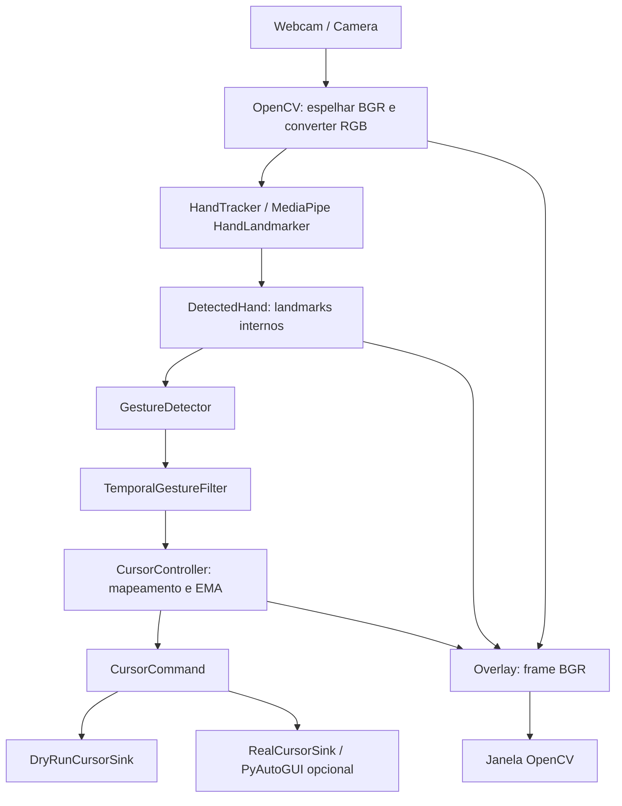

# HGI — Hand Gesture Interface

Interface local de visão computacional que interpreta gestos capturados por uma
webcam para mover o cursor com **POINT** (☝) e executar um clique primário com
**PINCH** (🤏). MediaPipe fornece os landmarks; regras geométricas e filtros
temporais interpretam a mão. PyAutoGUI executa o controle real opcional.

**Dry-run é o modo padrão. Controle real exige `--real-control` + E.**

> **Demo em preparação:** adicione uma gravação real em `assets/demo.gif`.
> Veja [orientações para a demo](assets/README.md). Nenhum GIF artificial é incluído.

## Funcionalidades

- Captura OpenCV, 21 landmarks e lateralidade quando disponível.
- Movimento com região ativa, mapeamento de coordenadas e suavização EMA.
- Pinça normalizada, confirmação temporal, histerese e cooldown.
- Dry-run com intenções inspecionáveis; backend real isolado e opcional.
- Overlay com gesto bruto/estável, candidato, armamento, cursor, modo e FPS.
- Feedback do último CLICK por 500 ms e contador de intenções da sessão.
- Testes sintéticos sem webcam e sem movimentar o mouse real.

## Gestos

| Gesto | Resultado quando a sessão está habilitada |
|---|---|
| ☝ POINT | Move o cursor virtual ou real pela ponta do indicador |
| 🤏 PINCH | Um clique primário no último alvo do cursor, após abertura e confirmação |
| PINCH mantido | Nenhum clique repetido |
| Sem mão ou outros estados | Nenhuma ação; tracking prolongadamente perdido limpa a interação |

POINT exige indicador estendido e médio, anelar e mindinho recolhidos, sem pinça.
OPEN_HAND, FIST e UNKNOWN são estados reconhecidos para neutralidade; não
executam ações adicionais. Drag, scroll e controle de teclado não fazem parte
desta versão.

## Como funciona

O frame BGR da webcam é espelhado e convertido explicitamente para RGB. O
HandTracker adapta os resultados do MediaPipe a tipos internos. O detector
geométrico identifica a pose e a razão de pinça. O filtro temporal confirma os
estados e autoriza cliques. O controller mapeia o indicador da região ativa para
a tela e aplica EMA antes de produzir MOVE, CLICK ou NONE.

A seleção usa o maior `handedness_score`, com a primeira mão em empate ou ausência
de score. Esse valor mede a classificação Left/Right, não confiança de detecção.
Não há identidade persistente entre mãos.

## Arquitetura



A orquestração está em `src/hgi/webcam.py`; o desenho em `overlay.py` e os efeitos
reais em `real_cursor.py`. Contratos, matemática e estados estão em
[ARCHITECTURE.md](docs/ARCHITECTURE.md).

## Modelo de segurança

A sessão começa **DISABLED**, em ambos os modos. A flag seleciona o backend;
somente E, com foco na janela OpenCV, habilita a sessão.

| Modo | E pressionado | Resultado |
|---|---|---|
| Sem flag | Sim | Apenas intenções dry-run |
| `--real-control` | Não | Nenhum movimento ou clique |
| `--real-control` | Sim | Controle real após os filtros temporais |

D desabilita; R reseta e desabilita; Q/Esc encerra. Ctrl+C no terminal também
encerra com limpeza. Câmera, tracker e janelas são liberados inclusive em falhas.
Perda de tracking interrompe comandos; após perda longa é necessária nova
confirmação e abertura da pinça. Uma mão nunca habilita a sessão automaticamente.

O **fail-safe do PyAutoGUI permanece habilitado**: leve fisicamente o mouse a
um canto da tela primária para interromper a próxima chamada do backend.
Falha em MOVE/CLICK trava o sink, desabilita a sessão e propaga a exceção original,
sem retry; reinicie a demo para tentar novamente. Disable/reset não geram input.
A pausa nativa do PyAutoGUI é preservada.

As teclas D/R/Q/Esc dependem do foco da janela; comandos nativos bloqueados podem
atrasar sua leitura. Antes de uma demo real, salve trabalhos, use uma área
inofensiva e comece com movimentos pequenos. Consulte o
[roteiro manual](docs/RELEASE_CHECKLIST.md#teste-manual-final).

HGI não grava nem transmite frames, não envia teclas, não usa clipboard e não
executa comandos externos. Não exige OpenAI. MediaPipe informa coleta de métricas
pela biblioteca; veja [origem do modelo e privacidade](docs/MODELS.md).

## Instalação

Requer **Python >= 3.11**; o ambiente validado é Python 3.11 em Linux/X11 x86_64.
Disponibilidade de wheels nativas varia por sistema e arquitetura.
Na raiz de uma cópia local do repositório, usando Python 3.11:

```bash
python -m venv .venv
source .venv/bin/activate
python -m pip install -e ".[dev,vision]"
python -m hgi
```

No PowerShell, ative com `.venv\Scripts\Activate.ps1`. `python -m hgi` imprime
a identificação do projeto e encerra; a demo é o script descrito abaixo.
A instalação foi reproduzida num venv novo, sem aproveitar os pacotes do Conda.
Uma sessão gráfica e webcam acessível são necessárias para a janela.

| Instalação | Finalidade |
|---|---|
| `python -m pip install -e .` | Núcleo e identificação, sem bibliotecas de hardware |
| `python -m pip install -e ".[vision]"` | Demo visual em dry-run |
| `python -m pip install -e ".[dev,vision]"` | Demo e ferramentas de desenvolvimento |
| `python -m pip install -e ".[vision,control]"` | Demo com backend real disponível |

`pyproject.toml` é a fonte das dependências. MediaPipe, OpenCV e PyAutoGUI têm
versões fixadas; NumPy e ferramentas de desenvolvimento têm intervalos aceitos.
Isso não é um lock completo das dependências transitivas. Não instale variantes
simultâneas de OpenCV: usamos somente **opencv-contrib-python com GUI**, exigido
também pelo MediaPipe, sem opencv-python ou headless.

## Preparação do modelo

O modelo não acompanha o repositório nem é baixado automaticamente. Siga
[MODELS.md](docs/MODELS.md) para criar `models/`, obter o bundle oficial versionado
`hand_landmarker.task` e verificar seu SHA-256 antes da primeira execução.
O caminho pode ser externo ao repositório; arquivos `.task` são ignorados pelo Git.

## Execução

Execute na raiz do repositório, com o ambiente ativado e o modelo preparado.
Os índices de câmera variam por sistema; o padrão é 0. Se 1 não abrir, tente 0.

### Dry-run

```bash
python scripts/demo_webcam.py \
  --model models/hand_landmarker.task \
  --camera 1
```

### Controle real

Instale o extra `control` pela tabela acima e execute:

```bash
python scripts/demo_webcam.py \
  --model models/hand_landmarker.task \
  --camera 1 \
  --real-control
```

O overlay diferencia **HGI | DRY-RUN** de **HGI | REAL CONTROL**, com cabeçalho
vermelho no modo real. Ambos começam DISABLED; pressione E somente quando pronto.

### Opções

```bash
python scripts/demo_webcam.py --help
```

| Opção | Significado |
|---|---|
| `--model` | Bundle local; padrão `models/hand_landmarker.task` |
| `--camera` | Índice da webcam; padrão 0 |
| `--width`, `--height` | Resolução solicitada; padrão 640×480, sujeita à câmera |
| `--screen-width`, `--screen-height` | Devem ser fornecidas juntas; tela lógica ou override real |
| `--real-control` | Seleciona backend real, sem habilitar a sessão |

O frame efetivamente entregue determina proporção e desenho. Mudança dessas
dimensões reseta e desabilita a sessão. Dry-run usa tela lógica 1920×1080 sem
consultar monitor. Em modo real, o backend detecta as dimensões; overrides
positivos não podem exceder a área detectada e usam origem (0,0). Reinicie após
alterar monitores. Modelo ausente gera orientação para MODELS.md.

### Controles da janela

| Tecla | Efeito |
|---|---|
| E | Enable: habilita a sessão no backend selecionado |
| D | Disable: interrompe comandos e limpa a interação |
| R | Reset + Disable: também limpa o contador visual |
| Q / Esc | Quit: encerra e libera recursos |

Fechar a janela também encerra. D/E preservam o contador de intenções CLICK.
O destaque de 500 ms existe somente na UI; não repete nem armazena comandos CLICK.

Uma demonstração finita, sem modelo, câmera ou mouse real:

```bash
python scripts/demo_cursor.py
```

## Testes e build

Com o extra `dev` instalado:

```bash
python -m pytest -q
python -m pytest --cov=hgi --cov-report=term-missing
python -m ruff check .
python -m ruff format --check .
python -m compileall src
python -m pip check
python -m pip wheel --no-deps --no-build-isolation --wheel-dir dist .
```

A build acima usa o `setuptools>=68` já instalado no ambiente de build;
`--no-build-isolation` não instala esse requisito por você. Os testes e a wheel
foram verificados em ambientes separados. Uma build com isolamento requer acesso
ao índice de pacotes; nesta sessão essa tentativa foi bloqueada por falha de DNS.

Pytest usa mãos sintéticas, clocks injetáveis e backends falsos; não abre webcam
real nem controla mouse. Cobertura não substitui o teste manual de ergonomia.
Resultados datados e checkpoints estão no
[plano de implementação](docs/IMPLEMENTATION_PLAN.md#17-fase-9--polimento-e-preparação-para-portfólio).

## Decisões técnicas

- **MediaPipe Tasks Vision / IMAGE:** modelo pronto, CPU e inferência síncrona.
- **Tipos internos:** gestos e geometria independem das utilities do MediaPipe.
- **Geometria:** pinça dividida pela referência wrist→middle MCP, com correção
  da proporção do frame; não depende de uma distância fixa em pixels.
- **EMA:** reduz jitter após o mapeamento; alpha menor aumenta o atraso.
- **Temporalidade:** confirmação de 80 ms, histerese 0.25/0.32, armamento após
  abertura, cooldown de 300 ms e tracking grace de 150 ms.
- **Sinks separados:** lógica produz intenções; somente o backend real realiza
  efeitos. Arredondamento ocorre nessa fronteira, sem duplicar filtros.

Defaults são pontos de partida. Use o [registro de calibração](docs/CALIBRATION.md)
para observar resultados e alterar um parâmetro por vez, sem ajustes automáticos.

## Limitações

- Linux/X11 é o ambiente das verificações atuais. A consulta de tela funcionou;
  tracking humano, movimento/clique real, FPS e latência ainda exigem aceite
  manual, pois não há webcam acessível nesta sessão.
- Wayland, inclusive via XWayland, é rejeitado pelo backend real; use dry-run.
  Windows/macOS precisam de validação e permissões locais de câmera/automação.
- Iluminação, oclusão, rotações fora do plano e câmera afetam landmarks.
  Heurísticas não são reconhecimento universal de linguagem de sinais.
- Thresholds e ergonomia podem variar entre pessoas e câmeras. Não há identidade
  persistente de múltiplas mãos nem suporte avançado a múltiplos monitores.
- `PyAutoGUI.PAUSE=0.1` foi preservado: ações frequentes podem limitar o FPS.
  Não há medição humana de desempenho nesta sessão.

## Roadmap

Após o aceite do MVP: calibração guiada, avaliação de filtros de movimento,
gestos configuráveis, ações adicionais de cursor e melhor suporte a monitores.
Esses itens não estão implementados nesta versão.

## Release e licença

A preparação para `v0.1.0` está em [RELEASE_CHECKLIST.md](docs/RELEASE_CHECKLIST.md).
A versão do pacote continua `0.1.0.dev0` até o fechamento das pendências.
Não há `LICENSE` neste repositório: a licença depende de decisão do autor antes
da release. MIT é uma opção a considerar para o código; não foi aplicada.
Modelos e dependências mantêm seus próprios termos, descritos em MODELS.md.
