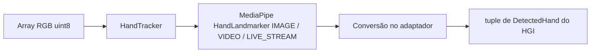
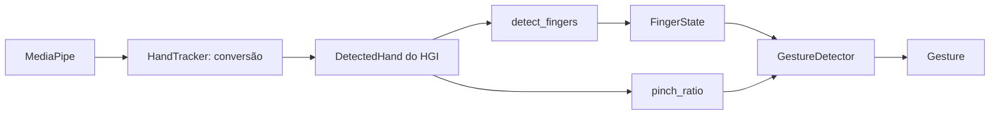
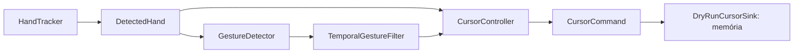
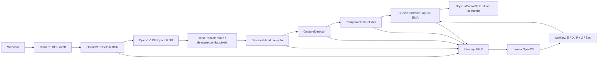
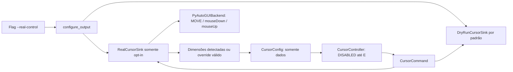

# Arquitetura do HGI

Atualizado em 02/10/2026, na Fase 11 de ações avançadas e integração local.
Instalação e execução: [README.md](../README.md).
Aceite físico/release: [RELEASE_CHECKLIST.md](RELEASE_CHECKLIST.md).

O núcleo matemático usa somente a biblioteca padrão Python. O entrypoint identifica o
projeto e encerra. Geometria e smoothing não fazem I/O, não consultam relógio/FPS,
não obtêm dimensões reais e não importam bibliotecas de visão ou automação.
O adaptador de visão usa NumPy e importa MediaPipe somente ao construir o tracker.
O modelo interno de mão e o reconhecimento geométrico usam somente Python padrão.
O cursor virtual exige enable explícito e filtra temporalmente as observações.
Começa DISABLED e usa um sink em memória por padrão. A Fase 8 acrescenta um
backend real isolado, selecionado por flag e habilitado separadamente com E.
A demo visual integra webcam e OpenCV com esse núcleo sem mudar os gestos.

## API atual

| API | Contrato |
|---|---|
| `Point2D(x, y)` | Dataclass imutável de duas coordenadas finitas; aceita negativos |
| `Region2D(left, top, right, bottom)` | Dataclass imutável; limites inclusivos e spans positivos, finitos |
| `distance(first, second)` | Distância euclidiana via hypot, na unidade compartilhada pelos pontos |
| `normalized_distance(first, second, reference_distance)` | Distância dividida por referência positiva e finita na mesma unidade |
| `clamp(value, minimum, maximum)` | Intervalo inclusivo; bounds iguais são válidos; valores não finitos e bounds invertidos são rejeitados |
| `normalized_to_pixels(point, width, height)` | Clip 0..1, multiplicação por dimensão−1 e clamp final; sem arredondamento para inteiro |
| `pixels_to_normalized(point, width, height)` | Conversão inversa com clipping; um eixo de um pixel retorna 0 |
| `mirror_horizontal(point)` | Reflexão `1-x`, preservando Y; não aplica clipping por conta própria |
| `map_camera_to_screen(point, camera_region, screen_width, screen_height, *, mirror_x=False)` | Clip na área útil → normalização relativa → espelhamento opcional → pixels seguros |
| `ExponentialSmoother(alpha)` | EMA com alpha validado e somente o último ponto como estado |
| `smoother.update(point)` | Primeiro ponto passa intacto; seguintes são suavizados nos dois eixos |
| `smoother.reset()` | Descarta o estado; próxima entrada passa intacta |
| `smoother.alpha` | Propriedade somente leitura; `0 < alpha <= 1` |

Não há hierarquia de unidades: usar nomes como `camera_point`, `screen_point` e
`normalized_point` e converter explicitamente. Um ponto e sua região devem usar
a mesma unidade. Distância entre coordenadas normalizadas de um frame retangular
não equivale à distância em pixels; converter os dois eixos usando as dimensões
fornecidas antes de comparar distâncias físicas no plano da imagem.

## Bordas, margens e precisão

Largura/altura são inteiros positivos, excluindo booleanos. Na convenção atual,
`0.0 → 0` e `1.0 → dimensão−1`. Para 1920×1080, o centro é `(959.5, 539.5)`.
Isso mantém os pixels extremos dentro da resolução. O clamp também é aplicado
após multiplicar, para conter arredondamentos na borda. Um eixo de um pixel só
tem posição 0; sua inversa escolhe 0 como valor canônico. Clipping e eixos de um
pixel perdem informação, portanto não permitem um round-trip geral.

A região representa diretamente as margens. Por exemplo, para um frame numérico
640×480, `Region2D(64, 48, 575, 431)` define uma área interna. Seus cantos mapeiam
para os extremos da tela fornecida. O espelhamento ocorre **depois** de normalizar
essa região; inverter o frame inteiro e inverter novamente o ponto seria duplicar
o espelhamento. A demo espelha antes da inferência e usa mirror_x=False;
a coerência numérica é testada, mas a direção física ainda exige aceite manual.

Não há arredondamento antecipado nem consulta ao monitor. A conversão em posições
inteiras é responsabilidade exclusiva do backend real. Coordenadas não
finitas, regiões vazias e referências de distância não positivas geram ValueError;
resultados de distância além da capacidade dos floats também são rejeitados.
Os tipos documentados devem ser respeitados pelos chamadores.

## EMA

Após inicialização, a regra por eixo é:

```text
novo = (1 - alpha) * anterior + alpha * atual
```

É equivalente a `anterior + alpha * (atual - anterior)`, mas evita overflow na
subtração de valores grandes de sinais opostos. Eixos com entrada igual ao valor
anterior são preservados exatamente, evitando deriva por arredondamento.
Alpha baixo responde mais lentamente; alpha 1 acompanha a entrada sem atraso.
O fator é validado na construção, sem configuração global nem defaults dispersos.

Não há compensação temporal: a mesma sequência de pontos produz a mesma saída,
mas a resposta em segundos pode variar com a frequência de chamadas. Nenhuma
medição de FPS ou regra temporal pertence ao smoother. O controller/filtro
reseta após perda longa ou inatividade; troca de mão exige reset manual.

## Verificação

Os testes usam somente pontos e dimensões sintéticos: distância, escalas, bordas,
clipping, margens, espelhamento, parâmetros inválidos, overflow e sequências EMA.
Os resultados e checkpoints RED/GREEN estão registrados no plano. Backend real
tem testes com fakes; hardware ainda não foi validado. Os testes de dedos
e gestos operam exclusivamente sobre mãos sintéticas internas, sem mocks.

## Fronteira de visão



`hand_tracker.py` é o único módulo de produção que conhece tipos MediaPipe.
`process(frame)` recebe `numpy.ndarray`, RGB, `uint8`, H×W×3, com eixos positivos.
Entradas inválidas geram TypeError/ValueError antes da inferência. Arrays strided
são tornados contíguos; RGB e entrada são preservados. Não se pode inferir RGB
versus BGR apenas por dtype/shape: a conversão pertence à integração webcam.py.

`HandTracker(model_path, *, config=HandTrackerConfig(), clock=monotonic,
performance_clock=perf_counter)` reutiliza um detector e exige modelo local.
Veja [MODELS.md](MODELS.md). Os keywords antigos de mãos/confidence continuam
aceitos quando `config` é omitido; misturar as duas fontes é rejeitado.
`tracker_config.py` centraliza enums RunningMode/InferenceDelegate e limites
de detecção, presença e tracking. Defaults permanecem **IMAGE/CPU**.

IMAGE chama `detect`; VIDEO chama `detect_for_video`, mantendo `process(frame)`.
VIDEO também aceita `timestamp_ms` explícito: inteiro não negativo, int64 e
estritamente crescente. Sem timestamp, o tracker converte segundos monotônicos
em ms; chamadas dentro do mesmo tick usam anterior+1. Clock regressivo/inválido
é rejeitado. Esse relógio não é passado ao filtro temporal dos gestos.
VIDEO e LIVE_STREAM podem aproveitar tracking do MediaPipe, conforme o
[guia oficial](https://developers.google.com/edge/mediapipe/solutions/vision/hand_landmarker/python).

LIVE_STREAM separa `submit(frame)` de `poll()`. Há uma inferência em voo e um
resultado pendente; submit retorna False quando ocupado. O callback converte
para LiveResult imutável, com mãos HGI, timestamp, dimensões e instantes de
submissão/conclusão. poll consome uma vez: None é pendente, hands=() é ausência.
Não há fila de frames nem ações de cursor no callback.

Retorno: `tuple[DetectedHand, ...]`, com `()` significando ausência normal de mão.
Não há identidade persistente ou garantia de ordem entre frames. Se houver
múltiplas categorias de handedness, o adaptador escolhe a de maior score disponível.
Handedness ausente permanece None. Não há confiança de detecção inventada.
Resultados malformados não são convertidos em ausência: são rejeitados.

| Tipo/API interna | Contrato |
|---|---|
| `HandLandmark` | IntEnum dos 21 índices oficiais, WRIST=0 até PINKY_TIP=20; INDEX_FINGER_TIP=8 |
| `NormalizedLandmark(x, y, z)` | Dataclass imutável; XYZ finitos; mantém a previsão sem clipping |
| `DetectedHand(landmarks, handedness=None, handedness_score=None)` | Tuple imutável com exatamente 21 pontos; lateralidade Left/Right opcional; score finito em 0..1 quando disponível |
| `HandTracker.process(frame)` | Converte todos os resultados para tipos HGI; nunca expõe objetos MediaPipe |
| `HandTrackerConfig(...)` | Configuração imutável de modo, delegate, máximo de mãos e confidences |
| `HandTracker.submit(frame, timestamp_ms=None)` | Exclusivo LIVE_STREAM; uma inferência em voo, sem backlog |
| `HandTracker.poll()` | Exclusivo LIVE_STREAM; consome LiveResult novo uma vez ou retorna None |
| `HandTracker.close()` / `with HandTracker(...)` | Fechamento explícito ou automático, inclusive sob exceção; close bem-sucedido é idempotente |

X/Y são normalizados pelas dimensões da imagem; Z é profundidade relativa ao
punho, aproximadamente na escala de X, **não metros**. Predições extrapoladas
fora de 0..1 são preservadas. `handedness_score` mede confiança de Left/Right,
não confiança por landmark. World landmarks e scores não expostos pela API não
são fabricados. Espelhamento deve ser coerente com a imagem processada; o tracker
não inverte coordenadas ou rótulos automaticamente.

Falhas de importação, criação, inferência e fechamento conhecidas geram
`HandTrackerError` com `__cause__` original. Erros inesperados propagam.
Um tracker fechado rejeita processamento e reentrada; um close que falhar pode
ser tentado novamente. Não há supressão de exceções no context manager, captura,
desenho, gestos, smoothing no pipeline ou automação. Métodos públicos usam uma
única thread proprietária. Um Lock protege somente mailbox/erro/estado do callback;
nenhum lock é mantido durante inferência ou close nativo, que espera callbacks.
Falhas do callback são retidas e propagadas pela thread proprietária, sem novas
submissões; preserva-se a primeira exceção. O pacote 1.0.1 apenas loga certos
erros assíncronos nativos: uma submissão sem callback por 5 s falha explicitamente.
Fechamento rejeita callbacks tardios e elimina resultados pendentes.

GPU é escolhida somente em BaseOptions, dentro do tracker. Falha de criação
preserva a causa e sugere `--delegate cpu`; não há fallback silencioso,
instalação de drivers ou dependência de GPU nos gestos/geometria/cursor.
Disponibilidade do enum não garante funcionamento ou qualidade do delegate.

Os testes substituem somente a fronteira MediaPipe, processando arrays sintéticos
e resultados externos falsos através da conversão real. O smoke com modelo real
é separado da suíte e não depende de webcam. Qualidade de tracking humano,
renderização e permissões de captura continuam exigindo teste manual futuro.

## Interpretação de dedos e gestos



Esse fluxo detalha o reconhecimento utilizado pelo loop visual da Fase 7.
`finger_state.py` reúne configuração, estado nomeado e medidas geométricas da
mão, inclusive pinch_ratio; `gesture_detector.py` converte essas medidas em
rótulos. Nenhum dos dois importa o tracker, NumPy, MediaPipe, OpenCV ou automação.
Não há I/O, relógio, acesso ao sistema operacional ou estado temporal nesses módulos.

| API | Contrato |
|---|---|
| `GestureConfig(...)` | Dataclass imutável, validada; compartilhada por dedos e gestos |
| `FingerState(thumb, index, middle, ring, pinky)` | Dataclass imutável com cinco flags nomeadas |
| `detect_fingers(hand, config=None)` | Recebe DetectedHand e retorna FingerState |
| `pinch_ratio(hand, config=None)` | Retorna razão finita entre pontas polegar/indicador e referência da palma |
| `Gesture` | Enum UNKNOWN, POINT, PINCH, OPEN_HAND, FIST, THUMBS_UP, THUMBS_DOWN, PEACE, ROCK |
| `GestureDetector(config=None).detect(hand)` | Retorna um rótulo por chamada; None significa UNKNOWN |
| `detector.config` | Configuração imutável exposta para inspeção |

### Plano da imagem e normalização

As medidas usam `Point2D(x * image_aspect_ratio, y)`, com proporção largura/altura
**fornecida pelo chamador**, sem obter dimensões de hardware. Isso coloca X/Y em
unidades relativas à altura da imagem. O padrão 1.0 assume imagem quadrada;
frames retangulares exigem a proporção correta. Y cresce para baixo, mas as
regras de distância não comparam tip.y com pip.y. Z é preservado no modelo de
mão, porém ignorado por estas heurísticas 2D.

Referência: `R = distance(WRIST, MIDDLE_FINGER_MCP)`. Não ocorre clipping das
previsões. São reutilizadas distance e normalized_distance de geometry.py,
incluindo a rejeição de resultados não finitos. O DetectedHand já impede mãos
com número diferente de 21 pontos, tipos incompatíveis ou coordenadas não finitas.

### Quatro dedos longos

Para cada indicador, médio, anelar e mindinho, usar a cadeia MCP→PIP→DIP→TIP:

```text
straightness = distance(MCP, TIP) /
               (distance(MCP, PIP) + distance(PIP, DIP) + distance(DIP, TIP))
extended = straightness >= extension_ratio
           AND distance(WRIST, TIP) > distance(WRIST, PIP)
```

Uma cadeia reta tem razão próxima de 1. O valor inicial **0.9** aceita alguma
flexão; não é um ângulo anatômico calibrado. A condição do punho evita classificar
como estendida uma cadeia reta que aponta de volta para a palma. A mesma regra
serve para os quatro dedos, usando os índices nomeados próprios de cada cadeia.

### Polegar e Left/Right

Usar a cadeia **MCP→IP→TIP** para straightness e uma condição extra de abertura:

```text
spread = distance(THUMB_TIP, INDEX_MCP) / R
         - distance(THUMB_IP, INDEX_MCP) / R
thumb_extended = straightness >= extension_ratio AND spread >= thumb_spread_ratio
```

O padrão de abertura é **0.2** da referência da palma. Essa regra procura um
polegar reto que se afasta da base do indicador; um polegar apenas reto e
aduzido não basta. Normalizar cada distância com a função existente evita
propagar infinito em entradas extremas. CMC não participa desta primeira regra.

Distâncias são invariantes a reflexão: não há sinais específicos, duplicação de
lógica ou dependência de handedness. A mesma geometria funciona para Left/Right
espelhadas, inclusive com handedness/score ausentes. O score da lateralidade
não é tratado como confiança de detecção. Não há gating por essa metadata.

### Pinça e semântica

```text
pinch_ratio = distance(THUMB_TIP, INDEX_FINGER_TIP) / R
pinched = pinch_ratio <= pinch_threshold
```

O padrão **0.25** significa pontas separadas por até um quarto da referência
wrist→middle MCP. É um valor inicial dimensionless e configurável, sem alegação
de calibração empírica. A comparação é inclusiva. Escala uniforme cancela na
razão enquanto a mão permanece acima do limite geométrico mínimo.

Primeiro validar os dedos, depois aplicar a prioridade:

1. PINCH quando a razão é suficientemente pequena, independentemente das flags.
2. ROCK quando indicador e mindinho estão estendidos, com polegar recolhido.
3. PEACE quando indicador e médio estão estendidos, com polegar recolhido.
4. THUMBS_UP/THUMBS_DOWN quando o polegar está vertical e os demais fechados.
5. POINT quando somente o indicador está estendido, incluindo polegar recolhido.
6. OPEN_HAND quando os cinco dedos estão estendidos.
7. FIST quando nenhum dedo está estendido.
8. UNKNOWN para qualquer outra pose válida ou ausência de mão.

POINT, ROCK, PEACE, THUMBS, OPEN_HAND e FIST são mutuamente exclusivos; PINCH
pode sobrepor-se a eles.
Uma pinça mantida retorna PINCH a cada chamada. Isso não é um evento de clique:
histerese, confirmação, debounce e cooldown pertencem à camada temporal abaixo.
`observe(hand)` retorna GestureObservation imutável com raw, pose e pinch_ratio.
pose é a classificação dos dedos sem prioridade de pinça; ratio=None indica
ausência de mão. `detect(hand)` permanece compatível e retorna observation.raw.
O detector calcula as medidas uma vez; o consumidor não recalcula geometria.

### Configuração, degenerações e limites

Configuração única e pequena, sem arquivo de configuração global:

| Campo | Padrão | Intervalo |
|---|---|---|
| pinch_threshold | 0.25 | Finito, ≥0; zero reconhece somente pontas coincidentes |
| extension_ratio | 0.9 | Finito, 0 < valor ≤1 |
| thumb_spread_ratio | 0.2 | Finito, ≥0 |
| min_reference_distance | 1e-6 | Finito, >0; em unidades normalizadas pela altura |
| image_aspect_ratio | 1.0 | Finito, >0; largura/altura |

Booleanos não são aceitos como parâmetros numéricos. Uma referência ou segmento
da cadeia com comprimento **≤ min_reference_distance** gera ValueError. Geometria
inválida não se transforma em FIST/UNKNOWN nem em PINCH. A demo propaga a
falha e encerra com limpeza, sem inventar landmarks ou gestos.

As heurísticas são invariantes a translação, reflexão, escala uniforme não
degenerada e rotação no plano **depois da correção de proporção**. Oclusão,
ruído, dedos cruzados, polegar dobrado/aduzido em poses diferentes, punho muito
flexionado e projeção fora do plano podem produzir erros. A razão chord/path não
modela ângulos individuais; cadeias com comprimentos desiguais podem esconder
flexão local. A vista de lado pode fazer a referência desaparecer. Nenhum desses
limiares foi calibrado com mãos reais nesta fase. Não é reconhecimento universal
de gestos nem de linguagem de sinais.

## Cursor virtual em dry-run



O chamador fornece uma mão interna ou None. Quando habilitado, o controller
chama detector/filtro temporal injetados e reúne mapeamento/EMA, sem conhecer o
tracker ou qualquer biblioteca de visão. `cursor.py` contém os dados e a fronteira de saída; `cursor_controller.py`
contém configuração e estado lógico. O relógio pertence somente ao filtro temporal.
Essa camada não contém backend real, webcam, consulta ao monitor ou automação.
A integração com captura/exibição pertence a webcam.py e à demo dedicada.

| API | Contrato |
|---|---|
| `CursorAction` | Enum MOVE, CLICK legado, MOUSE_DOWN, MOUSE_UP, NONE; somente intenções de cursor |
| `CursorCommand(action, x=None, y=None, gesture=None)` | Dataclass imutável; MOVE/CLICK/MOUSE_DOWN/MOUSE_UP exigem X/Y finitos e não negativos; NONE exige X/Y ausentes; gesto opcional e tipado |
| `CursorSink.emit(command)` | Protocol de um método; não exige herança ou framework |
| `DryRunCursorSink(max_history=None)` | Recebe todos os comandos, inclusive NONE; limite opcional descarta os mais antigos |
| `sink.commands` | Snapshot tuple imutável; não expõe a lista interna |
| `CursorConfig(screen_width, screen_height, ...)` | Dataclass imutável e validada; dimensões lógicas fornecidas explicitamente |
| `CursorController(config, *, sink=None, detector=None, temporal=None)` | Começa DISABLED; aceita CursorSink, com DryRunCursorSink padrão, detector/filtro e EMA própria |
| `controller.update(hand)` | Retorna e emite o mesmo CursorCommand uma vez por atualização válida |
| `controller.enable()` / `disable()` | Opt-in explícito / desarme; sem comando emitido pelos métodos |
| `controller.reset()` | Desabilita e limpa EMA, posição e todo estado temporal; preserva histórico do sink |
| `controller.state` | ControlState.DISABLED ou ENABLED, somente leitura; independente do backend |
| `controller.config` / `controller.sink` | Propriedades somente leitura para inspeção |
| `controller.observation` / `controller.position` | Última observação habilitada e posição virtual; snapshots imutáveis, sem consultas externas |

### POINT, margens, pixels e espelhamento

```text
POINT → INDEX_FINGER_TIP em XY normalizado
      → clip na região ativa
      → normalização relativa à região
      → espelhamento opcional de X
      → pixels da tela lógica fornecida
      → ExponentialSmoother
      → clamp final → MOVE
```

Toda a matemática vem de `map_camera_to_screen`, `clamp` e
`ExponentialSmoother`, sem duplicação. A correção de proporção do GestureDetector
pertence às distâncias dos gestos; o mapeamento usa X/Y normalizados originais,
porque a região ativa está nesse mesmo espaço. Um detector com a proporção real
do frame pode ser injetado sem consultar hardware.

| Campo de CursorConfig | Padrão/contrato |
|---|---|
| screen_width / screen_height | Obrigatórios; inteiros positivos, sem bool |
| active_region | Region2D(0.1, 0.1, 0.9, 0.9); retângulo não vazio dentro de 0..1 |
| mirror_x | True; deve ser booleano |
| smoothing_alpha | 0.25; finito, 0 < alpha ≤1, sem bool |

A região padrão reserva 10% em cada lado; é um ponto inicial configurável,
sem calibração ergonômica. Seus limites mapeiam para `0..largura-1` e
`0..altura-1`. Predições externas à área sofrem clipping. O centro de
1920×1080 permanece `(959.5, 539.5)`, com subpixels, sem arredondamento.

Convenção de entrada: landmarks de uma imagem de câmera **não espelhada**.
Para uma pessoa de frente para a câmera, deslocar a mão à sua direita reduz X
nessa imagem. Com mirror_x=True, X bruto 0.7→0.3 vira X virtual 250→750 numa
tela de largura 1001 e região padrão. Se a captura já espelhou o frame antes do
tracking, usar mirror_x=False. A reflexão ocorre relativamente à área ativa,
inclusive se ela for assimétrica; não refletir novamente o frame inteiro.

A EMA atualiza somente durante POINT: primeiro ponto passa intacto, seguintes
usam alpha por chamada. O default 0.25 favorece suavização; alpha 1 acompanha
diretamente a entrada. O clamp após a EMA mantém a saída nos limites da tela
lógica, inclusive sob arredondamentos. Não há compensação por FPS.

### PINCH, drag, inatividade e reset

O filtro temporal confirma PINCH e autoriza uma transição de botão: entrada
estável emite MOUSE_DOWN uma vez; permanência em PINCH emite MOVE com
INDEX_FINGER_TIP para permitir drag; saída confirmada emite MOUSE_UP uma vez.
Uma pinça curta vira mouseDown+mouseUp, equivalente a clique normal. Não há gesto
separado para drag nem repetição de MOUSE_DOWN em frames seguintes.

MOUSE_DOWN usa a última posição virtual, já suavizada; sem MOVE anterior, usa o
indicador mapeado sem inicializar a EMA. MOVE durante PINCH usa o mesmo
mapeamento e a mesma EMA do POINT. MOUSE_UP usa a última posição conhecida antes
de limpar o movimento quando necessário. RealCursorSink encaminha press/release
primário nesse alvo; o backend pode reposicionar para executar a ação.

PINCH preserva posição/EMA, permitindo arrastar e retomar POINT com suavização.
Ausência emite NONE e congela saída durante o grace period; ausência prolongada
emite MOUSE_UP quando havia botão pressionado.
UNKNOWN/OPEN_HAND/FIST ainda instáveis mantêm o gesto estável anterior; quando
confirmados, emitem NONE e limpam movimento. NONE informa o gesto estável,
portanto pode indicar POINT ou PINCH durante uma ausência breve, sem executá-los.
Reset/disable desabilitam e limpam toda a interação; se havia botão pressionado,
tentam emitir MOUSE_UP antes da limpeza, sem apagar comandos observados.
Qualquer erro de processamento/saída desabilita a sessão e propaga a exceção
original, sem falso sucesso, retry ou clique pendente.

### Segurança, observação e limites

DryRunCursorSink apenas adiciona dataclasses a uma deque privada, sem input.
Nenhum módulo do núcleo cursor/controller importa PyAutoGUI, OpenCV, MediaPipe
ou NumPy. RealCursorSink é uma fronteira separada, descrita abaixo. A fonte padrão de
tempo é monotonic, injetada somente na borda do filtro; não há APIs de automação.
Configuração e dados finitos são validados; nenhum download, segredo ou execução
dinâmica foi acrescentado. CursorSink exige somente emit(command); o controller
não conhece o backend, consulta de monitor ou mecanismo de input.

Demo finita, com mãos sintéticas e nenhuma biblioteca de hardware:

```bash
python scripts/demo_cursor.py
```

Requer HGI instalado, como no README. Usa relógio simulado e mostra DISABLED,
enable(), confirmação, CLICK único, cooldown sem fila, reabertura e disable().
stdout pertence apenas ao script; o controller e o sink não fazem I/O.

Limites conhecidos: ruído sustentado além dos limiares/duração pode produzir
gestos incorretos. Os defaults não foram calibrados com hardware. Não há
identidade persistente. Troca de mão sem perda explícita exige reset
pelo chamador. Controller/sink são sequenciais, sem garantia entre threads.
O histórico do sink cresce sem limite por padrão, adequado a testes/demos finitas;
a demo contínua usa max_history=1, mantendo somente o último comando.
Ergonomia, precisão das heurísticas e espelhamento da captura real continuam
dependendo de validação manual posterior. A integração da Fase 7 e o backend
real da Fase 8 estão descritos abaixo.

## Proteção temporal e opt-in

```text
DetectedHand → GestureDetector.observe → GestureObservation
            → TemporalGestureFilter → TemporalDecision
            → CursorController → CursorCommand → DryRunCursorSink
```

`temporal.py` contém TemporalConfig imutável, TemporalDecision imutável e
TemporalGestureFilter. A decisão possui gesture estável, permissões move,
mouse_down, mouse_up e reset_motion. Não há event bus, threads, timers ou
contagem de frames.
O controller mantém somente opt-in e movimento; o filtro mantém transições/tempo.

| Configuração temporal | Padrão | Contrato |
|---|---|---|
| stabilization_seconds | 0.08 s | Duração de confirmação; finita e ≥0 |
| enter_pinch_threshold | 0.25 | Fechar quando ratio ≤ limiar |
| exit_pinch_threshold | 0.32 | Abrir quando ratio ≥ limiar; exige enter < exit |
| click_cooldown_seconds | 0.30 s | Compatibilidade temporal; PINCH agora usa press/release e não repete down |
| tracking_grace_seconds | 0.15 s | Tolerância desde a primeira observação de mão ausente |

Todos os parâmetros são finitos, não negativos e rejeitam bool. Zero nas
durações permite integração imediata explícita; os defaults preservam proteção.
Os thresholds dimensionless usam a razão da Fase 4. A faixa 0.25..0.32 separa
fechamento e abertura como margem inicial, sem alegação de calibração empírica.
TemporalConfig é a autoridade para histerese, mesmo se GestureConfig usar outro
limiar do rótulo raw. pose e ratio preservados tornam essa distinção possível.

### Confirmação, debounce e cooldown

Um candidato muda somente após persistir por stabilization_seconds; trocar
o candidato reinicia a contagem. Até lá, o gesto estável anterior permanece.
Isso tolera UNKNOWN breve durante POINT. As posições usadas são sempre da
mão atual válida, nunca de um frame armazenado. Nenhuma mão significa NONE.
Fechar a pinça bloqueia MOVE imediatamente enquanto aguarda confirmação.

O latch de pinça entra em ratio ≤0.25, sai em ratio ≥0.32 e conserva estado
na faixa intermediária. A entrada/saída passa pela mesma confirmação temporal.
Uma abertura contínua por 80 ms e estado estável não-PINCH rearma a próxima
entrada. Ao entrar em PINCH estável, o filtro emite MOUSE_DOWN apenas uma vez.
Permanecer fechado nunca repete MOUSE_DOWN e continua permitindo MOVE. Ao sair
de PINCH de forma válida, emite MOUSE_UP. Comparações incluem a borda.

### Relógio e ausência de mão

`TemporalGestureFilter(config=None, *, clock=monotonic)` recebe Callable[[], float].
Há uma leitura por update, em segundos finitos e não decrescentes. NaN/infinito,
bool ou regressão geram ValueError e limpam estado. A origem absoluta pode ser
arbitrária. Testes/demo usam relógios falsos; não há sleep ou relógio no controller.
Prazos usam `now >= start + duration`, com precisão normal de ponto flutuante.

Ausência curta: preserva gesto estável, latch/armamento de pinça, posição e EMA;
emite NONE. Cancela candidato/release pendentes: tempo ausente não confirma gesto.
Na recuperação, PINCH mantido não produz outro MOUSE_DOWN e POINT retoma a mesma
EMA.

Ausência ≥150 ms: limpa gesto/candidato, latch e armamento, e solicita reset de
EMA/posição. Mantém o último clique para não contornar o cooldown. Reaquisição
começa neutra e precisa confirmar abertura antes de clicar, mesmo se reaparecer
com a mão fechada. A expiração também é verificada no próximo frame presente,
sem exigir chamadas intermediárias com ausência. Opt-in continua ENABLED, mas
nenhuma intenção fica pendente; movimento precisa confirmar novamente.

O grace period começa na primeira amostra ausente, não na última mão presente.
Sem chamadas não há reset em background; o chamador deve reportar ausência com
update(None). Lacunas sem observação de ausência não inferem perda de tracking.
Não compartilhar uma instância entre mãos ou threads; handedness não é identidade.

### Estados de sessão e falhas

| Situação | Resultado |
|---|---|
| Construção / DISABLED | Nenhum detector/clock é chamado; update emite somente NONE |
| enable() | Opt-in explícito; neutro, EMA vazia e PINCH desarmado; repetições são idempotentes |
| disable() / controller.reset() | DISABLED, libera botão pressionado se necessário, limpa temporalidade/cooldown e movimento |
| Perda breve | Mantém sessão e interação, congela saída; confirmação pendente descartada |
| Perda prolongada | Mantém opt-in, limpa interação/movimento, mantém cooldown; exige abertura confirmada |
| Exceção de detector/filtro/mapeamento/sink | Tenta MOUSE_UP se havia botão pressionado, desabilita, limpa e relança a exceção original; nenhum retry |

As capturas de exceção existem nas fronteiras para limpar e relançar,
sem ocultar falhas. Re-enable é uma sessão nova e exige confirmação/abertura;
nunca conserva clique pendente. Controller.reset também desabilita, uma mudança
de segurança em relação à Fase 5. O reset direto do filtro limpa somente seu
estado; sessões devem usar controller.reset para limpar também opt-in e EMA.

DryRunCursorSink permanece padrão; ControlState.ENABLED autoriza intenções no
sink selecionado. A Fase 11 oferece mouse MOVE/MOUSE_DOWN/MOUSE_UP real,
mantendo a separação entre cursor e ações de sistema. Não há teclado,
configuração persistente ou event bus.
O smoke manual da Fase 11 foi reportado pelo usuário como funcional; novas
calibrações continuam opcionais e dependem do ambiente.

## Integração visual da Fase 7



- `camera.py`: única fronteira de VideoCapture, índice/resolução solicitados,
  BGR uint8 validado, erros claros e context manager. Não converte cores, infere
  ou desenha. Falha de leitura encerra, sem loop silencioso ou frame falso.
- `webcam.py`: DemoConfig imutável; WebcamPipeline reutiliza tracker e sessão,
  usa dimensões efetivas, espelha BGR e converte explicitamente com cvtColor.
  A inferência RGB acontece antes do desenho. Só a borda depende de cv2/NumPy.
- Seleção: maior handedness_score, primeira em empate/ausência. A confiança é
  de Left/Right, não detecção; não existe identidade persistente. Tracker usa
  uma mão por padrão; troca humana de mão requer R e E.
- `overlay.py`: recebe OverlayState imutável e CursorConfig, usa índices/conexões
  HGI e primitivas OpenCV, sem utilities MediaPipe. Altera o BGR de exibição
  em memória sem modificar dimensões. Nenhuma imagem é salva pelo runtime.
- `scripts/demo_webcam.py`: argparse, configuração e diagnóstico de erros
  conhecidos. Modelo ausente aponta para MODELS.md. Não abre hardware ao importar,
  possui `--real-control` com sessão inicial DISABLED; `--help` não carrega
  bibliotecas de visão ou PyAutoGUI.

Dimensões da captura podem diferir das solicitadas (640×480 por padrão).
`frame.shape` define proporção para GestureConfig e transformação para pixels
do overlay. Mudança de dimensões descarta sessão anterior e começa DISABLED.
O modelo pesado não é reconstruído por frame. Em dry-run a tela padrão é
1920×1080, sem consulta de monitor. Em modo real o backend fornece dimensões.
Margens de 0.1..0.9 e alpha 0.25 permanecem iguais.

Espelhamento é feito antes do tracker; portanto mirror_x=False no controller
da demo, evitando reflexão duplicada. A entrada original de Camera permanece
inalterada. A cópia para espelhamento é necessária para a orientação de exibição;
não há cópias adicionais de frames para histórico/log. Handedness da imagem
espelhada ainda precisa de validação com mão humana.

Quando ENABLED, controller.observation expõe a medição que já alimentou o filtro,
sem recalcular geometria. Quando DISABLED, somente a integração avalia RAW para
o overlay; o controller permanece neutro e não lê o clock temporal. `position`
expõe o último alvo virtual suavizado/congelado. `TemporalStatus` expõe candidate,
stable, armed e cooldown_active imutáveis com o último timestamp amostrado;
ler status não chama clock nem avança a máquina de estados. Reset/disable limpam
também a observação. Não há acesso aos campos privados do filtro pelo overlay.

FPS usa monotonic na aplicação, separado do clock do filtro. É 1/intervalo entre
iterações e aparece com uma amostra de atraso (primeira: zero). Inclui captura,
inferência e trabalho de exibição anterior; não prova latência ponta a ponta.
Na Fase 10 esse valor recebe o nome Loop FPS. Inference FPS conta resultados
recentes entregues ao pipeline numa janela de um segundo, inclusive ausência
normal de mão, sem contar redraws pendentes. PipelineMetrics usa perf_counter
separado para conversão, inferência, controller/sink e overlay; captura é medida
no loop. Em LIVE_STREAM o tempo de inferência é submissão→callback, incluindo
adaptação e scheduling; nos modos síncronos é duração de process().
O sink virtual da demo usa deque(maxlen=1); o default público continua sem limite para
compatibilidade com os testes/demos finitas anteriores.

O overlay distingue CONTROL: ENABLED/DISABLED de DRY-RUN, mostrando mão,
score Left/Right, RAW/STABLE, candidato, armamento/cooldown, pinch_ratio, posição
virtual, Action e FPS. São 21 pontos com conexões, destaque do indicador e
feedback amarelo de PINCH. `Index normalized` descreve o indicador atual;
`screen target` é mapeado sem EMA, `Cursor` é a posição retida pelo controller.
Textos possuem fundo escuro para contraste, região ativa indica toda a tela
lógica e rodapé informa controles locais. Action é o comando do frame atual.
Last CLICK: RECENT e borda amarela confirmam a última intenção por 500 ms;
Session CLICKs mostra o contador da sessão visual.

`click_feedback.py` pertence à observabilidade: ClickFeedback recebe apenas
CursorAction uma vez após cada update/emit bem-sucedido do controller. Mantém
somente contador e timestamp do último CLICK, sem CursorCommand, posição,
referência ao sink ou permissão de ação. Um novo CLICK incrementa o total e
reinicia a janela visual; MOVE/NONE somente atualizam visibilidade. Não há
debounce/cooldown da UI e ela não decide se uma intenção deve ser autorizada.
ClickFeedbackState é um snapshot imutável com click_count/recent_click.
Desenhar o mesmo snapshot repetidamente não altera estado nem conta cliques.

WebcamPipeline injeta `ui_clock` no feedback separadamente do `clock` usado pelo
filtro temporal. Ambos usam monotonic por padrão; testes controlam cada relógio
independentemente. A indicação expira na primeira amostra da UI em/apos
last_click_at + 0.5 s, sem thread/timer/sleep. Se o loop parar, a imagem permanece
estática até a próxima amostra; a duração percebida depende da taxa de frames.
O total é da abertura da demo ou último R. WebcamPipeline.handle_key delega
os controles já existentes e limpa feedback/contador somente em R; D/E e
mudança de resolução preservam o total. CursorController/TemporalGestureFilter,
debounce, histerese, cooldown, emissão e retenção do sink não foram alterados.

run_webcam valida modelo e sessão gráfica antes da captura. Context managers
liberam câmera/tracker sob falhas; finally desabilita e destrói janelas. Erros
inesperados são relançados; não viram ausência de mão. Q/Esc e fechamento da
janela encerram; E habilita intenções no sink selecionado, D/R desabilitam/limpam.
waitKey é a única leitura de teclado. O backend real pode mover/clicar após duplo
opt-in. Não há envio de teclas, clipboard, comando externo, consulta sensível
ou gravação/transmissão de frames no código HGI.

Teste normal usa frames sintéticos, fake tracker/captura/janela e geometria,
temporalidade, sink e desenho reais. Native OpenCV sobre arrays não exige display.
Captura/inferência reais foram medidas na Fase 10, conforme PERFORMANCE.md;
o smoke manual da Fase 11 foi reportado pelo usuário como funcional.
Plugins/display ou drivers nativos defeituosos podem falhar fora das exceções
Python. Q/Esc são lidos entre frames; bloqueio nativo de captura/inferência pode
atrasar encerramento. Nenhum threshold foi recalibrado ou feature extra adicionada.

### Consumo assíncrono da Fase 10

O loop da janela continua sequencial. Em LIVE_STREAM, WebcamPipeline faz poll
e tenta submit do RGB atual. Quando há resultado novo, aplica exatamente um
update do controller. Enquanto pendente, apenas redesenha informação recente
com Action NONE; não emite, filtra ou suaviza novamente a mesma mão.
Resultado sem mão continua sendo uma amostra válida e chama update(None).

Amostras de dimensões incompatíveis, anteriores ao último enable/disable/reset
ou com idade desde a submissão superior ao tracking grace (default 150 ms) não
autorizam ações. Após silêncio maior que esse limite, usa ausência de mão para
o caminho normal de tracking perdido. A integração entrega ausência até o
status público do filtro estar UNKNOWN/desarmado; só então aceita novas mãos,
exigindo nova abertura para clique. O relógio de gesto, cooldown e thresholds
não são alterados ou resetados por essa recuperação.
E repetido numa sessão habilitada permanece idempotente; D/R/Q desabilitam
antes de aceitar outra amostra. Troca de dimensões também reinicia a barreira.
Cursor e PyAutoGUI são executados somente pela thread principal após opt-in;
o callback nunca acessa controller, sink, overlay ou estado temporal.

Medições e benchmarks, incluindo limitações do timeout nativo e diferenças
entre benchmark serial e demo assíncrona, estão em [PERFORMANCE.md](PERFORMANCE.md).

## Backend real da Fase 8



`real_cursor.py` é o único módulo de produção que importa PyAutoGUI, somente no
construtor de PyAutoGUIBackend. Importar webcam/overlay/core ou usar dry-run não
carrega a dependência de automação. Importar não inicializa o backend. Construir
o sink real configura fail-safe e consulta resolução, sem mover ou clicar.
`control` é um extra opcional com PyAutoGUI==0.9.54; visão/dev não exigem a biblioteca. Nenhum pacote instalado
foi alterado na Fase 8.

| API | Contrato |
|---|---|
| `MouseBackend` | Protocol size(), move_to(), click(), mouse_down(), mouse_up() |
| `PyAutoGUIBackend()` | Import tardio, X11 no Linux, FAILSAFE=True, PAUSE preservada |
| `RealCursorSink(backend=None, screen_width=None, screen_height=None)` | Backend injetável; consulta size uma vez; override pareado dentro dos limites |
| `sink.emit(command)` | NONE sem ação; MOVE uma chamada; MOUSE_DOWN/MOUSE_UP pressionam/liberam botão primário |
| `sink.screen_width / screen_height / detected_size` | Dimensões efetivas/detectadas somente leitura, sem consultas posteriores |
| `sink.failed` | Latch permanente após falha de ação; reconstrução necessária |
| `CursorMode` / `sink.mode` | DRY-RUN ou REAL CONTROL; independente de ControlState |
| `DemoConfig.real_control` | False por padrão; seleção explícita sem enable automático |
| `configure_output(config)` | Retorna CursorConfig e sink escolhido, antes da captura |
| `WebcamPipeline(..., sink=None)` | Sink virtual padrão; modo no overlay deriva do sink |

Na CLI, os dois argumentos de resolução têm default None. Em dry-run, None
resolve para 1920×1080 sem consulta; real resolve pela tela detectada. Overrides
exigem largura/altura juntas e positivas. Em real, não podem exceder a tela e
representam um retângulo de origem (0,0), sem selecionar monitor ou offset.
O sink converte subpixels por Python round (empates para par), valida números
originais/arredondados em 0≤x<width, 0≤y<height e rejeita violações antes de input.
Não recalcula EMA, mapeamento ou clipping. MOUSE_DOWN e MOUSE_UP utilizam a
posição contida no comando em chamadas PyAutoGUI.mouseDown/mouseUp; não há
debounce no sink nem fila/replay. A biblioteca pode reposicionar para executar
a ação nesse alvo. Screenshots de log ficam explicitamente desligados.

O controller aceita CursorSink por emit callable, sem importar backend ou SO.
Nada muda em TemporalGestureFilter, thresholds, histerese, armamento, cooldown
ou matemática do cursor. Construção começa DISABLED. Flag+sem E não gera input;
E sem flag continua virtual. D/R/Q/Esc desabilitam e soltam botão pressionado,
se houver.
Mudança de dimensões da captura reinicia DISABLED com o mesmo sink; um sink
travado por falha continua travado. Não há recuperação automática.

Qualquer falha em MOVE/MOUSE_DOWN/MOUSE_UP, inclusive FailSafeException ou
KeyboardInterrupt, trava o sink e propaga a mesma exceção. Se a falha ocorrer
com botão pressionado, RealCursorSink tenta mouse_up no último alvo conhecido
antes de latchear a falha. Controller/pipeline usam cleanup+raise,
desabilitando imediatamente. NONE continua inofensivo; até um enable externo
posterior não permite novas ações no sink travado. O loop normal encerra no
primeiro erro. Context managers da aplicação preservam a exceção original se
câmera/tracker também falharem ao fechar, acrescentando notes; erro de fechamento
sem falha anterior propaga normalmente. Janelas têm a mesma política. Nenhuma
ação já entregue ao SO pode ser desfeita por esse mecanismo.

O adaptador garante FAILSAFE=True antes de cada ação, nunca usa _pause=False e
não altera PAUSE, MINIMUM_DURATION ou proteções do fornecedor. MOVE passa
duration=0: somente a EMA existente suaviza. PAUSE=0.1 acrescenta custo por
comando, estimando no máximo cerca de 10 Hz sob MOVE contínuo antes do custo de
visão. Não é medição de FPS/latência real; foi documentado sem alterar defaults.

REAL CONTROL aparece em vermelho no cabeçalho e como texto no título, com
CONTROL ENABLED/DISABLED separado. Feedback CLICK de 500 ms/contador permanece
somente UI e recebe a ação depois de emit bem-sucedido; falha de clique não é
contabilizada como sucesso. Fechar a pinça não cria comandos extras da UI.

Limites: X11 com acesso ao servidor X; Wayland rejeitado, inclusive XWayland,
sem contornar permissões. A resolução informada pode representar o desktop
combinado X11, sem identificação de monitor físico. Reiniciar após mudar
resolução/configuração. Windows/macOS precisam de teste e permissões adequadas.
Teclas OpenCV dependem de foco; clicar fora pode retirar o foco, deixando o
fail-safe físico e Ctrl+C no terminal como alternativas. Nenhum atalho global.
Chamadas nativas e a pausa podem atrasar a próxima leitura de tecla.

Testes usam somente fakes de mouse e proíbem PyAutoGUI real. Cobrem duplo opt-in,
modo visual, resolução, limites/round, exatamente uma chamada, PINCH sustentado,
falhas/interrupts e fechamento simultaneamente defeituoso. Consulta X11 real foi
somente leitura, FAILSAFE=True e PAUSE=0.1. O smoke manual posterior foi reportado
pelo usuário como funcional; não há tabela manual de FPS versionada.

## Ações avançadas da Fase 11

A Fase 11 adiciona ações sem transformar `CursorController` em um controlador
universal. O fluxo fica bifurcado depois do filtro temporal:

```text
Stable Gesture
  ├─ cursor gestures → CursorController → CursorSink
  └─ system gestures → GestureActionController → ActionIntent → ActionSink
```

`system_actions.py` define `ActionKind`, `ActionIntent`, `ActionResult`,
`ActionConfig`, `DryRunActionSink`, `RealActionSink` e backends injetáveis.
CursorCommand continua separado e não carrega volume, screenshots ou URIs. O
overlay lê apenas snapshots: gesto, comando de cursor e resultado de ação de
sistema.

### Gestos e ações

| Gesto estável | Intenção | Controle real |
|---|---|---|
| THUMBS_UP | VOLUME_UP | `wpctl` ou fallback `pactl`, +5%, máximo 100% |
| THUMBS_DOWN | VOLUME_DOWN | `wpctl` ou fallback `pactl`, -5%, mínimo 0% |
| PEACE | SCREENSHOT | backend PyAutoGUI salva em `~/Pictures/HGI/` por padrão |
| ROCK | PLAY_SPOTIFY_TRACK | MPRIS/DBus quando disponível, senão `spotify URI` ou `xdg-open URI` |

THUMBS_UP/DOWN exigem polegar vertical claro e os demais dedos fechados. PEACE
exige indicador+médio abertos e polegar fechado. ROCK exige indicador+mindinho
abertos e polegar fechado. Essas regras são intencionais, simples e
dimensionais; não tentam reconhecer linguagem de sinais nem cobrir rotações
complexas da mão.

### Debounce e repetição

Volume é contínuo, mas limitado por estabilidade e intervalo de repetição:
250 ms para iniciar e 350 ms entre emissões. Sair do gesto limpa a repetição.
Screenshot é one-shot por ativação, com cooldown de 2 s. ROCK exige 700 ms de
estabilidade, dispara uma vez, exige saída do gesto e respeita cooldown de 5 s.
Todos os timers usam clock injetável e não chamam `sleep()`.

### Segurança dos efeitos reais

Dry-run é padrão. `configure_action_output` cria `DryRunActionSink` sem tocar em
volume, tela ou aplicativos. `RealActionSink` só é selecionado por
`--real-control`; mesmo assim, `GestureActionController.update(..., enabled=True)`
só é chamado quando a sessão está ENABLED. Backends reais são lazy: PyAutoGUI de
screenshot, comandos de volume e abridor Spotify são construídos apenas quando a
ação correspondente dispara.

Subprocessos usam listas fixas de argumentos, `shell=False` implícito e sem
concatenação de comandos. Volume consulta o valor atual, soma o delta e limita
0..100 antes de chamar `set-volume`. Screenshot cria o diretório alvo no momento
de salvar, fora do repositório por padrão. Spotify não usa Web API, OAuth,
client secret, senha ou automação visual; depende do cliente desktop local e da
sessão do usuário.

Falhas de volume/screenshot/Spotify viram `ActionResult(executed=False,
message="error: ...")` para o overlay. A visão continua rodando; essas falhas não
deixam mouse pressionado porque o cursor permanece em sua própria fronteira de
segurança. Falhas do cursor real continuam fatais para a sessão, pois input preso
é mais perigoso que perder uma ação de sistema.

## Instalação e preparação para portfólio

pyproject.toml é a fonte única de dependências. O núcleo não exige bibliotecas
nativas; vision contém MediaPipe/NumPy/OpenCV GUI; control contém PyAutoGUI; dev
contém pytest, pytest-cov, Ruff e NumPy/OpenCV para testes sintéticos. A repetição
de NumPy/OpenCV entre extras permite rodar testes sem MediaPipe nativo. Não há
requirements.txt duplicado. pytest-cov resolve coverage compatível com a opção
patch subprocess; não é necessário declarar uma segunda versão independente.

O pacote mínimo identifica o projeto via python -m hgi; o script de webcam é o
entrypoint visual explícito, sem captura ao importar. A wheel contém src/hgi e
metadados, sem modelo ou gravações. Para usar scripts e docs, mantenha uma cópia
do repositório. A versão de desenvolvimento permanece até os gates da release.
Não foram adicionados backends, gestos ou configuração persistente na Fase 9.

Consulte [MODELS.md](MODELS.md) para origem/checksum e privacidade;
[RELEASE_CHECKLIST.md](RELEASE_CHECKLIST.md) para aceite final.
