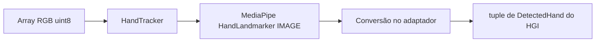
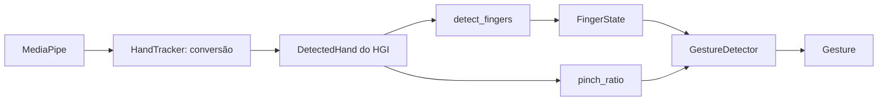
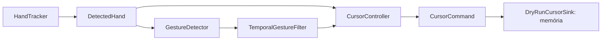

# Arquitetura do HGI — estado após a Fase 6

O núcleo matemático usa somente a biblioteca padrão Python. O entrypoint identifica o
projeto e encerra. Geometria e smoothing não fazem I/O, não consultam relógio/FPS,
não obtêm dimensões reais e não importam bibliotecas de visão ou automação.
O adaptador de visão usa NumPy e importa MediaPipe somente ao construir o tracker.
O modelo interno de mão e o reconhecimento geométrico usam somente Python padrão.
O cursor virtual exige enable explícito e filtra temporalmente as observações.
Começa DISABLED e emite somente intenções para um sink em memória. Ações reais
permanecem propostas no [plano de implementação](IMPLEMENTATION_PLAN.md).

## API atual

| API | Contrato |
|---|---|
| `Point2D(x, y)` | Dataclass imutável de duas coordenadas finitas; aceita negativos |
| `Region2D(left, top, right, bottom)` | Dataclass imutável; limites inclusivos e spans positivos, finitos |
| `distance(first, second)` | Distância euclidiana via hypot, na unidade compartilhada pelos pontos |
| `normalized_distance(first, second, reference_distance)` | Distância dividida por referência positiva e finita na mesma unidade |
| `clamp(value, minimum, maximum)` | Intervalo inclusivo; bounds iguais são válidos; valores não finitos e bounds invertidos são rejeitados |
| `normalized_to_pixels(point, width, height)` | Clip 0..1, multiplicação por dimensão−1 e clamp final; sem arredondamento para inteiro |
| `pixels_to_normalized(point, width, height)` | Conversão inversa com clipping; um eixo de um pixel retorna 0 |
| `mirror_horizontal(point)` | Reflexão `1-x`, preservando Y; não aplica clipping por conta própria |
| `map_camera_to_screen(point, camera_region, screen_width, screen_height, *, mirror_x=False)` | Clip na área útil → normalização relativa → espelhamento opcional → pixels seguros |
| `ExponentialSmoother(alpha)` | EMA com alpha validado e somente o último ponto como estado |
| `smoother.update(point)` | Primeiro ponto passa intacto; seguintes são suavizados nos dois eixos |
| `smoother.reset()` | Descarta o estado; próxima entrada passa intacta |
| `smoother.alpha` | Propriedade somente leitura; `0 < alpha <= 1` |

Não há hierarquia de unidades: usar nomes como `camera_point`, `screen_point` e
`normalized_point` e converter explicitamente. Um ponto e sua região devem usar
a mesma unidade. Distância entre coordenadas normalizadas de um frame retangular
não equivale à distância em pixels; converter os dois eixos usando as dimensões
fornecidas antes de comparar distâncias físicas no plano da imagem.

## Bordas, margens e precisão

Largura/altura são inteiros positivos, excluindo booleanos. Na convenção atual,
`0.0 → 0` e `1.0 → dimensão−1`. Para 1920×1080, o centro é `(959.5, 539.5)`.
Isso mantém os pixels extremos dentro da resolução. O clamp também é aplicado
após multiplicar, para conter arredondamentos na borda. Um eixo de um pixel só
tem posição 0; sua inversa escolhe 0 como valor canônico. Clipping e eixos de um
pixel perdem informação, portanto não permitem um round-trip geral.

A região representa diretamente as margens. Por exemplo, para um frame numérico
640×480, `Region2D(64, 48, 575, 431)` define uma área interna. Seus cantos mapeiam
para os extremos da tela fornecida. O espelhamento ocorre **depois** de normalizar
essa região; inverter o frame inteiro e inverter novamente o ponto seria duplicar
o espelhamento. Essa coerência deverá ser validada na integração futura.

Não há arredondamento antecipado nem consulta ao monitor. A conversão em posições
inteiras do backend será responsabilidade do controlador futuro. Coordenadas não
finitas, regiões vazias e referências de distância não positivas geram ValueError;
resultados de distância além da capacidade dos floats também são rejeitados.
Os tipos documentados devem ser respeitados pelos chamadores.

## EMA

Após inicialização, a regra por eixo é:

```text
novo = (1 - alpha) * anterior + alpha * atual
```

É equivalente a `anterior + alpha * (atual - anterior)`, mas evita overflow na
subtração de valores grandes de sinais opostos. Eixos com entrada igual ao valor
anterior são preservados exatamente, evitando deriva por arredondamento.
Alpha baixo responde mais lentamente; alpha 1 acompanha a entrada sem atraso.
O fator é validado na construção, sem configuração global nem defaults dispersos.

Não há compensação temporal: a mesma sequência de pontos produz a mesma saída,
mas a resposta em segundos pode variar com a frequência de chamadas. Nenhuma
medição de FPS ou filtro adicional pertence a esta fase. Na integração futura,
resetar após perda/troca de tracking evita reaproveitar posições antigas.

## Verificação

Os testes usam somente pontos e dimensões sintéticos: distância, escalas, bordas,
clipping, margens, espelhamento, parâmetros inválidos, overflow e sequências EMA.
Os resultados e checkpoints RED/GREEN estão registrados no plano. Controle real
continua sem implementação; hardware ainda não foi validado. Os testes de dedos
e gestos operam exclusivamente sobre mãos sintéticas internas, sem mocks.

## Fronteira de visão



`hand_tracker.py` é o único módulo de produção que conhece tipos MediaPipe.
`process(frame)` recebe `numpy.ndarray`, RGB, `uint8`, H×W×3, com eixos positivos.
Entradas inválidas geram TypeError/ValueError antes da inferência. Arrays strided
são tornados contíguos; RGB e entrada são preservados. Não se pode inferir RGB
versus BGR apenas por dtype/shape: a conversão pertence ao futuro módulo de captura.

`HandTracker(model_path, *, num_hands=1, min_hand_detection_confidence=0.5,
min_hand_presence_confidence=0.5)` configura CPU e **IMAGE** síncrono. Modelo
local obrigatório; detector criado uma vez e reutilizado. Veja [MODELS.md](MODELS.md).
A mudança da proposta VIDEO para IMAGE simplifica esta fase de um frame: não há
timestamps ou estado temporal. VIDEO/LIVE_STREAM poderão ser avaliados depois;
o IMAGE não usa o tracking temporal que reduz a latência nesses modos.

Retorno: `tuple[DetectedHand, ...]`, com `()` significando ausência normal de mão.
Não há identidade persistente ou garantia de ordem entre frames. Se houver
múltiplas categorias de handedness, o adaptador escolhe a de maior score disponível.
Handedness ausente permanece None. Não há confiança de detecção inventada.
Resultados malformados não são convertidos em ausência: são rejeitados.

| Tipo/API interna | Contrato |
|---|---|
| `HandLandmark` | IntEnum dos 21 índices oficiais, WRIST=0 até PINKY_TIP=20; INDEX_FINGER_TIP=8 |
| `NormalizedLandmark(x, y, z)` | Dataclass imutável; XYZ finitos; mantém a previsão sem clipping |
| `DetectedHand(landmarks, handedness=None, handedness_score=None)` | Tuple imutável com exatamente 21 pontos; lateralidade Left/Right opcional; score finito em 0..1 quando disponível |
| `HandTracker.process(frame)` | Converte todos os resultados para tipos HGI; nunca expõe objetos MediaPipe |
| `HandTracker.close()` / `with HandTracker(...)` | Fechamento explícito ou automático, inclusive sob exceção; close bem-sucedido é idempotente |

X/Y são normalizados pelas dimensões da imagem; Z é profundidade relativa ao
punho, aproximadamente na escala de X, **não metros**. Predições extrapoladas
fora de 0..1 são preservadas. `handedness_score` mede confiança de Left/Right,
não confiança por landmark. World landmarks e scores não expostos pela API não
são fabricados. Espelhamento deve ser coerente com a imagem processada; o tracker
não inverte coordenadas ou rótulos automaticamente.

Falhas de importação, criação, inferência e fechamento conhecidas geram
`HandTrackerError` com `__cause__` original. Erros inesperados propagam.
Um tracker fechado rejeita processamento e reentrada; um close que falhar pode
ser tentado novamente. Não há supressão de exceções no context manager, captura,
desenho, callbacks, gestos, smoothing no pipeline ou automação. O tracker não é
thread-safe; neste incremento deve ser usado sequencialmente.

Os testes substituem somente a fronteira MediaPipe, processando arrays sintéticos
e resultados externos falsos através da conversão real. O smoke com modelo real
é separado da suíte e não depende de webcam. Qualidade de tracking humano,
renderização e permissões de captura continuam exigindo teste manual futuro.

## Interpretação de dedos e gestos



Esse fluxo representa as interfaces disponíveis, ainda sem loop integrado.
`finger_state.py` reúne configuração, estado nomeado e medidas geométricas da
mão, inclusive pinch_ratio; `gesture_detector.py` converte essas medidas em
rótulos. Nenhum dos dois importa o tracker, NumPy, MediaPipe, OpenCV ou automação.
Não há I/O, relógio, acesso ao sistema operacional ou estado temporal nesses módulos.

| API | Contrato |
|---|---|
| `GestureConfig(...)` | Dataclass imutável, validada; compartilhada por dedos e gestos |
| `FingerState(thumb, index, middle, ring, pinky)` | Dataclass imutável com cinco flags nomeadas |
| `detect_fingers(hand, config=None)` | Recebe DetectedHand e retorna FingerState |
| `pinch_ratio(hand, config=None)` | Retorna razão finita entre pontas polegar/indicador e referência da palma |
| `Gesture` | Enum UNKNOWN, POINT, PINCH, OPEN_HAND, FIST |
| `GestureDetector(config=None).detect(hand)` | Retorna um rótulo por chamada; None significa UNKNOWN |
| `detector.config` | Configuração imutável exposta para inspeção |

### Plano da imagem e normalização

As medidas usam `Point2D(x * image_aspect_ratio, y)`, com proporção largura/altura
**fornecida pelo chamador**, sem obter dimensões de hardware. Isso coloca X/Y em
unidades relativas à altura da imagem. O padrão 1.0 assume imagem quadrada;
frames retangulares exigem a proporção correta. Y cresce para baixo, mas as
regras de distância não comparam tip.y com pip.y. Z é preservado no modelo de
mão, porém ignorado por estas heurísticas 2D.

Referência: `R = distance(WRIST, MIDDLE_FINGER_MCP)`. Não ocorre clipping das
previsões. São reutilizadas distance e normalized_distance de geometry.py,
incluindo a rejeição de resultados não finitos. O DetectedHand já impede mãos
com número diferente de 21 pontos, tipos incompatíveis ou coordenadas não finitas.

### Quatro dedos longos

Para cada indicador, médio, anelar e mindinho, usar a cadeia MCP→PIP→DIP→TIP:

```text
straightness = distance(MCP, TIP) /
               (distance(MCP, PIP) + distance(PIP, DIP) + distance(DIP, TIP))
extended = straightness >= extension_ratio
           AND distance(WRIST, TIP) > distance(WRIST, PIP)
```

Uma cadeia reta tem razão próxima de 1. O valor inicial **0.9** aceita alguma
flexão; não é um ângulo anatômico calibrado. A condição do punho evita classificar
como estendida uma cadeia reta que aponta de volta para a palma. A mesma regra
serve para os quatro dedos, usando os índices nomeados próprios de cada cadeia.

### Polegar e Left/Right

Usar a cadeia **MCP→IP→TIP** para straightness e uma condição extra de abertura:

```text
spread = distance(THUMB_TIP, INDEX_MCP) / R
         - distance(THUMB_IP, INDEX_MCP) / R
thumb_extended = straightness >= extension_ratio AND spread >= thumb_spread_ratio
```

O padrão de abertura é **0.2** da referência da palma. Essa regra procura um
polegar reto que se afasta da base do indicador; um polegar apenas reto e
aduzido não basta. Normalizar cada distância com a função existente evita
propagar infinito em entradas extremas. CMC não participa desta primeira regra.

Distâncias são invariantes a reflexão: não há sinais específicos, duplicação de
lógica ou dependência de handedness. A mesma geometria funciona para Left/Right
espelhadas, inclusive com handedness/score ausentes. O score da lateralidade
não é tratado como confiança de detecção. Não há gating por essa metadata.

### Pinça e semântica

```text
pinch_ratio = distance(THUMB_TIP, INDEX_FINGER_TIP) / R
pinched = pinch_ratio <= pinch_threshold
```

O padrão **0.25** significa pontas separadas por até um quarto da referência
wrist→middle MCP. É um valor inicial dimensionless e configurável, sem alegação
de calibração empírica. A comparação é inclusiva. Escala uniforme cancela na
razão enquanto a mão permanece acima do limite geométrico mínimo.

Primeiro validar os dedos, depois aplicar a prioridade:

1. PINCH quando a razão é suficientemente pequena, independentemente das flags.
2. POINT quando somente o indicador está estendido, incluindo polegar recolhido.
3. OPEN_HAND quando os cinco dedos estão estendidos.
4. FIST quando nenhum dedo está estendido.
5. UNKNOWN para qualquer outra pose válida ou ausência de mão.

POINT, OPEN_HAND e FIST são mutuamente exclusivos; PINCH pode sobrepor-se a eles.
Uma pinça mantida retorna PINCH a cada chamada. Isso não é um evento de clique:
histerese, confirmação, debounce e cooldown pertencem à camada temporal abaixo.
`observe(hand)` retorna GestureObservation imutável com raw, pose e pinch_ratio.
pose é a classificação dos dedos sem prioridade de pinça; ratio=None indica
ausência de mão. `detect(hand)` permanece compatível e retorna observation.raw.
O detector calcula as medidas uma vez; o consumidor não recalcula geometria.

### Configuração, degenerações e limites

Configuração única e pequena, sem arquivo de configuração global:

| Campo | Padrão | Intervalo |
|---|---|---|
| pinch_threshold | 0.25 | Finito, ≥0; zero reconhece somente pontas coincidentes |
| extension_ratio | 0.9 | Finito, 0 < valor ≤1 |
| thumb_spread_ratio | 0.2 | Finito, ≥0 |
| min_reference_distance | 1e-6 | Finito, >0; em unidades normalizadas pela altura |
| image_aspect_ratio | 1.0 | Finito, >0; largura/altura |

Booleanos não são aceitos como parâmetros numéricos. Uma referência ou segmento
da cadeia com comprimento **≤ min_reference_distance** gera ValueError. Geometria
inválida não se transforma em FIST/UNKNOWN nem em PINCH. O chamador futuro deverá
exibir essa invalidez ou descartar a mão explicitamente, sem inventar landmarks.

As heurísticas são invariantes a translação, reflexão, escala uniforme não
degenerada e rotação no plano **depois da correção de proporção**. Oclusão,
ruído, dedos cruzados, polegar dobrado/aduzido em poses diferentes, punho muito
flexionado e projeção fora do plano podem produzir erros. A razão chord/path não
modela ângulos individuais; cadeias com comprimentos desiguais podem esconder
flexão local. A vista de lado pode fazer a referência desaparecer. Nenhum desses
limiares foi calibrado com mãos reais nesta fase. Não é reconhecimento universal
de gestos nem de linguagem de sinais.

## Cursor virtual em dry-run



O chamador fornece uma mão interna ou None. Quando habilitado, o controller
chama detector/filtro temporal injetados e reúne mapeamento/EMA, sem conhecer o
tracker ou qualquer biblioteca de visão. `cursor.py` contém os dados e a fronteira de saída; `cursor_controller.py`
contém configuração e estado lógico. O relógio pertence somente ao filtro temporal.
Não há backend real, webcam, consulta ao monitor, automação de entrada ou
integração com o entrypoint de captura.

| API | Contrato |
|---|---|
| `CursorAction` | Enum MOVE, CLICK, NONE; somente intenções |
| `CursorCommand(action, x=None, y=None, gesture=None)` | Dataclass imutável; MOVE/CLICK exigem X/Y finitos e não negativos; NONE exige X/Y ausentes; gesto opcional e tipado |
| `CursorSink.emit(command)` | Protocol de um método; não exige herança ou framework |
| `DryRunCursorSink()` | Recebe todos os comandos, inclusive NONE, armazenando em ordem na memória |
| `sink.commands` | Snapshot tuple imutável; não expõe a lista interna |
| `CursorConfig(screen_width, screen_height, ...)` | Dataclass imutável e validada; dimensões lógicas fornecidas explicitamente |
| `CursorController(config, *, sink=None, detector=None, temporal=None)` | Começa DISABLED; usa somente DryRunCursorSink, detector/filtro padrão e EMA própria |
| `controller.update(hand)` | Retorna e emite o mesmo CursorCommand uma vez por atualização válida |
| `controller.enable()` / `disable()` | Opt-in explícito / desarme; sem comando emitido pelos métodos |
| `controller.reset()` | Desabilita e limpa EMA, posição e todo estado temporal; preserva histórico do sink |
| `controller.state` | ControlState.DISABLED ou ENABLED, somente leitura; ENABLED continua dry-run |
| `controller.config` / `controller.sink` | Propriedades somente leitura para inspeção |

### POINT, margens, pixels e espelhamento

```text
POINT → INDEX_FINGER_TIP em XY normalizado
      → clip na região ativa
      → normalização relativa à região
      → espelhamento opcional de X
      → pixels da tela lógica fornecida
      → ExponentialSmoother
      → clamp final → MOVE
```

Toda a matemática vem de `map_camera_to_screen`, `clamp` e
`ExponentialSmoother`, sem duplicação. A correção de proporção do GestureDetector
pertence às distâncias dos gestos; o mapeamento usa X/Y normalizados originais,
porque a região ativa está nesse mesmo espaço. Um detector com a proporção real
do frame pode ser injetado sem consultar hardware.

| Campo de CursorConfig | Padrão/contrato |
|---|---|
| screen_width / screen_height | Obrigatórios; inteiros positivos, sem bool |
| active_region | Region2D(0.1, 0.1, 0.9, 0.9); retângulo não vazio dentro de 0..1 |
| mirror_x | True; deve ser booleano |
| smoothing_alpha | 0.25; finito, 0 < alpha ≤1, sem bool |

A região padrão reserva 10% em cada lado; é um ponto inicial configurável,
sem calibração ergonômica. Seus limites mapeiam para `0..largura-1` e
`0..altura-1`. Predições externas à área sofrem clipping. O centro de
1920×1080 permanece `(959.5, 539.5)`, com subpixels, sem arredondamento.

Convenção de entrada: landmarks de uma imagem de câmera **não espelhada**.
Para uma pessoa de frente para a câmera, deslocar a mão à sua direita reduz X
nessa imagem. Com mirror_x=True, X bruto 0.7→0.3 vira X virtual 250→750 numa
tela de largura 1001 e região padrão. Se a captura já espelhou o frame antes do
tracking, usar mirror_x=False. A reflexão ocorre relativamente à área ativa,
inclusive se ela for assimétrica; não refletir novamente o frame inteiro.

A EMA atualiza somente durante POINT: primeiro ponto passa intacto, seguintes
usam alpha por chamada. O default 0.25 favorece suavização; alpha 1 acompanha
diretamente a entrada. O clamp após a EMA mantém a saída nos limites da tela
lógica, inclusive sob arredondamentos. Não há compensação por FPS.

### PINCH, inatividade e reset

O filtro temporal confirma PINCH e autoriza CLICK somente armado e fora do
cooldown. PINCH mantido emite NONE. A entrada de pinça congela MOVE imediatamente,
inclusive enquanto ainda instável. CLICK usa a última posição virtual, já
suavizada; sem MOVE anterior, usa o indicador mapeado sem inicializar a EMA. Isso define um alvo lógico, sem
reposicionar ou consultar o cursor real. A próxima camada deverá decidir como
executar esse contrato de maneira segura.

PINCH preserva posição/EMA, permitindo retomar POINT com suavização. Ausência
emite NONE e congela saída, preservando movimento durante o grace period.
UNKNOWN/OPEN_HAND/FIST ainda instáveis mantêm o gesto estável anterior; quando
confirmados, emitem NONE e limpam movimento. NONE informa o gesto estável,
portanto pode indicar POINT ou PINCH durante uma ausência breve, sem executá-los.
Reset/disable desabilitam e limpam toda a interação, sem apagar comandos observados.
Qualquer erro de processamento/saída desabilita a sessão e propaga a exceção
original, sem falso sucesso, retry ou clique pendente.

### Segurança, observação e limites

O sink implementado apenas adiciona dataclasses a uma lista privada. Nenhum
mouse real é movido, clique real ocorre ou teclado é controlado. Nenhum módulo
desta camada importa PyAutoGUI, OpenCV, MediaPipe ou NumPy. A fonte padrão de
tempo é monotonic, injetada somente na borda do filtro; não há APIs de automação.
Configuração e dados finitos são validados; nenhum download, segredo, execução
dinâmica ou captura foi acrescentado. O Protocol permite futura extensão, mas
a implementação e os testes atuais usam somente saída em memória.

Demo finita, com mãos sintéticas e nenhuma biblioteca de hardware:

```bash
python scripts/demo_cursor.py
```

Requer HGI instalado, como no README. Usa relógio simulado e mostra DISABLED,
enable(), confirmação, CLICK único, cooldown sem fila, reabertura e disable().
stdout pertence apenas ao script; o controller e o sink não fazem I/O.

Limites conhecidos: ruído sustentado além dos limiares/duração pode produzir
gestos incorretos. Os defaults não foram calibrados com hardware. Não há
identidade persistente. Troca de mão sem perda explícita exige reset
pelo chamador. Controller/sink são sequenciais, sem garantia entre threads.
O histórico do sink cresce sem limite, adequado a testes/demos finitas;
um futuro loop contínuo precisará de saída limitada ou sem retenção integral.
Ergonomia, precisão das heurísticas e espelhamento da captura real continuam
dependendo de validação manual posterior. Controle real e Fase 7 não foram iniciados.

## Proteção temporal e opt-in

```text
DetectedHand → GestureDetector.observe → GestureObservation
            → TemporalGestureFilter → TemporalDecision
            → CursorController → CursorCommand → DryRunCursorSink
```

`temporal.py` contém TemporalConfig imutável, TemporalDecision imutável e
TemporalGestureFilter. A decisão possui gesture estável, permissões move/click
e reset_motion. Não há event bus, threads, timers ou contagem de frames.
O controller mantém somente opt-in e movimento; o filtro mantém transições/tempo.

| Configuração temporal | Padrão | Contrato |
|---|---|---|
| stabilization_seconds | 0.08 s | Duração de confirmação; finita e ≥0 |
| enter_pinch_threshold | 0.25 | Fechar quando ratio ≤ limiar |
| exit_pinch_threshold | 0.32 | Abrir quando ratio ≥ limiar; exige enter < exit |
| click_cooldown_seconds | 0.30 s | Intervalo mínimo entre intenções CLICK autorizadas |
| tracking_grace_seconds | 0.15 s | Tolerância desde a primeira observação de mão ausente |

Todos os parâmetros são finitos, não negativos e rejeitam bool. Zero nas
durações permite integração imediata explícita; os defaults preservam proteção.
Os thresholds dimensionless usam a razão da Fase 4. A faixa 0.25..0.32 separa
fechamento e abertura como margem inicial, sem alegação de calibração empírica.
TemporalConfig é a autoridade para histerese, mesmo se GestureConfig usar outro
limiar do rótulo raw. pose e ratio preservados tornam essa distinção possível.

### Confirmação, debounce e cooldown

Um candidato muda somente após persistir por stabilization_seconds; trocar
o candidato reinicia a contagem. Até lá, o gesto estável anterior permanece.
Isso tolera UNKNOWN breve durante POINT. As posições usadas são sempre da
mão atual válida, nunca de um frame armazenado. Nenhuma mão significa NONE.
Fechar a pinça bloqueia MOVE imediatamente enquanto aguarda confirmação.

O latch de pinça entra em ratio ≤0.25, sai em ratio ≥0.32 e conserva estado
na faixa intermediária. A entrada/saída passa pela mesma confirmação temporal.
Uma abertura contínua por 80 ms e estado estável não-PINCH armam o clique.
Ao entrar em PINCH estável, a ativação é consumida, emitindo CLICK apenas se
armada e fora do cooldown. Permanecer fechado nunca repete. Uma ativação
bloqueada é descartada; passar o prazo mantendo PINCH não dispara clique atrasado.
É necessária nova abertura confirmada e nova entrada. Comparações incluem a borda.

### Relógio e ausência de mão

`TemporalGestureFilter(config=None, *, clock=monotonic)` recebe Callable[[], float].
Há uma leitura por update, em segundos finitos e não decrescentes. NaN/infinito,
bool ou regressão geram ValueError e limpam estado. A origem absoluta pode ser
arbitrária. Testes/demo usam relógios falsos; não há sleep ou relógio no controller.
Prazos usam `now >= start + duration`, com precisão normal de ponto flutuante.

Ausência curta: preserva gesto estável, latch/armamento de pinça, posição e EMA;
emite NONE. Cancela candidato/release pendentes: tempo ausente não confirma gesto.
Na recuperação, PINCH mantido não produz outro CLICK e POINT retoma a mesma EMA.

Ausência ≥150 ms: limpa gesto/candidato, latch e armamento, e solicita reset de
EMA/posição. Mantém o último clique para não contornar o cooldown. Reaquisição
começa neutra e precisa confirmar abertura antes de clicar, mesmo se reaparecer
com a mão fechada. A expiração também é verificada no próximo frame presente,
sem exigir chamadas intermediárias com ausência. Opt-in continua ENABLED, mas
nenhuma intenção fica pendente; movimento precisa confirmar novamente.

O grace period começa na primeira amostra ausente, não na última mão presente.
Sem chamadas não há reset em background; o chamador deve reportar ausência com
update(None). Lacunas sem observação de ausência não inferem perda de tracking.
Não compartilhar uma instância entre mãos ou threads; handedness não é identidade.

### Estados de sessão e falhas

| Situação | Resultado |
|---|---|
| Construção / DISABLED | Nenhum detector/clock é chamado; update emite somente NONE |
| enable() | Opt-in explícito; neutro, EMA vazia e PINCH desarmado; repetições são idempotentes |
| disable() / controller.reset() | DISABLED, limpa toda a temporalidade/cooldown e movimento; nenhum comando emitido |
| Perda breve | Mantém sessão e interação, congela saída; confirmação pendente descartada |
| Perda prolongada | Mantém opt-in, limpa interação/movimento, mantém cooldown; exige abertura confirmada |
| Exceção de detector/filtro/mapeamento/sink | Desabilita, limpa e relança a exceção original; nenhum retry |

Os except Exception existem apenas nas fronteiras para limpar e relançar,
sem ocultar falhas. Re-enable é uma sessão nova e exige confirmação/abertura;
nunca conserva clique pendente. Controller.reset também desabilita, uma mudança
de segurança em relação à Fase 5. O reset direto do filtro limpa somente seu
estado; sessões devem usar controller.reset para limpar também opt-in e EMA.

O sink permanece exclusivamente DryRunCursorSink; ControlState.ENABLED significa
autorizar intenções virtuais. Não foi implementado PyAutoGUI, mouse, teclado,
webcam, consulta de resolução, GUI ou configuração persistente. Antes do controle
real ainda serão necessários backend/fail-safe, integração de captura e QA manual
autorizados separadamente. O MVP completo continua pendente.
