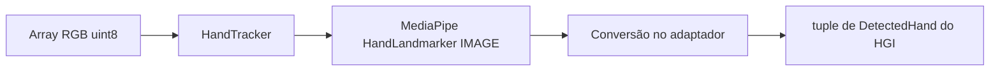
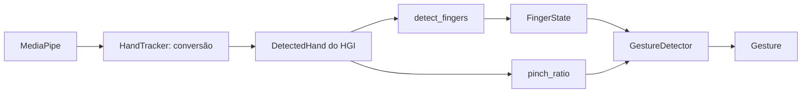

# Arquitetura do HGI — estado após a Fase 4

O núcleo matemático usa somente a biblioteca padrão Python. O entrypoint identifica o
projeto e encerra. Geometria e smoothing não fazem I/O, não consultam relógio/FPS,
não obtêm dimensões reais e não importam bibliotecas de visão ou automação.
O adaptador de visão usa NumPy e importa MediaPipe somente ao construir o tracker.
O modelo interno de mão e o reconhecimento geométrico usam somente Python padrão.
Ações permanecem propostas no [plano de implementação](IMPLEMENTATION_PLAN.md).

## API atual

| API | Contrato |
|---|---|
| `Point2D(x, y)` | Dataclass imutável de duas coordenadas finitas; aceita negativos |
| `Region2D(left, top, right, bottom)` | Dataclass imutável; limites inclusivos e spans positivos, finitos |
| `distance(first, second)` | Distância euclidiana via hypot, na unidade compartilhada pelos pontos |
| `normalized_distance(first, second, reference_distance)` | Distância dividida por referência positiva e finita na mesma unidade |
| `clamp(value, minimum, maximum)` | Intervalo inclusivo; bounds iguais são válidos; valores não finitos e bounds invertidos são rejeitados |
| `normalized_to_pixels(point, width, height)` | Clip 0..1, multiplicação por dimensão−1 e clamp final; sem arredondamento para inteiro |
| `pixels_to_normalized(point, width, height)` | Conversão inversa com clipping; um eixo de um pixel retorna 0 |
| `mirror_horizontal(point)` | Reflexão `1-x`, preservando Y; não aplica clipping por conta própria |
| `map_camera_to_screen(point, camera_region, screen_width, screen_height, *, mirror_x=False)` | Clip na área útil → normalização relativa → espelhamento opcional → pixels seguros |
| `ExponentialSmoother(alpha)` | EMA com alpha validado e somente o último ponto como estado |
| `smoother.update(point)` | Primeiro ponto passa intacto; seguintes são suavizados nos dois eixos |
| `smoother.reset()` | Descarta o estado; próxima entrada passa intacta |
| `smoother.alpha` | Propriedade somente leitura; `0 < alpha <= 1` |

Não há hierarquia de unidades: usar nomes como `camera_point`, `screen_point` e
`normalized_point` e converter explicitamente. Um ponto e sua região devem usar
a mesma unidade. Distância entre coordenadas normalizadas de um frame retangular
não equivale à distância em pixels; converter os dois eixos usando as dimensões
fornecidas antes de comparar distâncias físicas no plano da imagem.

## Bordas, margens e precisão

Largura/altura são inteiros positivos, excluindo booleanos. Na convenção atual,
`0.0 → 0` e `1.0 → dimensão−1`. Para 1920×1080, o centro é `(959.5, 539.5)`.
Isso mantém os pixels extremos dentro da resolução. O clamp também é aplicado
após multiplicar, para conter arredondamentos na borda. Um eixo de um pixel só
tem posição 0; sua inversa escolhe 0 como valor canônico. Clipping e eixos de um
pixel perdem informação, portanto não permitem um round-trip geral.

A região representa diretamente as margens. Por exemplo, para um frame numérico
640×480, `Region2D(64, 48, 575, 431)` define uma área interna. Seus cantos mapeiam
para os extremos da tela fornecida. O espelhamento ocorre **depois** de normalizar
essa região; inverter o frame inteiro e inverter novamente o ponto seria duplicar
o espelhamento. Essa coerência deverá ser validada na integração futura.

Não há arredondamento antecipado nem consulta ao monitor. A conversão em posições
inteiras do backend será responsabilidade do controlador futuro. Coordenadas não
finitas, regiões vazias e referências de distância não positivas geram ValueError;
resultados de distância além da capacidade dos floats também são rejeitados.
Os tipos documentados devem ser respeitados pelos chamadores.

## EMA

Após inicialização, a regra por eixo é:

```text
novo = (1 - alpha) * anterior + alpha * atual
```

É equivalente a `anterior + alpha * (atual - anterior)`, mas evita overflow na
subtração de valores grandes de sinais opostos. Eixos com entrada igual ao valor
anterior são preservados exatamente, evitando deriva por arredondamento.
Alpha baixo responde mais lentamente; alpha 1 acompanha a entrada sem atraso.
O fator é validado na construção, sem configuração global nem defaults dispersos.

Não há compensação temporal: a mesma sequência de pontos produz a mesma saída,
mas a resposta em segundos pode variar com a frequência de chamadas. Nenhuma
medição de FPS ou filtro adicional pertence a esta fase. Na integração futura,
resetar após perda/troca de tracking evita reaproveitar posições antigas.

## Verificação

Os testes usam somente pontos e dimensões sintéticos: distância, escalas, bordas,
clipping, margens, espelhamento, parâmetros inválidos, overflow e sequências EMA.
Os resultados e checkpoints RED/GREEN estão registrados no plano. Controle real
continua sem implementação; hardware ainda não foi validado. Os testes de dedos
e gestos operam exclusivamente sobre mãos sintéticas internas, sem mocks.

## Fronteira de visão



`hand_tracker.py` é o único módulo de produção que conhece tipos MediaPipe.
`process(frame)` recebe `numpy.ndarray`, RGB, `uint8`, H×W×3, com eixos positivos.
Entradas inválidas geram TypeError/ValueError antes da inferência. Arrays strided
são tornados contíguos; RGB e entrada são preservados. Não se pode inferir RGB
versus BGR apenas por dtype/shape: a conversão pertence ao futuro módulo de captura.

`HandTracker(model_path, *, num_hands=1, min_hand_detection_confidence=0.5,
min_hand_presence_confidence=0.5)` configura CPU e **IMAGE** síncrono. Modelo
local obrigatório; detector criado uma vez e reutilizado. Veja [MODELS.md](MODELS.md).
A mudança da proposta VIDEO para IMAGE simplifica esta fase de um frame: não há
timestamps ou estado temporal. VIDEO/LIVE_STREAM poderão ser avaliados depois;
o IMAGE não usa o tracking temporal que reduz a latência nesses modos.

Retorno: `tuple[DetectedHand, ...]`, com `()` significando ausência normal de mão.
Não há identidade persistente ou garantia de ordem entre frames. Se houver
múltiplas categorias de handedness, o adaptador escolhe a de maior score disponível.
Handedness ausente permanece None. Não há confiança de detecção inventada.
Resultados malformados não são convertidos em ausência: são rejeitados.

| Tipo/API interna | Contrato |
|---|---|
| `HandLandmark` | IntEnum dos 21 índices oficiais, WRIST=0 até PINKY_TIP=20; INDEX_FINGER_TIP=8 |
| `NormalizedLandmark(x, y, z)` | Dataclass imutável; XYZ finitos; mantém a previsão sem clipping |
| `DetectedHand(landmarks, handedness=None, handedness_score=None)` | Tuple imutável com exatamente 21 pontos; lateralidade Left/Right opcional; score finito em 0..1 quando disponível |
| `HandTracker.process(frame)` | Converte todos os resultados para tipos HGI; nunca expõe objetos MediaPipe |
| `HandTracker.close()` / `with HandTracker(...)` | Fechamento explícito ou automático, inclusive sob exceção; close bem-sucedido é idempotente |

X/Y são normalizados pelas dimensões da imagem; Z é profundidade relativa ao
punho, aproximadamente na escala de X, **não metros**. Predições extrapoladas
fora de 0..1 são preservadas. `handedness_score` mede confiança de Left/Right,
não confiança por landmark. World landmarks e scores não expostos pela API não
são fabricados. Espelhamento deve ser coerente com a imagem processada; o tracker
não inverte coordenadas ou rótulos automaticamente.

Falhas de importação, criação, inferência e fechamento conhecidas geram
`HandTrackerError` com `__cause__` original. Erros inesperados propagam.
Um tracker fechado rejeita processamento e reentrada; um close que falhar pode
ser tentado novamente. Não há supressão de exceções no context manager, captura,
desenho, callbacks, gestos, smoothing no pipeline ou automação. O tracker não é
thread-safe; neste incremento deve ser usado sequencialmente.

Os testes substituem somente a fronteira MediaPipe, processando arrays sintéticos
e resultados externos falsos através da conversão real. O smoke com modelo real
é separado da suíte e não depende de webcam. Qualidade de tracking humano,
renderização e permissões de captura continuam exigindo teste manual futuro.

## Interpretação de dedos e gestos



Esse fluxo representa as interfaces disponíveis, ainda sem loop integrado.
`finger_state.py` reúne configuração, estado nomeado e medidas geométricas da
mão, inclusive pinch_ratio; `gesture_detector.py` converte essas medidas em
rótulos. Nenhum dos dois importa o tracker, NumPy, MediaPipe, OpenCV ou automação.
Não há I/O, relógio, acesso ao sistema operacional ou estado temporal nesses módulos.

| API | Contrato |
|---|---|
| `GestureConfig(...)` | Dataclass imutável, validada; compartilhada por dedos e gestos |
| `FingerState(thumb, index, middle, ring, pinky)` | Dataclass imutável com cinco flags nomeadas |
| `detect_fingers(hand, config=None)` | Recebe DetectedHand e retorna FingerState |
| `pinch_ratio(hand, config=None)` | Retorna razão finita entre pontas polegar/indicador e referência da palma |
| `Gesture` | Enum UNKNOWN, POINT, PINCH, OPEN_HAND, FIST |
| `GestureDetector(config=None).detect(hand)` | Retorna um rótulo por chamada; None significa UNKNOWN |
| `detector.config` | Configuração imutável exposta para inspeção |

### Plano da imagem e normalização

As medidas usam `Point2D(x * image_aspect_ratio, y)`, com proporção largura/altura
**fornecida pelo chamador**, sem obter dimensões de hardware. Isso coloca X/Y em
unidades relativas à altura da imagem. O padrão 1.0 assume imagem quadrada;
frames retangulares exigem a proporção correta. Y cresce para baixo, mas as
regras de distância não comparam tip.y com pip.y. Z é preservado no modelo de
mão, porém ignorado por estas heurísticas 2D.

Referência: `R = distance(WRIST, MIDDLE_FINGER_MCP)`. Não ocorre clipping das
previsões. São reutilizadas distance e normalized_distance de geometry.py,
incluindo a rejeição de resultados não finitos. O DetectedHand já impede mãos
com número diferente de 21 pontos, tipos incompatíveis ou coordenadas não finitas.

### Quatro dedos longos

Para cada indicador, médio, anelar e mindinho, usar a cadeia MCP→PIP→DIP→TIP:

```text
straightness = distance(MCP, TIP) /
               (distance(MCP, PIP) + distance(PIP, DIP) + distance(DIP, TIP))
extended = straightness >= extension_ratio
           AND distance(WRIST, TIP) > distance(WRIST, PIP)
```

Uma cadeia reta tem razão próxima de 1. O valor inicial **0.9** aceita alguma
flexão; não é um ângulo anatômico calibrado. A condição do punho evita classificar
como estendida uma cadeia reta que aponta de volta para a palma. A mesma regra
serve para os quatro dedos, usando os índices nomeados próprios de cada cadeia.

### Polegar e Left/Right

Usar a cadeia **MCP→IP→TIP** para straightness e uma condição extra de abertura:

```text
spread = distance(THUMB_TIP, INDEX_MCP) / R
         - distance(THUMB_IP, INDEX_MCP) / R
thumb_extended = straightness >= extension_ratio AND spread >= thumb_spread_ratio
```

O padrão de abertura é **0.2** da referência da palma. Essa regra procura um
polegar reto que se afasta da base do indicador; um polegar apenas reto e
aduzido não basta. Normalizar cada distância com a função existente evita
propagar infinito em entradas extremas. CMC não participa desta primeira regra.

Distâncias são invariantes a reflexão: não há sinais específicos, duplicação de
lógica ou dependência de handedness. A mesma geometria funciona para Left/Right
espelhadas, inclusive com handedness/score ausentes. O score da lateralidade
não é tratado como confiança de detecção. Não há gating por essa metadata.

### Pinça e semântica

```text
pinch_ratio = distance(THUMB_TIP, INDEX_FINGER_TIP) / R
pinched = pinch_ratio <= pinch_threshold
```

O padrão **0.25** significa pontas separadas por até um quarto da referência
wrist→middle MCP. É um valor inicial dimensionless e configurável, sem alegação
de calibração empírica. A comparação é inclusiva. Escala uniforme cancela na
razão enquanto a mão permanece acima do limite geométrico mínimo.

Primeiro validar os dedos, depois aplicar a prioridade:

1. PINCH quando a razão é suficientemente pequena, independentemente das flags.
2. POINT quando somente o indicador está estendido, incluindo polegar recolhido.
3. OPEN_HAND quando os cinco dedos estão estendidos.
4. FIST quando nenhum dedo está estendido.
5. UNKNOWN para qualquer outra pose válida ou ausência de mão.

POINT, OPEN_HAND e FIST são mutuamente exclusivos; PINCH pode sobrepor-se a eles.
Uma pinça mantida retorna PINCH a cada chamada. Isso não é um evento de clique:
histerese, confirmação, debounce e cooldown continuam para incrementos posteriores.

### Configuração, degenerações e limites

Configuração única e pequena, sem arquivo de configuração global:

| Campo | Padrão | Intervalo |
|---|---|---|
| pinch_threshold | 0.25 | Finito, ≥0; zero reconhece somente pontas coincidentes |
| extension_ratio | 0.9 | Finito, 0 < valor ≤1 |
| thumb_spread_ratio | 0.2 | Finito, ≥0 |
| min_reference_distance | 1e-6 | Finito, >0; em unidades normalizadas pela altura |
| image_aspect_ratio | 1.0 | Finito, >0; largura/altura |

Booleanos não são aceitos como parâmetros numéricos. Uma referência ou segmento
da cadeia com comprimento **≤ min_reference_distance** gera ValueError. Geometria
inválida não se transforma em FIST/UNKNOWN nem em PINCH. O chamador futuro deverá
exibir essa invalidez ou descartar a mão explicitamente, sem inventar landmarks.

As heurísticas são invariantes a translação, reflexão, escala uniforme não
degenerada e rotação no plano **depois da correção de proporção**. Oclusão,
ruído, dedos cruzados, polegar dobrado/aduzido em poses diferentes, punho muito
flexionado e projeção fora do plano podem produzir erros. A razão chord/path não
modela ângulos individuais; cadeias com comprimentos desiguais podem esconder
flexão local. A vista de lado pode fazer a referência desaparecer. Nenhum desses
limiares foi calibrado com mãos reais nesta fase. Não é reconhecimento universal
de gestos nem de linguagem de sinais.
