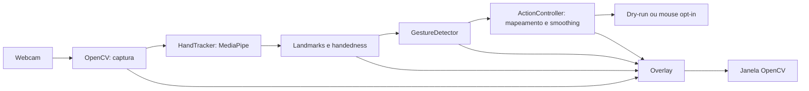

# Plano de implementação — HGI

## 1. Escopo e autorização

Fonte de requisitos: [AGENTS.md](../AGENTS.md). O HGI será uma aplicação local
de visão computacional para uma mão, com cursor suavizado, clique por pinça e
overlay de debug. Usará um detector pronto e regras geométricas explicáveis.

Este documento foi criado na **Fase 0**, sem implementação. O usuário autorizou
posteriormente a **Fase 1 — bootstrap** e a **Fase 2 — matemática e smoothing**,
registradas nas seções 9 e 10. As fases 3–10 continuam propostas, sem autorização.
Não houve download de modelo, abertura de webcam, automação ou publicação.

O MVP inclui dry-run padrão, controle real opt-in, landmarks, handedness quando
disponível, dedos estendidos, movimento, pinça, histerese, confirmação, cooldown
e encerramento limpo. Volume, mídia, calibração, FPS e persistência ficam para
depois da validação do MVP. Não haverá treinamento, backend, banco ou API OpenAI.

## 2. Inspeção inicial

Evidências coletadas em 29/09/2026:

| Item | Estado observado |
|---|---|
| Arquivos do projeto | `AGENTS.md` e `.gitignore`; sem código, testes ou manifestos |
| Orientações locais | `AGENTS.md` lido; estrutura, segurança e fases já definidas |
| Diretórios auxiliares | `.agents/` e `.codex/` vazios; `.aws/` e `.git/` presentes |
| Git | Branch `mais`, sem commits; arquivos existentes ainda não versionados |
| Python | 3.11.16; ambiente Conda `hgi` |
| Interpretador | `/home/syl/miniconda3/envs/hgi/bin/python` |
| Sistema | Linux x86_64, kernel 6.8.0-90-generic; sessão X11 |
| Webcam | Nenhum `/dev/video*` visível nesta sessão; acesso real não testado |
| ECC | Bundle 2.2.2 disponível; nenhuma instalação adicional necessária |

Metadados de pacotes instalados: `opencv-python` e `opencv-contrib-python`
5.0.0.93; `mediapipe` 1.0.1; `numpy` 2.4.6; `PyAutoGUI` 0.9.54;
`pytest` 9.1.1; `pytest-cov` 7.1.0; `ruff` 0.16.9.
`python -B -m pip check` passou, mas não prova compatibilidade binária, importação
das bibliotecas, GUI ou funcionamento do hardware. Essas versões são inventário,
não a seleção final de dependências. Conteúdo de credenciais não foi inspecionado.

Não existem convenções de código ou histórico para reutilizar. A proposta segue
o `AGENTS.md`: módulos pequenos, nomes explícitos, type hints e funções puras.

## 3. Arquitetura proposta



| Módulo previsto em `src/hgi/` | Responsabilidade |
|---|---|
| `__init__.py`, `__main__.py` | Importação sem efeitos colaterais; entrypoint `python -m hgi` |
| `app.py` | CLI argparse, recursos, loop e encerramento; nenhuma regra geométrica |
| `config.py` | Parâmetros centralizados e validados; dry-run como padrão |
| `landmarks.py` | Representação simples dos 21 pontos, índices nomeados e handedness opcional |
| `geometry.py` | Distâncias, normalização por escala, mapeamento e clipping |
| `hand_tracker.py` | Adaptar frames e resultados MediaPipe; nunca executar ações |
| `gesture_detector.py` | Dedos, MOVE/IDLE/PINCH, confirmação e histerese |
| `smoothing.py` | Média exponencial e reset, sem dependência de hardware |
| `action_controller.py` | Alvo virtual, backend de mouse injetável e cooldown |
| `overlay.py` | Landmarks, mão, gesto, modo, alvo virtual e feedback de pinça |

Os módulos implementados na Fase 2 e seus contratos estão em
[ARCHITECTURE.md](ARCHITECTURE.md). `Point2D` e `Region2D` residem em `geometry.py`;
`landmarks.py` permanece proposto para a adaptação do tracker na Fase 3, onde
evitará índices mágicos e
acoplamento das regras à API externa. O backend PyAutoGUI poderá permanecer
pequeno no controlador, sem hierarquia de plugins. Imports de automação serão
adiados até `--control`; testes e dry-run usarão um backend sem efeitos reais.
Sem display, testes e imports devem funcionar; a janela exige uma sessão gráfica.

### Decisões para os primeiros incrementos

- Preferir Python 3.11 e validar instalação limpa antes de fixar versões.
  `pyproject.toml` será a referência; `requirements.txt` deverá ser consistente.
  Desenvolvimento terá pytest, pytest-cov e Ruff, sem ferramentas redundantes.
- Preferir Hand Landmarker da API Tasks, CPU, uma mão e modo VIDEO síncrono para
  manter o fluxo simples. Validar a API na versão escolhida antes da Fase 3.
  O modo VIDEO aceita frames de webcam com timestamps estritamente crescentes.
  Exige modelo local compatível; obtê-lo durante preparação, nunca no loop.
  Registrar origem, versão, licença e checksum real quando for adquirido.
- Não copiar exemplos de `mp.solutions.hands` sem comprovar compatibilidade.
  Handedness descreve lateralidade, não identidade persistente de uma mão.
- Converter BGR para RGB na fronteira do tracker. Preservar coordenadas
  normalizadas e corrigir a proporção largura/altura no cálculo de distâncias
  2D, para não distorcer a pinça em frames retangulares.
- Avaliar extensão dos dedos por ângulos e relações articulares; tratar o polegar
  separadamente. Validar rotações no plano e ambas as mãos; oclusão e rotação
  fora do plano continuam limitações a documentar.
- Propor referência de palma entre wrist e middle MCP. Rejeitar escala degenerada
  e pontos não finitos; não substituir resultados inválidos por gestos válidos.
- Mapear indicador da área útil da câmera para `0..largura-1` e `0..altura-1` da
  tela primária, com margem configurável e clipping. No dry-run, usar dimensões
  virtuais explícitas, sem depender do PyAutoGUI.
- Aplicar `previous + alpha * (current - previous)`, com `0 < alpha <= 1`;
  primeiro ponto inicializa o filtro. Resetar na perda de tracking/inatividade.
- MOVE exige indicador estendido, demais dedos longos recolhidos e ausência de
  pinça. Pinça tem prioridade. Usar thresholds `close < open`, confirmação de
  frames e relógio monotônico; emitir clique somente em OPEN → PINCHED confirmado.
- Pinça mantida não repete clique; gesto descartado por cooldown não é enfileirado.
  Após perda/troca de mão, bloquear cliques até abertura confirmada e iniciar
  novamente o smoothing, evitando cliques e saltos na reaquisição.
- Manter `FAILSAFE` e pausas de segurança. Fail-safe ou erro conhecido do backend
  desarma controle e mantém detecção em dry-run, com aviso; não rearmar sozinho.
  Erros inesperados encerram com limpeza, sem `except` genérico que os esconda.

## 4. Milestones e ordem de implementação

Ordem: **0 → 1 → 2 → 3 → 4 → 5 → 6 → 7 → gate da 8 → 9 → 10**.
A Fase 8 é adiada durante a entrega do MVP; só poderá iniciar depois da Fase 10
e dos testes manuais obrigatórios. Documentação acompanha cada fase, além do
fechamento na Fase 9. Não marcar milestone concluído com aceite manual pendente.

| Fase | Incremento e arquivos principais | Testes e verificações | Hardware e critério de aceite |
|---|---|---|---|
| 0 — plano | Somente `docs/IMPLEMENTATION_PLAN.md` | Revisar requisitos, fontes, riscos, escopo e diff; sem teste de aplicação | Sem hardware. Plano contém arquitetura, ordem, testes e aceites; demais arquivos preservados |
| 1 — bootstrap | Pacote/entrypoint, `pyproject.toml`, README mínimo e ajustes de ignore | `test_bootstrap.py`: importação silenciosa do pacote/entrypoint sem bibliotecas de hardware; execução com identificação. Compileall, pytest, Ruff e instalação limpa | Sem webcam. Pacote importável/instalável, testes passam e nenhuma captura automática; concluída no escopo autorizado, conforme seção 9 |
| 2 — geometria e smoothing | `geometry.py`, `smoothing.py`; pontos/regiões e parâmetros passados explicitamente, sem arquivo de configuração global | RED/GREEN: zero, 3-4-5, referência inválida, valores não finitos, dimensões fornecidas, limites, clipping, regiões inválidas, espelhamento, alpha inválido/limite 1, sequência previsível, reset e regressões de arredondamento | Concluída sem hardware: 142 testes novos, 144 no total e 100% de linhas/branches nos novos módulos; evidências na seção 10 |
| 3 — tracker e diagnóstico | `hand_tracker.py`, captura em `app.py`, desenho mínimo em `overlay.py`; preparação do modelo | `test_hand_tracker.py`/`test_app.py`: resultados sem mão/com mão, handedness ausente, BGR/RGB, timestamps, modelo ausente/inválido, câmera indisponível, leitura interrompida e limpeza com mocks. Manual: landmarks e saída com q/Esc | Webcam, modelo local e GUI. Mão/landmarks estáveis; câmera/tracker/janelas liberados em saída e exceção; falha de captura termina sem loop silencioso |
| 4 — dedos e gestos | `gesture_detector.py` e debug básico | Fixtures sintéticas: dedos, polegar, ambas as mãos, rotações, pinça invariável por escala, limiares inclusivos, faixa de histerese, ruído, N frames, abertura, prioridade e ausência de mão | Lógica sem webcam; validação visual exige câmera. Estados e transições previsíveis, sem usar coordenada vertical isolada como regra geral |
| 5 — cursor virtual | `action_controller.py` em dry-run, mapa/smoothing e alvo no overlay | `test_action_controller.py`: bordas, centro, clipping, margem, suavização, reset e ausência total de chamadas reais; simular tamanho de tela | Webcam/GUI para ergonomia. Alvo virtual suave e limitado; dry-run funciona sem carregar automação |
| 6 — mouse opt-in | Backend PyAutoGUI, `--control`, clique e cooldown | Backend falso/spy e relógio injetado: clique único mantido por muitos frames, reabertura/novo clique, cooldown antes/no limite/depois, evento descartado, perda/reaquisição, backend indisponível, fail-safe e nenhuma reativação automática | Webcam, display e permissões. Manual: MOVE, pinça única, novo clique após abertura, parada pelo fail-safe e q/Esc; fallback seguro verificável |
| 7 — overlay e ergonomia | Completar `overlay.py`, informações do modo/gesto/mão | Testar dados apresentados e modo efetivo após fallback com mocks; manual para legibilidade, feedback de pinça e instruções | Webcam/GUI. Uma pessoa entende o modo e a ação; sem excesso de métricas. FPS permanece opcional posterior |
| 8 — gate de extras | Volume/mídia e demais extras adiados | Nenhum teste ou código de extras durante o MVP; futura fase precisará de plano próprio e testes de backend degradável | Aceite do MVP é pré-requisito; indisponibilidade de mídia não poderá afetar mouse/detecção |
| 9 — documentação | README completo, arquitetura, testes, licença, assets, plano atualizado e instruções de demo | Reproduzir instalação em ambiente isolado e comandos do README; revisar links, gestos, matemática, histerese, segurança e limites por SO | Instalação sem câmera; execução completa exige hardware. Outra pessoa consegue instalar/executar seguindo só o README |
| 10 — QA do MVP | Correções necessárias, revisão final e evidências | Ruff, pytest, cobertura, compileall, revisão Python/segurança/diff e quality-gate estrito se disponível no harness; roteiro manual completo | MVP só pronto com verificações automatizadas e manuais aprovadas. Pendências de hardware serão registradas, nunca tratadas como PASS |

## 5. Processo ECC e estratégia de testes

Cada incremento seguirá planejar → teste RED → implementação mínima → GREEN →
revisão → verificação → documentação. Aplicar `tdd-workflow` à lógica testável;
a falha inicial deve provar comportamento ausente, não dependência quebrada.
Usar fixtures sintéticas próprias, spies e relógio injetado, sem `sleep` nos testes.
Registrar tarefa → teste → evidência RED/GREEN e cobertura no relatório da fase.
Quando Git estiver configurado para commits, preservar checkpoints locais
pequenos de teste/fix/refactor; não publicar ou alterar arquivos alheios à tarefa.

Aplicar as orientações de `python-reviewer` aos arquivos Python alterados:
interfaces tipadas, nomes/índices explícitos, recursos liberados, erros específicos,
funções pequenas e ausência de acoplamento entre visão e automação. Corrigir
CRITICAL/HIGH antes de avançar. Na Fase 0, não há Python para revisar ou testar.

`security-review` cobre entradas/configuração, origem do modelo, permissões,
privacidade e automação. A aplicação deverá operar localmente, sem salvar ou
transmitir frames e sem segredos; os testes nunca moverão mouse ou abrirão webcam
real por padrão. Não aplicar checklists de web/autenticação ao projeto local.

`verification-loop` será adaptado à stack Python. Comandos previstos após bootstrap:

```bash
python -m pip check
python -m compileall src
python -m ruff check .
python -m ruff format --check .
python -m pytest -q
python -m pytest --cov=hgi --cov-report=term-missing
git diff --check
git status --short
```

Cobertura total será informativa; exigir ≥80% por módulo de lógica pura
(`geometry`, `smoothing`, regras de gesto e lógica do controlador), sem cobertura
artificial de hardware. Selecionar esses módulos no pytest-cov para o gate,
ajustando a lista ao que já existe. Type checker adicional só será configurado
se houver necessidade concreta; Ruff não substitui checagem de tipos.
Usar `/quality-gate . --strict` no fechamento se disponível no harness atual;
a presença do comando no bundle não comprova sua exposição ao Codex.

Após cada milestone, relatar arquivos alterados, testes adicionados, comandos e
resultados reais, cobertura, limitações manuais e próxima fase permitida pela
autorização vigente. Verificar também arquivos novos: `git diff` não os inclui
enquanto não forem versionados. Na Fase 0, build/lint/testes de código são N/A.

## 6. Dependências externas e riscos técnicos

| Risco | Impacto e mitigação proposta |
|---|---|
| Webcam ausente/inacessível | Alto: nenhum dispositivo visível aqui. Validar no computador de demo na Fase 3; não afirmar que tracking foi aprovado com mocks |
| OpenCV duplicado | Alto: duas distribuições instaladas compartilham `cv2`. Preparar ambiente isolado com apenas uma distribuição com GUI; considerar dependência transitiva do MediaPipe antes de escolher python ou contrib |
| API/wheels MediaPipe e NumPy | Alto: versões do ambiente ainda não homologadas. Consultar fonte oficial, validar imports e modelo em instalação limpa; escolher versões compatíveis, não fixar por memória |
| Modelo externo | Alto: Tasks necessita arquivo compatível. Preparar download separado, origem oficial, licença/checksum e erro claro se ausente; execução offline após instalação |
| Linux Wayland/macOS/permissões | Alto: controle depende do SO; X11 atual não prova permissão. Dry-run deve continuar disponível; sem contornar proteção do sistema |
| Display ausente e monitor/DPI | Médio: janela precisa de GUI; PyAutoGUI orienta tela primária. Documentar limite, validar escala no host e não prometer múltiplos monitores |
| Pinça ruidosa/cliques acidentais | Alto: normalização, confirmação, histerese, clique por transição, cooldown e bloqueio até abertura após tracking perdido |
| Rotação, oclusão e espelhamento | Médio: testar ambas as mãos e proporção do frame; mostrar estado inválido/IDLE. Espelhamento deverá ser coerente com mão exibida e direção do cursor |
| Travamento de captura/encerramento | Alto: falha de leitura encerra; recursos em finally/context managers. Validar q/Esc com foco na janela e comportamento de exceções |
| Latência do detector/automação | Médio: CPU, uma mão, objetos reutilizados e resolução moderada; medir no host. Manter pausas/fail-safe e ajustar frequência de movimento se necessário, sem hacks |
| Instalação pouco reproduzível | Médio: ambiente Conda atual não é prova de portabilidade. Documentar caminho de venv, dependências consistentes e instalação limpa; não instalar globalmente |
| Escopo além do MVP | Médio: adiar extras até QA e evidências manuais; sem serviços remotos, captura persistente ou treinamento |

Webcam, display e permissões são dependências de integração, não dos testes de
lógica. O modelo poderá ser validado sem webcam com imagem sintética em memória;
isso comprova inicialização/inferência, não qualidade de tracking humano.
Falhas ou gates de hardware pendentes devem ficar explícitos; trabalho independente
de lógica pode ser preparado, sem declarar a fase de integração concluída.

## 7. Aceite final e próximos passos

- Instalação documentada reproduzida; pacote importável sem abrir hardware.
- Webcam e landmarks/handedness aprovados manualmente, com encerramento limpo.
- Dedos/gestos testados; movimento virtual suave e mapeamento limitado.
- Controle somente com `--control`; fail-safe preservado e falhas desarmam ações.
- Uma pinça mantida gera um clique; debounce, histerese, cooldown e reaquisição
  cobertos por testes determinísticos.
- Ruff e pytest passam; cobertura de lógica atende à meta; sem CRITICAL/HIGH.
- README explica arquitetura, matemática, limites de plataforma e demonstração.
- Sem segredos, chamadas OpenAI, transmissão ou gravação automática de webcam.
- Todos os itens da Definition of Done do `AGENTS.md` revisados com evidência.

O aceite da Fase 0 foi restrito ao documento. Após a matemática autorizada,
a próxima fase proposta é **Fase 3 — HandTracker**, que aguardará
instrução do usuário. O plano não libera testes reais de controle do computador
nem gravação de demo por conta própria.

## 8. Fontes consultadas e limites da pesquisa

- [Hand Landmarker — guia Python oficial](https://developers.google.cn/edge/mediapipe/solutions/vision/hand_landmarker/python): modelo local e modos de execução.
- [Hand Landmarker — implementação oficial](https://github.com/google-ai-edge/mediapipe/blob/master/mediapipe/tasks/python/vision/hand_landmarker.py): timestamps crescentes em VIDEO; referência de API, não validação da versão instalada.
- [OpenCV — instruções dos mantenedores](https://pypi.org/project/opencv-python/): instalar apenas uma distribuição no namespace `cv2`; GUI para a janela.
- [PyAutoGUI — documentação oficial](https://pyautogui.readthedocs.io/en/latest/index.html): tela primária, fail-safe e pausas de segurança.

As URLs diretas de guia/setup em `ai.google.dev` falharam na ferramenta de
consulta; foram usadas fontes oficiais alternativas para o Hand Landmarker.
Não foi homologada nesta fase uma matriz de versões/plataformas. Revalidar fontes
e APIs da versão selecionada durante bootstrap e integração, antes de implementar.

## 9. Evidências da Fase 1 — bootstrap

**Estado: concluída no escopo mínimo solicitado pelo usuário.** No encerramento
da Fase 1, a Fase 2 ainda não estava iniciada; sua execução posterior está na seção 10.

Arquivos criados: `pyproject.toml`, `README.md`, `src/hgi/__init__.py`,
`src/hgi/__main__.py` e `tests/test_bootstrap.py`. Arquivos modificados:
`.gitignore` e este plano. `AGENTS.md` foi preservado.

Decisões: layout `src`, setuptools, Python >=3.11, versão de desenvolvimento
`0.1.0.dev0`, runtime sem dependências e extra `dev` com pytest, pytest-cov e Ruff.
`pyproject.toml` é a declaração equivalente de dependências; não duplicar em
requirements nesta fase. Ruff usa regras E/F/I/UP/B e alvo py311. A cobertura de
subprocessos usa `patch = ["subprocess"]`, suportado pela versão de coverage
exigida pelo pytest-cov >=7. Não foram instaladas ferramentas adicionais.

O entrypoint imprime `HGI — Hand Gesture Interface` e termina. A importação do
pacote e de `hgi.__main__` é silenciosa; os testes confirmam ausência de imports
de cv2, MediaPipe, NumPy e PyAutoGUI em um processo sem display. `app.py`, flags
de hardware e configuração de gestos foram adiados para as fases correspondentes,
conforme o pedido de bootstrap mínimo. Licença/assets permanecem entregáveis
posteriores; esta entrega ainda não é o MVP.

| Garantia | Teste | Evidência RED → GREEN |
|---|---|---|
| Importação silenciosa, sem bibliotecas de hardware | `test_import_is_quiet_without_hardware_dependencies` | Falhou por ausência do pacote; passou após criar/instalar o HGI; ampliado para importação silenciosa do entrypoint |
| Execução identifica o projeto e encerra com código zero | `test_module_entrypoint_identifies_project` | Falhou por ausência do módulo; passou com o entrypoint mínimo |

Checkpoint RED local: `6b74a42`, com dois testes executados e falhando por ausência
da implementação. O checkpoint GREEN reúne a implementação e a evidência abaixo;
nenhum push foi feito. Não foi necessário refactor de código de produção.

| Comando/verificação executado | Resultado |
|---|---|
| `python -m pip install --no-deps --no-build-isolation --no-index -e .` | HGI registrado no Conda ativo; sem rede ou instalação de dependências externas |
| `python -m pytest -q` | 2 testes passaram após implementação |
| `python -m pytest -q --cov=hgi --cov-report=term-missing` | 2 passaram; 100% das 4 instruções e dos 2 ramos do bootstrap |
| `python -m ruff check .` | PASS após corrigir uma linha longa no teste |
| `python -m ruff format --check .` | PASS |
| `python -m hgi` | Identificação correta na raiz e em `/tmp`, sem PYTHONPATH manual |
| `python -m compileall src` | PASS |
| `python -B -m pip check` | Nenhum requisito quebrado |
| `python -m pip wheel --no-deps --no-build-isolation --no-index --wheel-dir /tmp/hgi-bootstrap-wheels .` | Wheel construída sem downloads |
| Instalação da wheel com `--no-index --no-deps` em venv temporário | Execução com `python -I -m hgi` e pip check passaram, sem pacotes de visão/automação |
| Revisão Python e segurança | Sem CRITICAL/HIGH; função pública tipada, sem imports de hardware, captura, rede, exceções ocultadas ou segredos nos arquivos alterados |
| `git diff --check` e revisão de arquivos novos | Sem problemas de whitespace ou alterações fora do escopo |

O `verification-loop` cobriu build, lint, testes/cobertura, segurança e diff.
Type checker dedicado não foi configurado; a interface mínima foi revisada
manualmente. A cobertura mede somente o bootstrap, não a lógica futura do HGI.

Problemas encontrados e situação final:

- OpenCV: `opencv-python` e `opencv-contrib-python` 5.0.0.93 continuam instalados;
  nenhuma variante headless. MediaPipe 1.0.1 depende de contrib. A correção futura
  proposta é manter apenas contrib e reparar seus arquivos após remover a outra
  distribuição, com autorização específica; nada foi removido/reinstalado agora.
- As versões de todas as dependências preexistentes foram conferidas e preservadas.
  Somente o pacote local HGI foi instalado. Não houve importação real de `cv2`
  para homologar o ambiente de visão.
- A primeira checagem Ruff encontrou E501, corrigido sem desativar a regra.
  Avisos iniciais de cobertura do processo pai foram resolvidos incluindo a
  garantia de importação silenciosa do entrypoint no teste; nenhum aviso suprimido.
- pip informou cache indisponível no sandbox, mas desabilitou esse cache e
  concluiu as operações; não houve mudança de permissões.
- Testes de hardware e permissões não se aplicam ao bootstrap. A webcam segue
  não homologada, e o conflito OpenCV deve ser resolvido antes da Fase 3.

Referências de configuração:
[setuptools](https://setuptools.pypa.io/en/latest/userguide/pyproject_config.html),
[pytest](https://docs.pytest.org/en/stable/reference/customize.html),
[Ruff](https://docs.astral.sh/ruff/configuration/) e
[cobertura de subprocessos](https://pytest-cov.readthedocs.io/en/latest/subprocess-support.html).

## 10. Evidências da Fase 2 — geometria, coordenadas e smoothing

**Estado: concluída. Fase 3 não iniciada. Nenhum acesso a hardware.**

Fonte das garantias: objetivos de geometria/EMA do usuário e Fase 2 deste plano.
Para cada grupo, testes foram escritos e executados antes da implementação.
Os RED iniciais foram erros de coleta pelo módulo/API ainda inexistente, não
falhas de dependências externas. Os testes de regressão tiveram RED em runtime.

| Grupo/garantia | Testes | RED real | GREEN real | Checkpoints locais |
|---|---|---|---|---|
| Pontos finitos/imutáveis, distância, razão por escala e clamp | `test_geometry.py` | 1 erro de coleta: `hgi.geometry` inexistente | 36 passaram | `02df5b7` → `6b41f35` |
| Conversões, regiões, margens, limites e espelhamento | `test_coordinates.py` | 1 erro de coleta: `Region2D` inexistente | 80 passaram; 116 com o primeiro grupo | `310d57b` → `2dabc64` |
| EMA em X/Y, alpha, primeiro ponto, reset e instâncias independentes | `test_smoothing.py` | 1 erro de coleta: `hgi.smoothing` inexistente | 21 passaram | `94f2499` → `d0ce052` |
| Clamp após aritmética e eixos EMA estacionários | Coordenadas + smoothing | 5 falhas, 101 passaram; violações de limites e deriva por arredondamento | 106 passaram | `310586f` → `87f935d` |

Comandos dos ciclos: `python -m pytest -q tests/test_geometry.py`, depois
`python -m pytest -q tests/test_coordinates.py`, depois
`python -m pytest -q tests/test_smoothing.py`. No fechamento das transformações,
geometria e coordenadas foram verificadas juntas. Nas regressões, executar
`python -m pytest -q tests/test_coordinates.py tests/test_smoothing.py` reproduziu
as cinco falhas e comprovou o GREEN após a correção.

Arquivos criados: `src/hgi/geometry.py`, `src/hgi/smoothing.py`,
`tests/test_geometry.py`, `tests/test_coordinates.py`, `tests/test_smoothing.py`
e `docs/ARCHITECTURE.md`. Modificados: README e este plano. Entry point,
`AGENTS.md`, dependências e configurações de ferramentas foram preservados.

Decisões matemáticas e de escopo:

- Pontos e regiões são dataclasses imutáveis pequenas, sem hierarquia de unidades.
  Todos os pontos/regiões envolvidos numa operação devem compartilhar a unidade.
  Coordenadas negativas são válidas; NaN e infinito são rejeitados.
- Pixels usam `0..dimensão−1`, com subpixels e clipping. Centro de 1920×1080:
  `(959.5, 539.5)`. Dimensões devem ser inteiros positivos, sem bool. Eixo de um
  pixel tem posição 0 e inversa normalizada canônica 0.
- Região útil é um retângulo fornecido explicitamente; clipping precede a
  normalização e o espelhamento relativo à região. Não há consulta ao monitor.
- Distância normalizada divide pela referência positiva na mesma unidade;
  é invariante sob escala uniforme. Distâncias físicas em frames retangulares
  deverão usar conversão por eixo antes da comparação, conforme arquitetura.
- Alpha é fornecido ao construtor e somente leitura, com `0 < alpha <= 1`.
  Estado contém apenas o fator e o último ponto. Primeiro ponto passa intacto;
  reset descarta o histórico. A regra é por chamada, sem compensação de FPS.
- Forma ponderada do EMA evita subtração com overflow. Eixos estacionários são
  preservados exatamente. Conversão reaplica clamp após multiplicação para
  conter arredondamento além da borda, mesmo com dimensões numéricas grandes.
- `landmarks.py` e configuração de hardware continuam adiados: as funções puras
  e o construtor recebem os parâmetros necessários, evitando arquivos/camadas
  sem uso nesta fase. Não foram implementados ângulos, gestos ou tracking.

Fechamento do `verification-loop` e revisão `python-reviewer`:

| Verificação executada | Resultado |
|---|---|
| `python -m pytest -q` | 144 passaram: 142 novos e 2 de bootstrap |
| `python -m pytest --cov=hgi --cov-report=term-missing` | 100% total; geometry: 59 instruções/16 branches; smoothing: 22 instruções/6 branches, todos cobertos |
| `python -m ruff check .` | PASS |
| `python -m ruff format --check .` | PASS |
| `python -m compileall src` | PASS |
| `python -m pip check` | Nenhum requisito quebrado; aviso de cache indisponível do sandbox, sem falha |
| Execução matemática via `python -I -S -B` com src explícito | PASS sem site-packages; nenhum import de cv2, MediaPipe, NumPy ou PyAutoGUI |
| Inspeção AST dos imports dos novos módulos | Somente dataclasses/math e hgi.geometry |
| Revisão de código Python | Tipagem/docstrings públicas, estado mínimo, erros explícitos e bordas revisados; sem CRITICAL/HIGH pendente |
| `git diff --check` e revisão do diff da fase | Sem problemas de whitespace ou arquivos fora do escopo |

Mypy/Pyright não estão instalados; revisão de tipos foi manual, sem acrescentar
ferramentas. Nenhum teste foi desativado. Cobertura de 100% não comprova integração
de hardware; esta fase não requer teste manual com dispositivo.

Problemas corrigidos: E501/formatação de uma condição longa; classificação
temporária de import pelo Ruff enquanto smoothing.py ainda não existia; os dois
casos numéricos acima, reproduzidos por cinco testes antes da correção. Nenhuma
regra ou aviso foi desativado para obter PASS.

Limitações registradas: unidade dos pontos depende do chamador; floats têm
precisão/faixa limitadas; alpha é por atualização, não por segundo. Espelhamento
da imagem e handedness precisarão de coerência na futura integração. O conflito
OpenCV registrado anteriormente permanece pendente para a fase de hardware;
nenhum pacote foi instalado, removido, reinstalado ou importado para visão nesta fase.
Os checkpoints pertencem à branch `mais` e serão mantidos; não houve push.
Próxima fase recomendada: Fase 3, somente após instrução do usuário e preparação
do ambiente/modelo e dos testes manuais correspondentes.
