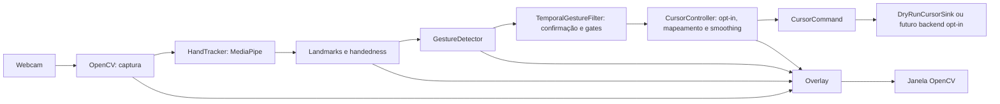

# Plano de implementação — HGI

## 1. Escopo e autorização

Fonte de requisitos: [AGENTS.md](../AGENTS.md). O HGI é uma aplicação local
de visão computacional para uma mão, com cursor suavizado, clique por pinça e
overlay de debug. Usará um detector pronto e regras geométricas explicáveis.

Este documento foi criado na **Fase 0**. As Fases 1–8 foram implementadas
conforme as autorizações posteriores do usuário, com evidências nas seções 9–16.
A autorização atual é somente a **Fase 9 — polimento técnico, documentação e
preparação para portfólio**, registrada na seção 17. A numeração vigente segue
esses pedidos: Fase 6 temporalidade, Fase 7 integração visual e Fase 8 backend
real. Não corresponde à sequência original de extras do AGENTS.md.
Aceites com webcam e mouse humano continuam pendentes. Não há autorização para
novas funcionalidades, tag, push ou publicação de release nesta fase.

O MVP inclui dry-run padrão, controle real opt-in, landmarks, handedness quando
disponível, dedos estendidos, movimento, pinça, histerese, confirmação, cooldown
e encerramento limpo. Volume, mídia, calibração e persistência ficam para
depois da validação do MVP. FPS observável foi autorizado na Fase 7.
Não haverá treinamento, backend, banco ou API OpenAI.

## 2. Inspeção inicial

Evidências coletadas em 29/09/2026:

| Item | Estado observado |
|---|---|
| Arquivos do projeto | `AGENTS.md` e `.gitignore`; sem código, testes ou manifestos |
| Orientações locais | `AGENTS.md` lido; estrutura, segurança e fases já definidas |
| Diretórios auxiliares | `.agents/` e `.codex/` vazios; `.aws/` e `.git/` presentes |
| Git | Branch `mais`, sem commits; arquivos existentes ainda não versionados |
| Python | 3.11.16; ambiente Conda `hgi` |
| Interpretador | `/home/syl/miniconda3/envs/hgi/bin/python` |
| Sistema | Linux x86_64, kernel 6.8.0-90-generic; sessão X11 |
| Webcam | Nenhum `/dev/video*` visível nesta sessão; acesso real não testado |
| ECC | Bundle 2.2.2 disponível; nenhuma instalação adicional necessária |

Metadados de pacotes instalados: `opencv-python` e `opencv-contrib-python`
5.0.0.93; `mediapipe` 1.0.1; `numpy` 2.4.6; `PyAutoGUI` 0.9.54;
`pytest` 9.1.1; `pytest-cov` 7.1.0; `ruff` 0.16.9.
`python -B -m pip check` passou, mas não prova compatibilidade binária, importação
das bibliotecas, GUI ou funcionamento do hardware. Essas versões são inventário,
não a seleção final de dependências. Conteúdo de credenciais não foi inspecionado.

Não existem convenções de código ou histórico para reutilizar. A proposta segue
o `AGENTS.md`: módulos pequenos, nomes explícitos, type hints e funções puras.

## 3. Arquitetura proposta



| Módulo previsto em `src/hgi/` | Responsabilidade |
|---|---|
| `__init__.py`, `__main__.py` | Importação sem efeitos colaterais; entrypoint `python -m hgi` |
| `app.py` | CLI argparse, recursos, loop e encerramento; nenhuma regra geométrica |
| `config.py` | Parâmetros centralizados e validados; dry-run como padrão |
| `hand_landmarks.py` | Representação própria dos 21 pontos XYZ, índices oficiais e handedness/score opcionais |
| `geometry.py` | Distâncias, normalização por escala, mapeamento e clipping |
| `hand_tracker.py` | Adaptar frames e resultados MediaPipe; nunca executar ações |
| `finger_state.py` | Configuração imutável, dedos nomeados e medidas geométricas da mão |
| `gesture_detector.py` | Rótulo bruto, pose dos dedos e razão de pinça por chamada; stateless |
| `temporal.py` | Duração de estabilização, histerese, rearmamento, cooldown e grace period com clock injetável |
| `smoothing.py` | Média exponencial e reset, sem dependência de hardware |
| `cursor.py` | Intenções tipadas MOVE/CLICK/NONE, Protocol de saída e sink dry-run em memória |
| `cursor_controller.py` | Opt-in explícito, configuração imutável, alvo virtual, mapeamento e EMA |
| `action_controller.py` | Futuro backend real e fail-safe; exige autorização própria; proteção temporal já isolada |
| `overlay.py` | Landmarks, mão, gesto, modo, alvo virtual e feedback de pinça |

Os módulos implementados na Fase 2 e seus contratos estão em
[ARCHITECTURE.md](ARCHITECTURE.md). `Point2D` e `Region2D` residem em `geometry.py`;
`hand_landmarks.py` foi implementado na Fase 3, seguindo o nome solicitado pelo
usuário, e evita índices mágicos e acoplamento das regras à API externa.
O backend PyAutoGUI poderá permanecer
pequeno no controlador, sem hierarquia de plugins. Imports de automação serão
adiados até `--control`; testes e dry-run usarão um backend sem efeitos reais.
Sem display, testes e imports devem funcionar; a janela exige uma sessão gráfica.

### Decisões para os primeiros incrementos

- Preferir Python 3.11 e validar instalação limpa antes de fixar versões.
  `pyproject.toml` será a referência; `requirements.txt` deverá ser consistente.
  Desenvolvimento terá pytest, pytest-cov e Ruff, sem ferramentas redundantes.
- Usar Hand Landmarker da API Tasks, CPU, uma mão por padrão e **IMAGE** síncrono
  na Fase 3, para processar um frame sem timestamps ou estado temporal. A API foi
  confirmada na versão instalada 1.0.1. A proposta anterior de VIDEO fica para
  futura integração de vídeo; esse modo exige timestamps crescentes. Exigir modelo
  local compatível, preparado explicitamente, nunca adquirido no runtime.
  Origem, versão, licença indicada pela model card e checksum estão em MODELS.md.
- Não copiar exemplos de `mp.solutions.hands` sem comprovar compatibilidade.
  Handedness descreve lateralidade, não identidade persistente de uma mão.
- Converter BGR para RGB na futura captura, antes da chamada ao tracker, cuja
  entrada nesta fase é estritamente RGB. Preservar coordenadas
  normalizadas e corrigir a proporção largura/altura no cálculo de distâncias
  2D, para não distorcer a pinça em frames retangulares.
- Na Fase 4, avaliar extensão por razão chord/path da cadeia articular e distância
  relativa ao punho; tratar o polegar separadamente por abertura da base do indicador.
  A proposta de ângulos individuais foi simplificada; relações/distâncias 2D
  favorecem leitura e testes. Rotações no plano e ambas as mãos têm testes;
  oclusão e rotação fora do plano permanecem limitações.
- Propor referência de palma entre wrist e middle MCP. Rejeitar escala degenerada
  e pontos não finitos; não substituir resultados inválidos por gestos válidos.
- Mapear indicador da área útil da câmera para `0..largura-1` e `0..altura-1` da
  tela primária, com margem configurável e clipping. No dry-run, usar dimensões
  virtuais explícitas, sem depender do PyAutoGUI.
- Aplicar `previous + alpha * (current - previous)`, com `0 < alpha <= 1`;
  primeiro ponto inicializa o filtro. Resetar na perda de tracking/inatividade.
- MOVE exige POINT estável, somente indicador estendido e ausência de pinça.
  A Fase 6 adotou confirmação por duração (80 ms), thresholds 0.25 < 0.32,
  cooldown de 300 ms e relógio injetável; nenhum contador de frames adicional.
- Pinça mantida não repete clique; gesto descartado por cooldown não é enfileirado.
  Após perda longa (150 ms desde a primeira ausência), bloquear cliques até
  abertura confirmada e reiniciar smoothing. Ausência breve preserva interação.
  Troca de mão sem ausência exige reset explícito; não há identificação persistente.
- Começar DISABLED. enable permite somente intenções virtuais; disable/reset
  limpam a sessão e não emitem comandos. Erros desabilitam e propagam a causa.
- Manter `FAILSAFE` e pausas de segurança. Fail-safe ou erro conhecido do backend
  desarma controle e mantém detecção em dry-run, com aviso; não rearmar sozinho.
  Erros inesperados encerram com limpeza, sem `except` genérico que os esconda.

## 4. Milestones e ordem de implementação

Ordem: **0 → 1 → 2 → 3 → 4 → 5 → 6 → 7 → gate da 8 → 9 → 10**.
A Fase 8 é adiada durante a entrega do MVP; só poderá iniciar depois da Fase 10
e dos testes manuais obrigatórios. Documentação acompanha cada fase, além do
fechamento na Fase 9. Não marcar milestone concluído com aceite manual pendente.
O backend real originalmente previsto na Fase 6 foi adiado pelo pedido atual;
exigirá um incremento com autorização e plano próprios antes do aceite final
do MVP. A Fase 7 proposta não autoriza automação implicitamente.

| Fase | Incremento e arquivos principais | Testes e verificações | Hardware e critério de aceite |
|---|---|---|---|
| 0 — plano | Somente `docs/IMPLEMENTATION_PLAN.md` | Revisar requisitos, fontes, riscos, escopo e diff; sem teste de aplicação | Sem hardware. Plano contém arquitetura, ordem, testes e aceites; demais arquivos preservados |
| 1 — bootstrap | Pacote/entrypoint, `pyproject.toml`, README mínimo e ajustes de ignore | `test_bootstrap.py`: importação silenciosa do pacote/entrypoint sem bibliotecas de hardware; execução com identificação. Compileall, pytest, Ruff e instalação limpa | Sem webcam. Pacote importável/instalável, testes passam e nenhuma captura automática; concluída no escopo autorizado, conforme seção 9 |
| 2 — geometria e smoothing | `geometry.py`, `smoothing.py`; pontos/regiões e parâmetros passados explicitamente, sem arquivo de configuração global | RED/GREEN: zero, 3-4-5, referência inválida, valores não finitos, dimensões fornecidas, limites, clipping, regiões inválidas, espelhamento, alpha inválido/limite 1, sequência previsível, reset e regressões de arredondamento | Concluída sem hardware: 142 testes novos, 144 no total e 100% de linhas/branches nos novos módulos; evidências na seção 10 |
| 3 — adaptador HandTracker | `hand_tracker.py`, `hand_landmarks.py`; modelo local documentado, sem loop de captura/overlay | TDD: conversão, handedness, nenhuma mão, 21 pontos, frame RGB, configuração, erros e limpeza; smoke com modelo real e arrays sintéticos | Concluída no escopo atualizado pelo usuário, conforme seção 11. Sem webcam/GUI obrigatórias; tracking humano e diagnóstico visual manual permanecem pendentes |
| 4 — dedos e gestos | `finger_state.py`, `gesture_detector.py`; somente interpretação por mão | Fixtures sintéticas: estados nomeados, Left/Right, rotações, proporção, pinça/escalas/limite inclusivo, degenerações, prioridade e ausência; sem temporalidade | Concluída no escopo atualizado pelo usuário, seção 12. Nenhum hardware; calibração e validação visual permanecem pendentes |
| 5 — cursor virtual | `cursor.py`, `cursor_controller.py`, comandos em memória e demo sintética; sem overlay ou captura | `test_cursor.py`, `test_cursor_controller.py`: dados/sink, centro, clipping, região, espelhamento, resoluções, EMA, reset, inatividade e clique lógico por transição | Concluída no escopo atualizado pelo usuário, seção 13. Sem hardware; alvo limitado e suave, saída inspecionável; ergonomia visual pendente |
| 6 — temporal e opt-in lógico | `temporal.py`, observações do detector e gates do CursorController; somente sink dry-run | Clock falso: confirmação, histerese, rearmamento, cooldown inclusivo/sem fila, perda curta/longa, enable/disable/reset e falhas que desabilitam | Concluída no escopo atualizado pelo usuário, seção 14. Sem hardware/automação; backend real e fail-safe ainda pendentes |
| 7 — integração visual dry-run | `camera.py`, `webcam.py`, `overlay.py`, demo e observabilidade pública limitada | 48 testes novos sem hardware; captura/cor/RGB, seleção, overlay, temporalidade, teclas, falhas/limpeza e CLI | Implementada, com aceite manual pendente: sem /dev/video*. FPS simples autorizado. Exclusivamente DryRunCursorSink; evidências na seção 15 |
| 8 — gate de extras | Volume/mídia e demais extras adiados | Nenhum teste ou código de extras durante o MVP; futura fase precisará de plano próprio e testes de backend degradável | Aceite do MVP é pré-requisito; indisponibilidade de mídia não poderá afetar mouse/detecção |
| 9 — documentação | README completo, arquitetura, testes, licença, assets, plano atualizado e instruções de demo | Reproduzir instalação em ambiente isolado e comandos do README; revisar links, gestos, matemática, histerese, segurança e limites por SO | Instalação sem câmera; execução completa exige hardware. Outra pessoa consegue instalar/executar seguindo só o README |
| 10 — QA do MVP | Correções necessárias, revisão final e evidências | Ruff, pytest, cobertura, compileall, revisão Python/segurança/diff e quality-gate estrito se disponível no harness; roteiro manual completo | MVP só pronto com verificações automatizadas e manuais aprovadas. Pendências de hardware serão registradas, nunca tratadas como PASS |

## 5. Processo ECC e estratégia de testes

Cada incremento seguirá planejar → teste RED → implementação mínima → GREEN →
revisão → verificação → documentação. Aplicar `tdd-workflow` à lógica testável;
a falha inicial deve provar comportamento ausente, não dependência quebrada.
Usar fixtures sintéticas próprias, spies e relógio injetado, sem `sleep` nos testes.
Registrar tarefa → teste → evidência RED/GREEN e cobertura no relatório da fase.
Quando Git estiver configurado para commits, preservar checkpoints locais
pequenos de teste/fix/refactor; não publicar ou alterar arquivos alheios à tarefa.

Aplicar as orientações de `python-reviewer` aos arquivos Python alterados:
interfaces tipadas, nomes/índices explícitos, recursos liberados, erros específicos,
funções pequenas e ausência de acoplamento entre visão e automação. Corrigir
CRITICAL/HIGH antes de avançar. Na Fase 0, não há Python para revisar ou testar.

`security-review` cobre entradas/configuração, origem do modelo, permissões,
privacidade e automação. A aplicação deverá operar localmente, sem salvar ou
transmitir frames e sem segredos; os testes nunca moverão mouse ou abrirão webcam
real por padrão. Não aplicar checklists de web/autenticação ao projeto local.

`verification-loop` será adaptado à stack Python. Comandos previstos após bootstrap:

```bash
python -m pip check
python -m compileall src
python -m ruff check .
python -m ruff format --check .
python -m pytest -q
python -m pytest --cov=hgi --cov-report=term-missing
git diff --check
git status --short
```

Cobertura total será informativa; exigir ≥80% por módulo de lógica pura
(`geometry`, `smoothing`, regras de gesto e lógica do controlador), sem cobertura
artificial de hardware. Selecionar esses módulos no pytest-cov para o gate,
ajustando a lista ao que já existe. Type checker adicional só será configurado
se houver necessidade concreta; Ruff não substitui checagem de tipos.
Usar `/quality-gate . --strict` no fechamento se disponível no harness atual;
a presença do comando no bundle não comprova sua exposição ao Codex.

Após cada milestone, relatar arquivos alterados, testes adicionados, comandos e
resultados reais, cobertura, limitações manuais e próxima fase permitida pela
autorização vigente. Verificar também arquivos novos: `git diff` não os inclui
enquanto não forem versionados. Na Fase 0, build/lint/testes de código são N/A.

## 6. Dependências externas e riscos técnicos

| Risco | Impacto e mitigação proposta |
|---|---|
| Webcam ausente/inacessível | Alto: nenhum dispositivo visível aqui. Validar no computador de demo na Fase 3; não afirmar que tracking foi aprovado com mocks |
| OpenCV duplicado | Alto: duas distribuições instaladas compartilham `cv2`. Preparar ambiente isolado com apenas uma distribuição com GUI; considerar dependência transitiva do MediaPipe antes de escolher python ou contrib |
| API/wheels MediaPipe e NumPy | Alto: versões do ambiente ainda não homologadas. Consultar fonte oficial, validar imports e modelo em instalação limpa; escolher versões compatíveis, não fixar por memória |
| Modelo externo | Alto: Tasks necessita arquivo compatível. Preparar download separado, origem oficial, licença/checksum e erro claro se ausente; execução offline após instalação |
| Linux Wayland/macOS/permissões | Alto: controle depende do SO; X11 atual não prova permissão. Dry-run deve continuar disponível; sem contornar proteção do sistema |
| Display ausente e monitor/DPI | Médio: janela precisa de GUI; PyAutoGUI orienta tela primária. Documentar limite, validar escala no host e não prometer múltiplos monitores |
| Pinça ruidosa/cliques acidentais | Alto: normalização, confirmação, histerese, clique por transição, cooldown e bloqueio até abertura após tracking perdido |
| Rotação, oclusão e espelhamento | Médio: testar ambas as mãos e proporção do frame; mostrar estado inválido/IDLE. Espelhamento deverá ser coerente com mão exibida e direção do cursor |
| Travamento de captura/encerramento | Alto: falha de leitura encerra; recursos em finally/context managers. Validar q/Esc com foco na janela e comportamento de exceções |
| Latência do detector/automação | Médio: CPU, uma mão, objetos reutilizados e resolução moderada; medir no host. Manter pausas/fail-safe e ajustar frequência de movimento se necessário, sem hacks |
| Instalação pouco reproduzível | Médio: ambiente Conda atual não é prova de portabilidade. Documentar caminho de venv, dependências consistentes e instalação limpa; não instalar globalmente |
| Escopo além do MVP | Médio: adiar extras até QA e evidências manuais; sem serviços remotos, captura persistente ou treinamento |

Webcam, display e permissões são dependências de integração, não dos testes de
lógica. O modelo poderá ser validado sem webcam com imagem sintética em memória;
isso comprova inicialização/inferência, não qualidade de tracking humano.
Falhas ou gates de hardware pendentes devem ficar explícitos; trabalho independente
de lógica pode ser preparado, sem declarar a fase de integração concluída.

## 7. Aceite final e próximos passos

- Instalação documentada reproduzida; pacote importável sem abrir hardware.
- Webcam e landmarks/handedness aprovados manualmente, com encerramento limpo.
- Dedos/gestos testados; movimento virtual suave e mapeamento limitado.
- Controle somente com `--control`; fail-safe preservado e falhas desarmam ações.
- Uma pinça mantida gera um clique; debounce, histerese, cooldown e reaquisição
  cobertos por testes determinísticos.
- Ruff e pytest passam; cobertura de lógica atende à meta; sem CRITICAL/HIGH.
- README explica arquitetura, matemática, limites de plataforma e demonstração.
- Sem segredos, chamadas OpenAI, transmissão ou gravação automática de webcam.
- Todos os itens da Definition of Done do `AGENTS.md` revisados com evidência.

O aceite da Fase 0 foi restrito ao documento. A **Fase 7 — integração visual em
dry-run** foi autorizada posteriormente e está registrada na seção 15. A validação
visual do tracker ainda exige câmera. O plano não libera testes reais de controle do computador
nem gravação de demo por conta própria.

## 8. Fontes consultadas e limites da pesquisa

- [Hand Landmarker — guia Python oficial](https://developers.google.cn/edge/mediapipe/solutions/vision/hand_landmarker/python): modelo local e modos de execução.
- [Hand Landmarker — implementação oficial](https://github.com/google-ai-edge/mediapipe/blob/master/mediapipe/tasks/python/vision/hand_landmarker.py): timestamps crescentes em VIDEO; referência de API, não validação da versão instalada.
- [OpenCV — instruções dos mantenedores](https://pypi.org/project/opencv-python/): instalar apenas uma distribuição no namespace `cv2`; GUI para a janela.
- [PyAutoGUI — documentação oficial](https://pyautogui.readthedocs.io/en/latest/index.html): tela primária, fail-safe e pausas de segurança.

As URLs diretas de guia/setup em `ai.google.dev` falharam na ferramenta de
consulta; foram usadas fontes oficiais alternativas para o Hand Landmarker.
Não foi homologada nesta fase uma matriz de versões/plataformas. Revalidar fontes
e APIs da versão selecionada durante bootstrap e integração, antes de implementar.

## 9. Evidências da Fase 1 — bootstrap

**Estado: concluída no escopo mínimo solicitado pelo usuário.** No encerramento
da Fase 1, a Fase 2 ainda não estava iniciada; sua execução posterior está na seção 10.

Arquivos criados: `pyproject.toml`, `README.md`, `src/hgi/__init__.py`,
`src/hgi/__main__.py` e `tests/test_bootstrap.py`. Arquivos modificados:
`.gitignore` e este plano. `AGENTS.md` foi preservado.

Decisões: layout `src`, setuptools, Python >=3.11, versão de desenvolvimento
`0.1.0.dev0`, runtime sem dependências e extra `dev` com pytest, pytest-cov e Ruff.
`pyproject.toml` é a declaração equivalente de dependências; não duplicar em
requirements nesta fase. Ruff usa regras E/F/I/UP/B e alvo py311. A cobertura de
subprocessos usa `patch = ["subprocess"]`, suportado pela versão de coverage
exigida pelo pytest-cov >=7. Não foram instaladas ferramentas adicionais.

O entrypoint imprime `HGI — Hand Gesture Interface` e termina. A importação do
pacote e de `hgi.__main__` é silenciosa; os testes confirmam ausência de imports
de cv2, MediaPipe, NumPy e PyAutoGUI em um processo sem display. `app.py`, flags
de hardware e configuração de gestos foram adiados para as fases correspondentes,
conforme o pedido de bootstrap mínimo. Licença/assets permanecem entregáveis
posteriores; esta entrega ainda não é o MVP.

| Garantia | Teste | Evidência RED → GREEN |
|---|---|---|
| Importação silenciosa, sem bibliotecas de hardware | `test_import_is_quiet_without_hardware_dependencies` | Falhou por ausência do pacote; passou após criar/instalar o HGI; ampliado para importação silenciosa do entrypoint |
| Execução identifica o projeto e encerra com código zero | `test_module_entrypoint_identifies_project` | Falhou por ausência do módulo; passou com o entrypoint mínimo |

Checkpoint RED local: `6b74a42`, com dois testes executados e falhando por ausência
da implementação. O checkpoint GREEN reúne a implementação e a evidência abaixo;
nenhum push foi feito. Não foi necessário refactor de código de produção.

| Comando/verificação executado | Resultado |
|---|---|
| `python -m pip install --no-deps --no-build-isolation --no-index -e .` | HGI registrado no Conda ativo; sem rede ou instalação de dependências externas |
| `python -m pytest -q` | 2 testes passaram após implementação |
| `python -m pytest -q --cov=hgi --cov-report=term-missing` | 2 passaram; 100% das 4 instruções e dos 2 ramos do bootstrap |
| `python -m ruff check .` | PASS após corrigir uma linha longa no teste |
| `python -m ruff format --check .` | PASS |
| `python -m hgi` | Identificação correta na raiz e em `/tmp`, sem PYTHONPATH manual |
| `python -m compileall src` | PASS |
| `python -B -m pip check` | Nenhum requisito quebrado |
| `python -m pip wheel --no-deps --no-build-isolation --no-index --wheel-dir /tmp/hgi-bootstrap-wheels .` | Wheel construída sem downloads |
| Instalação da wheel com `--no-index --no-deps` em venv temporário | Execução com `python -I -m hgi` e pip check passaram, sem pacotes de visão/automação |
| Revisão Python e segurança | Sem CRITICAL/HIGH; função pública tipada, sem imports de hardware, captura, rede, exceções ocultadas ou segredos nos arquivos alterados |
| `git diff --check` e revisão de arquivos novos | Sem problemas de whitespace ou alterações fora do escopo |

O `verification-loop` cobriu build, lint, testes/cobertura, segurança e diff.
Type checker dedicado não foi configurado; a interface mínima foi revisada
manualmente. A cobertura mede somente o bootstrap, não a lógica futura do HGI.

Problemas encontrados e situação final:

- OpenCV: `opencv-python` e `opencv-contrib-python` 5.0.0.93 continuam instalados;
  nenhuma variante headless. MediaPipe 1.0.1 depende de contrib. A correção futura
  proposta é manter apenas contrib e reparar seus arquivos após remover a outra
  distribuição, com autorização específica; nada foi removido/reinstalado agora.
- As versões de todas as dependências preexistentes foram conferidas e preservadas.
  Somente o pacote local HGI foi instalado. Não houve importação real de `cv2`
  para homologar o ambiente de visão.
- A primeira checagem Ruff encontrou E501, corrigido sem desativar a regra.
  Avisos iniciais de cobertura do processo pai foram resolvidos incluindo a
  garantia de importação silenciosa do entrypoint no teste; nenhum aviso suprimido.
- pip informou cache indisponível no sandbox, mas desabilitou esse cache e
  concluiu as operações; não houve mudança de permissões.
- Testes de hardware e permissões não se aplicam ao bootstrap. A webcam segue
  não homologada, e o conflito OpenCV deve ser resolvido antes da Fase 3.

Referências de configuração:
[setuptools](https://setuptools.pypa.io/en/latest/userguide/pyproject_config.html),
[pytest](https://docs.pytest.org/en/stable/reference/customize.html),
[Ruff](https://docs.astral.sh/ruff/configuration/) e
[cobertura de subprocessos](https://pytest-cov.readthedocs.io/en/latest/subprocess-support.html).

## 10. Evidências da Fase 2 — geometria, coordenadas e smoothing

**Estado: concluída. Ao encerrar a Fase 2, a Fase 3 não estava iniciada.**
Sua execução posterior está na seção 11. Nenhum acesso a hardware na Fase 2.

Fonte das garantias: objetivos de geometria/EMA do usuário e Fase 2 deste plano.
Para cada grupo, testes foram escritos e executados antes da implementação.
Os RED iniciais foram erros de coleta pelo módulo/API ainda inexistente, não
falhas de dependências externas. Os testes de regressão tiveram RED em runtime.

| Grupo/garantia | Testes | RED real | GREEN real | Checkpoints locais |
|---|---|---|---|---|
| Pontos finitos/imutáveis, distância, razão por escala e clamp | `test_geometry.py` | 1 erro de coleta: `hgi.geometry` inexistente | 36 passaram | `02df5b7` → `6b41f35` |
| Conversões, regiões, margens, limites e espelhamento | `test_coordinates.py` | 1 erro de coleta: `Region2D` inexistente | 80 passaram; 116 com o primeiro grupo | `310d57b` → `2dabc64` |
| EMA em X/Y, alpha, primeiro ponto, reset e instâncias independentes | `test_smoothing.py` | 1 erro de coleta: `hgi.smoothing` inexistente | 21 passaram | `94f2499` → `d0ce052` |
| Clamp após aritmética e eixos EMA estacionários | Coordenadas + smoothing | 5 falhas, 101 passaram; violações de limites e deriva por arredondamento | 106 passaram | `310586f` → `87f935d` |

Comandos dos ciclos: `python -m pytest -q tests/test_geometry.py`, depois
`python -m pytest -q tests/test_coordinates.py`, depois
`python -m pytest -q tests/test_smoothing.py`. No fechamento das transformações,
geometria e coordenadas foram verificadas juntas. Nas regressões, executar
`python -m pytest -q tests/test_coordinates.py tests/test_smoothing.py` reproduziu
as cinco falhas e comprovou o GREEN após a correção.

Arquivos criados: `src/hgi/geometry.py`, `src/hgi/smoothing.py`,
`tests/test_geometry.py`, `tests/test_coordinates.py`, `tests/test_smoothing.py`
e `docs/ARCHITECTURE.md`. Modificados: README e este plano. Entry point,
`AGENTS.md`, dependências e configurações de ferramentas foram preservados.

Decisões matemáticas e de escopo:

- Pontos e regiões são dataclasses imutáveis pequenas, sem hierarquia de unidades.
  Todos os pontos/regiões envolvidos numa operação devem compartilhar a unidade.
  Coordenadas negativas são válidas; NaN e infinito são rejeitados.
- Pixels usam `0..dimensão−1`, com subpixels e clipping. Centro de 1920×1080:
  `(959.5, 539.5)`. Dimensões devem ser inteiros positivos, sem bool. Eixo de um
  pixel tem posição 0 e inversa normalizada canônica 0.
- Região útil é um retângulo fornecido explicitamente; clipping precede a
  normalização e o espelhamento relativo à região. Não há consulta ao monitor.
- Distância normalizada divide pela referência positiva na mesma unidade;
  é invariante sob escala uniforme. Distâncias físicas em frames retangulares
  deverão usar conversão por eixo antes da comparação, conforme arquitetura.
- Alpha é fornecido ao construtor e somente leitura, com `0 < alpha <= 1`.
  Estado contém apenas o fator e o último ponto. Primeiro ponto passa intacto;
  reset descarta o histórico. A regra é por chamada, sem compensação de FPS.
- Forma ponderada do EMA evita subtração com overflow. Eixos estacionários são
  preservados exatamente. Conversão reaplica clamp após multiplicação para
  conter arredondamento além da borda, mesmo com dimensões numéricas grandes.
- `landmarks.py` e configuração de hardware continuam adiados: as funções puras
  e o construtor recebem os parâmetros necessários, evitando arquivos/camadas
  sem uso nesta fase. Não foram implementados ângulos, gestos ou tracking.

Fechamento do `verification-loop` e revisão `python-reviewer`:

| Verificação executada | Resultado |
|---|---|
| `python -m pytest -q` | 144 passaram: 142 novos e 2 de bootstrap |
| `python -m pytest --cov=hgi --cov-report=term-missing` | 100% total; geometry: 59 instruções/16 branches; smoothing: 22 instruções/6 branches, todos cobertos |
| `python -m ruff check .` | PASS |
| `python -m ruff format --check .` | PASS |
| `python -m compileall src` | PASS |
| `python -m pip check` | Nenhum requisito quebrado; aviso de cache indisponível do sandbox, sem falha |
| Execução matemática via `python -I -S -B` com src explícito | PASS sem site-packages; nenhum import de cv2, MediaPipe, NumPy ou PyAutoGUI |
| Inspeção AST dos imports dos novos módulos | Somente dataclasses/math e hgi.geometry |
| Revisão de código Python | Tipagem/docstrings públicas, estado mínimo, erros explícitos e bordas revisados; sem CRITICAL/HIGH pendente |
| `git diff --check` e revisão do diff da fase | Sem problemas de whitespace ou arquivos fora do escopo |

Mypy/Pyright não estão instalados; revisão de tipos foi manual, sem acrescentar
ferramentas. Nenhum teste foi desativado. Cobertura de 100% não comprova integração
de hardware; esta fase não requer teste manual com dispositivo.

Problemas corrigidos: E501/formatação de uma condição longa; classificação
temporária de import pelo Ruff enquanto smoothing.py ainda não existia; os dois
casos numéricos acima, reproduzidos por cinco testes antes da correção. Nenhuma
regra ou aviso foi desativado para obter PASS.

Limitações registradas: unidade dos pontos depende do chamador; floats têm
precisão/faixa limitadas; alpha é por atualização, não por segundo. Espelhamento
da imagem e handedness precisarão de coerência na futura integração. O conflito
OpenCV registrado anteriormente permanece pendente para a fase de hardware;
nenhum pacote foi instalado, removido, reinstalado ou importado para visão nesta fase.
Os checkpoints pertencem à branch `mais` e serão mantidos; não houve push.
Próxima fase recomendada: Fase 3, somente após instrução do usuário e preparação
do ambiente/modelo e dos testes manuais correspondentes.

## 11. Evidências da Fase 3 — HandTracker / MediaPipe

**Estado: concluída no escopo de adaptador de um frame autorizado pelo usuário.**
O pedido desta fase substituiu o loop/captura/desenho obrigatórios da proposta
original por uma camada isolada e um smoke de webcam opcional. Não existe loop
de webcam, overlay, gestos, smoothing no pipeline ou controle do computador.
Tracking humano e diagnóstico visual permanecem sem aceite manual. Ao encerrar
a Fase 3, a Fase 4 não estava iniciada; sua execução posterior está na seção 12.

### Inspeção antes de qualquer alteração

AGENTS.md, este plano e ARCHITECTURE.md foram relidos integralmente. Git estava
limpo na branch `mais`, base `235d659`. Python 3.11.16, Conda `hgi`; MediaPipe
**1.0.1**, NumPy **2.4.6**; opencv-python e opencv-contrib-python **5.0.0.93**;
nenhuma variante headless. O import real do MediaPipe funcionou e confirmou
Tasks Vision, HandLandmarker/Options e modos IMAGE, VIDEO e LIVE_STREAM.

`documentation-lookup` foi aplicado com fontes oficiais porque Context7 não
estava exposto neste harness. O guia Python e overview oficiais consultados
estavam atualizados em 17/08/2026, após a publicação do pacote 1.0.1. A consulta
direta a ai.google.dev falhou; a fonte oficial developers.google.cn funcionou.
O tag remoto v1.0.1 não foi retornado pela ferramenta; a implementação e
docstrings **instaladas** foram inspecionadas para confirmar as assinaturas,
resultado, enum dos 21 índices, exceções, formato de imagem e fechamento.
Não foi usada a API legada mp.solutions.hands.

OpenCV compartilha cv2 entre duas distribuições, mas não bloqueou importação
nem a inferência IMAGE real. Nenhuma dependência foi instalada, atualizada,
reinstalada ou removida. A recomendação para manutenção posterior continua
manter apenas contrib, requerido pelo MediaPipe, e reparar os arquivos após
remoção de python; não executar essa correção por causa de um conflito apenas
potencial. Nenhum módulo HGI importa cv2 nesta fase.

### Implementação e contratos

Criados: `src/hgi/hand_landmarks.py`, `src/hgi/hand_tracker.py`,
`tests/test_hand_landmarks.py`, `tests/test_hand_tracker.py` e `docs/MODELS.md`.
Modificados: pyproject.toml, .gitignore, README, ARCHITECTURE.md e este plano.
AGENTS.md, entrypoint, geometria e smoothing foram preservados.

- IntEnum HandLandmark segue os 21 índices oficiais. NormalizedLandmark preserva
  XYZ finitos, inclusive previsões fora do frame. Z relativo não é métrico.
- DetectedHand guarda tuple imutável de exatamente 21 pontos e lateralidade/score
  opcionais. Score é de handedness, não de detecção ou de cada landmark.
- HandTracker recebe RGB uint8 H×W×3 com dimensões positivas; arruma contiguidade
  sem trocar canais ou modificar a entrada. BGR→RGB pertence à captura futura.
- Retorna tuple de mãos próprias do HGI; ausência é (). Apenas hand_tracker.py
  conhece tipos MediaPipe. MediaPipe é importado na construção, não pelo pacote
  ou modelo interno. Nenhum objeto externo escapa na saída.
- CPU e IMAGE síncrono, sem timestamps, simplificam este incremento. Detector
  reutilizado; num_hands e thresholds de detecção/presença validados. VIDEO e
  LIVE_STREAM ficam para futura decisão de integração.
- Close idempotente após sucesso e context manager garantem encerramento sob
  exceção. Tracker fechado não processa/reabre. Falha de fechamento é explícita
  e permite nova tentativa. Erros conhecidos recebem HandTrackerError com causa
  original; erros inesperados e resultados inválidos não viram ausência de mão.
- Extra vision declara mediapipe==1.0.1 e numpy>=2.4,<3; extra dev inclui NumPy
  para testar arrays mesmo sem MediaPipe. Versões instaladas satisfazem os extras.
  Não houve reinstalação; wheel foi construída offline, sem dependências novas.
- Modelo preparado explicitamente, fora do runtime, ignorado pelo Git. Origem,
  licença indicada na model card, versão e checksum estão em MODELS.md.

### TDD e especificação das garantias

Os dois grupos começaram com teste escrito e executado antes da implementação.
Os RED foram erros de coleta pelo módulo HGI ausente, não 14/26 testes de runtime
falhando. Após GREEN, validação de opções foi extraída para uma função pequena,
mantendo 40 testes verdes antes/depois. Os testes de import ausente e dados não
finitos ampliaram as garantias existentes, sem mocks da lógica interna.

| Grupo | Comando do ciclo | RED observado | GREEN observado | Checkpoints |
|---|---|---|---|---|
| Modelo interno | `python -m pytest -q tests/test_hand_landmarks.py` | 1 erro de coleta: hgi.hand_landmarks ausente | 14 passaram | `4cdf01a` → `c7e0816` |
| Adaptador, entrada e recursos | `python -m pytest -q tests/test_hand_tracker.py` | 1 erro de coleta: hgi.hand_tracker ausente | 24 passaram inicialmente; 26 após ampliar contratos | `cd7ddb4` → `5725b57` |

O GREEN final do grupo executou ambos os arquivos: 40 passaram. A fronteira
MediaPipe é substituída por fakes de fábrica, imagem, resultado e detector;
a validação, o modelo interno e a conversão executam código real do HGI.

| Garantia | Teste/arquivo | Tipo | Resultado/evidência |
|---|---|---|---|
| 21 índices oficiais, XYZ preservado, imutabilidade e metadados opcionais | test_hand_landmarks.py | Unitário puro | 14 PASS |
| CPU/IMAGE, RGB preservado, arrays strided contíguos e ausência normal | test_image_mode_options_rgb_and_contiguous_input | Fronteira MediaPipe fake | PASS no pytest final |
| Duas mãos, maior score, pontos indexáveis e nenhuma referência externa compartilhada | test_convert_two_hands_without_external_objects | Conversão real / fake externo | PASS |
| Handedness ausente é opcional | test_handedness_can_be_absent | Contrato de resultado | PASS |
| Entradas inválidas não chegam ao detector | test_invalid_frames_do_not_reach_detector | Contrato de entrada | PASS |
| Número incorreto de pontos e coordenadas não finitas são rejeitados | test_malformed_results_are_errors_not_empty_detections / test_nonfinite_detector_coordinates_are_rejected | Conversão real | PASS |
| Close, exceção do chamador, reentrada fechada e falha de shutdown | Testes de ciclo de vida em test_hand_tracker.py | Recursos na fronteira fake | PASS |
| Modelo/import ausentes, configuração inválida e causas preservadas | Testes de erro em test_hand_tracker.py | Contratos / fake externo | PASS |
| Modelo real inicializa, infere em duas resoluções e fecha | Smoke descrito em MODELS.md | Integração real sem câmera | PASS; zero mãos nos frames sintéticos |

### Verificação final e revisão

| Comando/verificação executado | Resultado |
|---|---|
| `python -m pytest -q` | 184 passaram, 40 novos; sem skips |
| `python -m pytest --cov=hgi --cov-report=term-missing` | 100% total, 207 instruções/58 branches; novos módulos: 51/12 e 71/22, todos cobertos |
| `python -m ruff check .` | PASS |
| `python -m ruff format --check .` | PASS |
| `python -m compileall src` | PASS |
| `python -m pip check` | Nenhum requisito quebrado; cache do pip indisponível no sandbox, sem falha |
| `python -m pip wheel --no-deps --no-build-isolation --no-index --wheel-dir /tmp/hgi-phase3-wheels .` | PASS; wheel contém módulos novos, sem binário de modelo |
| Modelo interno via python -I -S -B, sem site-packages | PASS, sem NumPy/MediaPipe/cv2/PyAutoGUI |
| `python -m hgi` | Identificação preservada, sem abrir hardware |
| Compatibilidade das versões instaladas com extras dev/vision | PASS via metadados e specifiers |
| Revisão python-reviewer | Interfaces/docstrings, limites, dados imutáveis, erros e recursos revisados; sem CRITICAL/HIGH pendente |
| Security-review e grep dos arquivos da fase | Sem credenciais, execução dinâmica, exceções genéricas, captura, automação ou download em runtime |
| `git diff --check` e revisão do diff | PASS; alterações limitadas à Fase 3 |

O verification-loop cobriu build, revisão de tipos, lint, testes/cobertura,
segurança e diff. Mypy/Pyright/Bandit não estão instalados; tipos foram revisados
manualmente e interfaces inspecionadas via AST, sem alegar checagem estática
dedicada ou auditoria completa de dependências. A cobertura pertence ao código
HGI, não ao MediaPipe nativo ou à qualidade do detector.

### Integração real, riscos e limites

Download explícito do bundle float16/1 para `/tmp` precisou de autorização de
rede após DNS bloqueado pelo sandbox; foi concluído sem alterar dependências.
Arquivo: 7.819.105 bytes; SHA-256 registrado em MODELS.md. Com MediaPipe real,
dois frames RGB vazios (320×240 e 160×120) produziram (). Close e segundo close
foram bem-sucedidos. Avisos nativos sobre feedback tensors e NORM_RECT/projeção
foram preservados, não ocultados. Sua relevância visual requer teste com mão.

Nenhum dispositivo /dev/video* estava visível: o smoke manual de webcam não foi
executado. Não há evidência de lateralidade ou landmarks reais estáveis. Latência
contínua, espelhamento/handedness e captura/GUI permanecem limites de integração;
IMAGE não usa a otimização de tracking temporal de VIDEO. Instâncias do tracker
devem ser usadas sequencialmente, sem prometer segurança entre threads.
O aviso do fornecedor descreve métricas de uso/desempenho; não foi auditado
tráfego da biblioteca. HGI não envia nem grava frames.

Os checkpoints RED/GREEN são locais e foram preservados, sem squash ou push.
Próxima fase recomendada: Fase 4, após autorização. A validação manual de captura
e landmarks deverá ser realizada quando houver webcam, sem inferir PASS dos mocks.

## 12. Evidências da Fase 4 — dedos e gestos determinísticos

**Estado: concluída somente a interpretação geométrica por mão autorizada.**
O pedido desta fase adiou explicitamente a temporalidade da proposta original:
não foram implementados histerese, confirmação, debounce, cooldown ou eventos.
Nenhum frame, webcam, display, biblioteca de visão ou automação foi usado pelo
reconhecimento. Ao encerrar a Fase 4, a Fase 5 não estava iniciada; sua execução
posterior está registrada na seção 13.

AGENTS.md, plano, arquitetura, hand_landmarks.py e geometry.py foram lidos
integralmente antes das alterações. Git estava limpo na branch `mais`, base
`43be3d7`. ECC aplicado: planejamento, tdd-workflow, python-reviewer e
verification-loop. Nenhuma API externa foi implementada ou dependência alterada.

### Arquivos, API e decisões

Criados: `src/hgi/finger_state.py`, `src/hgi/gesture_detector.py`,
`tests/conftest.py`, `tests/test_finger_state.py` e `tests/test_gesture_detector.py`.
Modificados: README, ARCHITECTURE.md e este plano. O módulo finger_state recebeu
somente formatação adicional no checkpoint de fechamento. AGENTS.md, geometria,
tipos internos de mão, tracker, smoothing e pyproject.toml foram preservados.

API: GestureConfig imutável; FingerState com thumb/index/middle/ring/pinky;
detect_fingers(hand, config=None); pinch_ratio(hand, config=None); Gesture enum;
GestureDetector(config=None), detect(hand) e configuração somente leitura.

As quatro cadeias MCP→PIP→DIP→TIP usam chord/path ≥0.9 e ponta mais distante do
punho que PIP. O polegar usa MCP→IP→TIP e abertura relativa à base do indicador
≥0.2 da referência wrist→middle MCP. As regras de distância são simétricas para
Left/Right; handedness/score ausentes não impedem avaliação. Não há regra tip.y < pip.y.

Pinch: distance(THUMB_TIP, INDEX_FINGER_TIP) / distance(WRIST, MIDDLE_FINGER_MCP),
com limiar inclusivo ≤0.25. Essa proporção corresponde a um quarto da referência,
um ponto inicial configurável sem calibração empírica. PINCH tem prioridade;
POINT exige somente indicador, OPEN_HAND cinco dedos, FIST nenhum, demais UNKNOWN.
None representa ausência e retorna UNKNOWN; geometria inválida gera erro explícito.

XY é corrigido por largura/altura fornecida via image_aspect_ratio, padrão 1.
Sem consulta de hardware, clipping ou uso de Z na heurística. Referências e
segmentos ≤1e-6 são rejeitados; todos os parâmetros são configuráveis, validados
e sem números mágicos duplicados. Reutilizadas distance/normalized_distance.
As fórmulas, intervalos e limitações estão em ARCHITECTURE.md.

### TDD, refactor e garantias

Requisitos foram convertidos em testes antes da implementação. Nenhum mock é
usado nesta fase: a factory produz DetectedHand/NormalizedLandmark reais. Os
dois RED iniciais são erros de coleta por APIs ausentes; não são 18/15 testes
executados e falhando. A regressão numérica tem RED real em runtime.

| Incremento | Comando do ciclo | RED observado | GREEN observado | Checkpoints |
|---|---|---|---|---|
| Estados dos dedos/configuração | `python -m pytest -q tests/test_finger_state.py` | 1 erro de coleta: hgi.finger_state ausente | 18 passaram | `c85d96e` → `e636adc` |
| Refactor das cadeias fixas | Mesmo teste de dedos | Não requerido: refactor com suíte verde | 18 passaram antes/depois | `66dfe9f` |
| Pinça e gestos | `python -m pytest -q tests/test_gesture_detector.py` | 1 erro de coleta: pinch_ratio ausente | 34 passaram ao executar dedos+gestos | `08f34d4` → `9e02a17` |
| Overflow na abertura normalizada do polegar | Testes de dedos | 1 falhou, 19 passaram; infinito não era rejeitado | 35 passaram em dedos+gestos | `18ede89` → `43d7bcb` |

O segundo grupo adicionou também uma garantia de dedo reto apontando para o
punho; a regressão acrescentou uma garantia numérica. Total novo: **35 testes**,
20 de dedos/configuração e 15 de gestos. Não houve squash, reescrita ou push.

| Garantia de comportamento | Teste/arquivo | Tipo | Evidência |
|---|---|---|---|
| FIST, indicador, indicador+médio e cinco dedos | test_named_finger_states | Unitário puro | PASS no pytest final |
| Polegar aberto em Left/Right e sem metadata | test_thumb_uses_same_geometry_for_left_right_and_missing_metadata | Geometria sintética | PASS |
| Rotações de 90°/180° independem do sentido de Y | test_in_plane_rotation_does_not_depend_on_tip_y | Geometria sintética | PASS |
| Polegar reto aduzido e dedo reto voltado ao punho não bastam | Testes de polegar e cadeia voltada ao punho | Geometria sintética | PASS |
| Proporção retangular e thresholds configuráveis | Testes de aspect/configuração | Contrato de parâmetros | PASS |
| PINCH abaixo/no limite, rejeição acima, prioridade sobre POINT | Testes de pinça/prioridade | Unitário puro | PASS |
| Escalas 0.5 e 2 preservam razão/gesto | test_uniform_hand_scaling_preserves_ratio_and_gesture | Geometria sintética | PASS |
| Referência zero/próxima de zero e segmentos coincidentes geram erro | Testes de degenerações | Contrato de entrada | PASS |
| Número incorreto de pontos é barrado pelo tipo interno | test_invalid_hand_size_is_rejected_by_internal_type | Contrato de DetectedHand | PASS |
| UNKNOWN, ausência e chamadas repetidas sem estado temporal | Testes de semântica/ausência | Unitário puro | PASS |
| Overflow de normalização não produz extensão válida | test_thumb_spread_overflow_is_rejected | Regressão numérica RED→GREEN | PASS |

### Revisão e verification-loop

| Verificação executada | Resultado |
|---|---|
| `python -m pytest -q` | 219 passaram, 35 novos, sem skips |
| `python -m pytest --cov=hgi --cov-report=term-missing` | 99% total; 290 instruções, 1 não coberta; 80 branches cobertos |
| Cobertura dos novos módulos | finger_state: 100% (54 instruções/12 branches); gesture_detector: 97% (29 instruções/10 branches) |
| `python -m ruff check .` | PASS |
| `python -m ruff format --check .` | PASS |
| `python -m compileall src` | PASS |
| `python -m pip check` | Nenhum requisito quebrado; aviso de cache indisponível do sandbox, sem falha |
| Wheel offline, sem deps/build isolation/index, em /tmp/hgi-phase4-wheels | PASS; módulos da Fase 4 incluídos |
| POINT e PINCH via `python -I -S -B`, sem site-packages | PASS; sem NumPy/MediaPipe/cv2/PyAutoGUI carregados |
| `python -m hgi` | Identificação preservada; nenhum hardware aberto |
| python-reviewer e inspeção AST | Interfaces tipadas, APIs documentadas, funções de produção ≤32 linhas; sem CRITICAL/HIGH pendente |
| Scan limitado e inspeção de imports | Sem imports proibidos, acesso ao SO, exceções genéricas, segredos ou execução dinâmica nos arquivos desta fase |
| Diff/whitespace/documentação | PASS, alterações restritas ao incremento |

Mypy/Pyright não estão instalados; tipos foram revisados manualmente, sem alegar
checagem estática dedicada. A linha não coberta é somente o getter detector.config;
não foram adicionados testes para perseguir 100%. Todas as decisões do classificador
estão cobertas. Testes sintéticos não demonstram acurácia com mãos reais.

Problemas corrigidos: B905 de zip e B008 de default na assinatura, linha longa,
formatação, função inicial de dedos com 59 linhas e overflow da normalização do
polegar. Cadeias fixas foram movidas para constante; normalização do polegar passou
a reutilizar a validação de finitude de geometry.py. Nenhuma regra foi desativada
ou exceção ocultada para obter PASS.

Limitações: projeção 2D, comprimentos de ossos desiguais, oclusão, ruído, rotação
fora do plano e poses diferentes de polegar podem confundir as regras; proporção
incorreta distorce distâncias. Z não participa. O mínimo absoluto torna mãos
numericamente minúsculas inválidas. Os limiares não foram calibrados com câmera.
Não é reconhecimento universal de linguagem de sinais. Nenhum teste manual de
hardware foi executado ou exigido para aceitar a lógica determinística desta fase.

Próxima fase recomendada: **Fase 5 — cursor virtual em dry-run**, somente após
autorização. Calibração, diagnóstico visual e proteção temporal permanecem itens
futuros; nenhum controle real do computador foi habilitado.

## 13. Evidências da Fase 5 — cursor virtual em dry-run

**Estado: concluída somente a camada lógica autorizada.** Ao encerrar a Fase 5,
a Fase 6 não estava iniciada; sua execução posterior está na seção 14.
O pedido desta fase substitui o overlay/webcam da proposta inicial por comandos
inspecionáveis e demo sintética. Não houve controle real, consulta ao monitor,
captura, loop de frames, relógio, cooldown ou dependência nova. Inspeção iniciada
em 29/09/2026; fechamento em 30/09/2026, conforme data da sessão.

AGENTS.md, plano, arquitetura e os cinco módulos matemáticos/de reconhecimento
solicitados foram lidos integralmente antes de alterar código. Git estava limpo
na branch `mais`, base `d8ea794`. ECC: planejamento, tdd-workflow, python-reviewer,
security-review e verification-loop. Nenhuma API externa exigiu pesquisa nova.

### Arquivos, contratos e decisões

Criados: `src/hgi/cursor.py`, `src/hgi/cursor_controller.py`,
`tests/test_cursor.py`, `tests/test_cursor_controller.py`, `scripts/demo_cursor.py`.
Modificados: README, ARCHITECTURE.md e este plano. AGENTS.md, módulos anteriores,
entrypoint e dependências preservados. O nome CursorController separa o alvo
lógico do futuro ActionController/backend de efeitos reais da Fase 6.

- CursorCommand imutável: action MOVE/CLICK/NONE; X/Y em pixels lógicos finitos
  e não negativos para MOVE/CLICK, ausentes para NONE; Gesture opcional tipado.
- CursorSink é um Protocol de emit(command). A única implementação é
  DryRunCursorSink, com lista privada por instância e snapshot tuple para inspeção.
  Todos os comandos, inclusive NONE, são registrados em ordem, sem I/O.
- CursorConfig imutável exige resolução explícita e região normalizada válida.
  Defaults únicos: Region2D(0.1, 0.1, 0.9, 0.9), mirror_x=True e alpha=0.25.
  Margem/alpha são valores iniciais configuráveis, sem calibração de hardware.
- CursorController(config, *, sink=None, detector=None) cria EMA própria e aceita
  detector/sink injetados. update(hand | None) retorna e emite a mesma intenção;
  config/sink são inspecionáveis. Não consulta resolução ou posição real.
- POINT usa INDEX_FINGER_TIP → map_camera_to_screen → ExponentialSmoother →
  clamp final → MOVE. Reutiliza somente matemática existente; mantém subpixels
  em 0..dimensão−1. Correção de proporção pertence ao detector injetado, não ao
  espaço normalizado original do mapeamento.
- Entrada padrão não espelhada: a mão de frente à câmera movendo-se à direita
  reduz X bruto. A reflexão relativa à área ativa faz o cursor virtual ir à
  direita. Entrada já espelhada exige mirror_x=False para não inverter duas vezes.
- PINCH gera CLICK somente na transição não-PINCH→PINCH, na última posição
  virtual suavizada; sem posição anterior, mapeia o indicador sem inicializar
  EMA. PINCH mantido gera NONE e preserva EMA/posição, sem MOVE.
- Ausência, UNKNOWN, OPEN_HAND e FIST geram NONE e descartam movimento antigo.
  reset limpa EMA/posição/gesto anterior sem apagar o histórico observado.
  Geometria inválida limpa estado e propaga ValueError, sem emitir resultado
  falso. Erros de sink propagam; estado calculado não é revertido nem reenviado.

### TDD e especificação das garantias

Os dois grupos receberam testes escritos e executados antes da implementação.
RED significa erro de coleta por módulo ausente, não testes de runtime executados
e falhando. Não foram usados mocks de nenhuma regra interna, apenas a factory
existente de mãos e transformações sintéticas que preservam a pose.

| Grupo | Comando do ciclo | RED observado | GREEN observado | Checkpoints locais |
|---|---|---|---|---|
| Dados imutáveis, validação e sink | `python -m pytest -q tests/test_cursor.py` | 1 erro de coleta: hgi.cursor ausente | 11 passaram | `74520c1` → `4de9ed0` |
| Pipeline, configuração, estados e clique lógico | `python -m pytest -q tests/test_cursor_controller.py` | 1 erro de coleta: hgi.cursor_controller ausente | 31 passaram | `b550722` → `c6ed987` |
| Fronteira segura e demo | Ambos os arquivos de teste; `python scripts/demo_cursor.py` | Ampliação de garantia existente, sem nova falha de funcionalidade | 43 testes do cursor passaram; demo MOVE/MOVE/CLICK/NONE/NONE | Checkpoint de fechamento |

Durante o segundo GREEN, 9 testes inicialmente falharam por igualdade exata
de floats, com 22 passando. Valores como 999.9999999999999 são subpixels válidos;
as comparações numéricas foram corrigidas para pytest.approx, sem arredondar
produção ou mudar regras para satisfazer os testes. Nenhum teste foi desativado.
Não houve refactor que exigisse um checkpoint adicional. Sem squash ou push.

| Garantia | Teste/arquivo | Tipo | Evidência |
|---|---|---|---|
| Command imutável, enums e rejeição de ausência/NaN/infinito/negativos/bool | test_cursor.py | Unitário de contratos | PASS |
| Ordem, snapshots e históricos independentes | Testes de DryRunCursorSink | Unitário em memória | PASS |
| Centro em 1920×1080, 801×601 e 1×1 | test_point_center_uses_supplied_screen_dimensions | Integração sintética | PASS |
| Região ativa menor, seus limites e clipping externo | test_active_region_reaches_edges_and_clips_predictions | Integração de geometria | PASS |
| Direção física conceitual e entrada já espelhada | Dois testes de mirror | Integração de mapeamento | PASS |
| Sequência EMA em X/Y, inicialização e instâncias independentes | Testes de smoothing do controller | Integração real da EMA | PASS |
| None/UNKNOWN/FIST/OPEN_HAND não movem e limpam movimento | test_inactivity_emits_none_and_discards_old_motion | Integração de gestos | PASS |
| CLICK na entrada, último alvo, PINCH mantido e reabertura | Testes de pinça e ordem de saída | Estado lógico | PASS |
| PINCH inicial, preservação de EMA e reaquisição documentada | Testes específicos de pinça | Estado lógico | PASS |
| Reset limpa posição/EMA/transição sem apagar saída | Teste de reset | Estado observável | PASS |
| Geometria inválida propaga e limpa estado; thresholds injetáveis | Testes de erro/injeção | Contrato de fronteira interna | PASS |
| Configuração imutável, valores inválidos e default seguro | Testes de CursorConfig | Contrato de configuração | PASS |
| Imports da camada não incluem bibliotecas de dispositivo/SO | Teste de fronteira por AST | Garantia estrutural | PASS |

Total novo: **43 testes**, 12 de comandos/sink/fronteira e 31 de controller.

### Verification-loop, revisão Python e segurança

| Comando/verificação executado | Resultado |
|---|---|
| `python -m pytest -q` | 262 passaram; 43 novos; sem skips |
| `python -m pytest --cov=hgi --cov-report=term-missing` | 99% total; 394 instruções, 1 não coberta; 104 branches cobertos |
| Cobertura de cursor.py / cursor_controller.py | 100% cada; 39/65 instruções e 12/12 branches, respectivamente |
| `python -m ruff check .` | PASS |
| `python -m ruff format --check .` | PASS; 27 arquivos Python formatados |
| `python -m compileall src` | PASS |
| `python -m pip check` | Nenhum requisito quebrado; cache pip indisponível no sandbox, sem falha |
| Wheel offline com --no-deps --no-build-isolation --no-index em /tmp/hgi-phase5-wheels | PASS; nenhum download/dependência instalada |
| `python scripts/demo_cursor.py` | MOVE 959.5/539.5, MOVE 1019.5/573.2, CLICK no mesmo alvo, NONE, NONE |
| Demo via python -I -S -B, sem site-packages | PASS com imports cv2/mediapipe/numpy/pyautogui bloqueados e audit hook para rede/processos/ctypes |
| python-reviewer, AST e revisão manual de tipos | Interfaces tipadas, imutabilidade, defaults, estado/erros e funções ≤28 linhas; sem CRITICAL/HIGH pendente |
| security-review, scan limitado e imports transitivos | Somente stdlib/puro HGI; sem segredos, execução dinâmica, automação, consulta ao SO ou captura na camada |
| Diff/whitespace e documentos | Alterações limitadas à Fase 5; AGENTS.md preservado |

Tipos foram revisados manualmente: Mypy/Pyright/Bandit não estão instalados;
não se alega checagem estática dedicada nem auditoria completa de dependências.
A única linha não coberta continua o getter detector.config da Fase 4. A demo
manual está em scripts, fora da cobertura do pacote, sem exclusões artificiais.

Confirmação de segurança: nenhum mouse real foi movido, nenhum clique real
ocorreu, nenhum teclado foi controlado e nenhuma API do SO foi chamada pela
camada implementada. Nenhum módulo dessa camada exige PyAutoGUI. Controller/sink
operam em memória; somente o script imprime as intenções. Nenhuma câmera ou
biblioteca de visão foi carregada pela demo. Ferramentas de teste/build e Git
usam o ambiente de desenvolvimento normalmente, sem automação de entrada.

### Riscos e próxima fase

A transição básica não é debounce: oscilação de reconhecimento pode reemitir
CLICK. Reset/perda de mão rearma PINCH, inclusive se a pinça reaparecer fechada.
Não há cooldown, histerese, confirmação ou associação persistente de mão.
O futuro backend deverá tratar alvo de CLICK, falhas de saída, fail-safe e
reaquisição antes de qualquer controle real. A arquitetura atual é sequencial.
O sink mantém histórico ilimitado; um loop contínuo precisará limitar retenção.
Alpha é por chamada; margens e heurísticas ainda não têm calibração com mãos
reais. Testes sintéticos não validam ergonomia ou orientação da captura real.

A duplicidade OpenCV anteriormente registrada permanece, sem alteração de
dependências; não participa desta fase puramente Python. Nenhum teste de hardware
foi necessário ou realizado. Próxima fase recomendada: **Fase 6 — controle
opt-in e proteção temporal**, somente após nova autorização, preservando dry-run
e adicionando os gates ausentes antes de habilitar qualquer efeito real.

## 14. Evidências da Fase 6 — proteção temporal e opt-in lógico

**Estado: concluída somente a fase autorizada. Ao seu encerramento, Fase 7 e mouse real não iniciados.**
O pedido atual substitui o backend PyAutoGUI da proposta original por uma camada
temporal síncrona, testável e exclusivamente dry-run. Leitura integral de
AGENTS.md, plano, arquitetura, cursor.py, cursor_controller.py, gesture_detector.py
e smoothing.py antes das alterações. Base Git limpa: `d3efb4e`, branch `mais`.
Fechamento em 30/09/2026. ECC aplicado: planejamento, tdd-workflow,
python-reviewer, security-review e verification-loop. Nenhuma dependência alterada.

### Arquivos e arquitetura

Criados: `src/hgi/temporal.py`, `tests/test_temporal.py`, `tests/test_cursor_session.py`.
Modificados: cursor.py, cursor_controller.py, gesture_detector.py, testes de
cursor/detector e conftest.py, scripts/demo_cursor.py, README, ARCHITECTURE.md
e este plano. AGENTS.md, geometria, smoothing, tracker, tipos de mão e manifestos
preservados. Não existe action_controller.py/backend real, CLI de controle ou GUI.

Fluxo: DetectedHand → GestureDetector.observe → GestureObservation →
TemporalGestureFilter → TemporalDecision → CursorController → CursorCommand →
DryRunCursorSink. O controller chama as duas dependências, mantendo somente
opt-in/posição/EMA; toda a lógica de tempo está isolada em temporal.py.

GestureObservation imutável preserva raw, pose sem PINCH e pinch_ratio; None no
ratio indica mão ausente. Medidas calculadas uma vez, reutilizando a geometria
existente. detect(hand) continua retornando o mesmo rótulo bruto. Isso evita
recalcular razões ou tentar extrair a pose de um rótulo que já virou PINCH.
TemporalDecision imutável expõe gesture estável, move, click e reset_motion.
Não há event bus ou infraestrutura adicional.

### Decisões e mudanças de contrato

- Estratégia única: **duração**, padrão **80 ms**. Troca de candidato reinicia
  confirmação; o gesto estável anterior persiste até a nova confirmação.
  UNKNOWN breve durante POINT preserva o movimento/EMA. PINCH em fechamento
  congela MOVE imediatamente, mesmo antes de se tornar estável.
- Histerese: entra em ratio **≤0.25**, sai em ratio **≥0.32**, conserva latch
  no intervalo intermediário. Parâmetros finitos/não negativos, sem bool;
  exige enter < exit. TemporalConfig governa esses limiares, independentemente
  do threshold que GestureConfig usa para o rótulo raw.
- Clique exige abertura em ratio ≥exit por 80 ms e estado não-PINCH; entrada
  confirmada consome armamento. PINCH mantido não repete. Cooldown padrão
  **300 ms**, com borda inclusiva. Evento bloqueado é descartado, nunca enfileirado;
  somente nova abertura/entrada válidas podem produzir outro CLICK.
- Clock Callable[[], float] injetado no filtro, monotonic como default de borda;
  uma leitura por update, sem clock no controller. Segundos finitos e não
  decrescentes; relógio inválido/regressivo gera erro e limpa a interação.
  Comparação por deadlines start+duration, sem sleep/timers/threads.
- Tracking: grace de **150 ms desde a primeira ausência**. Ausência curta
  emite NONE, conserva gesto/latch/armamento/EMA, mas cancela confirmação
  pendente. Tempo ausente não confirma PINCH ou abertura.
- Ausência longa limpa interação, solicita reset de EMA/posição e exige
  abertura nova; preserva último clique para não contornar cooldown. A recuperação
  verifica expiração mesmo sem chamadas intermediárias. Opt-in permanece ENABLED,
  porém sem intenção pendente e com movimento sujeito à confirmação nova.
- ControlState começa DISABLED. enable() é explícito e idempotente; uma
  sessão nova começa neutra/desarmada. disable()/controller.reset() desabilitam
  e limpam tempo/cooldown/EMA/posição sem emitir comandos ou apagar o histórico.
  Re-enable não conserva confirmação nem clique pendente.
- update(hand) e a representação CursorCommand foram preservados, mas agora
  nenhuma entrada gera MOVE/CLICK antes de enable e confirmação. O sink aceito
  é exclusivamente DryRunCursorSink, não um backend arbitrário. Qualquer exceção
  de processamento/saída desabilita e propaga a original, sem retry/supressão.
- Os testes de geometria da Fase 5 passaram a dar enable e a injetar durações
  zero/clock fixo. Suas verificações de mapeamento/EMA foram mantidas. Contratos
  antigos de rearmamento por perda/reset foram substituídos por abertura obrigatória
  e disable. Injeção do detector preserva configuração geométrica; histerese
  agora pertence ao filtro, não ao limiar bruto do detector.

### TDD, checkpoints e garantias

| Incremento | Comando do ciclo | RED real | GREEN real | Checkpoints |
|---|---|---|---|---|
| Observações sem perder pose/ratio | `python -m pytest -q tests/test_gesture_detector.py` | 2 falharam, 15 passaram; observe ausente | 17 passaram | `cbcd8cd` → `d423a31` |
| Proteções temporais | `python -m pytest -q tests/test_temporal.py` | 1 erro de coleta: hgi.temporal ausente | 27 passaram; 29 após ampliar garantias de configuração/clock | `e715c76` → `5bc07d1` |
| Opt-in e falhas seguras | `python -m pytest -q tests/test_cursor_session.py` | 13 falharam; state/temporal ausentes e sink sem restrição | 13 passaram | `4dc0f40` → `b670b6e` |
| Compatibilidade e demo | `python -m pytest -q`, Ruff e demo temporal | Adaptação explícita à semântica nova, sem redefinir matemática | 306 passaram e demo confirmou os gates | `6b7c566` |

Não houve mocks de geometria/detecção/filtro. Testes temporais usam observações
reais tipadas e clock falso; integração usa mãos sintéticas e componentes HGI
reais. Apenas o sink de teste que lança erro representa uma falha na fronteira
de saída. Não houve sleep, teste desativado, squash ou push.

| Garantia | Teste/arquivo | Evidência |
|---|---|---|
| Medidas preservadas, ausência normal e detect compatível | test_gesture_detector.py | 17 PASS |
| Confirmação mínima, candidato reiniciado e UNKNOWN breve | test_temporal.py / test_cursor_session.py | PASS com segundos falsos |
| Fechamento/abertura inclusivos, faixa intermediária e release confirmado | Testes de histerese/rearmamento | PASS |
| Thresholds personalizados usam ratio, sem depender do rótulo raw | test_custom_hysteresis_uses_measurement_instead_of_the_raw_label | PASS |
| CLICK único, cooldown antes/no limite e nenhuma fila | Testes de confirmação/cooldown | PASS |
| Inicialização/reset/reaquisição fechada não clicam sem abertura | Testes de armamento e tracking | PASS |
| Tracking curto preserva EMA e PINCH, longo limpa sem contornar cooldown | Testes temporais e de sessão | PASS |
| Ausência cancela candidatos; recuperação verifica timeout | Testes de tracking | PASS |
| DISABLED não move/clica; enable explícito, disable/reset/re-enable neutros | test_cursor_session.py | PASS |
| Clock inválido/regressivo, input inválido e saída com erro ficam seguros | Testes de falha/configuração | PASS; erros propagados |
| Uma leitura de clock por update | test_one_clock_read_per_temporal_update | PASS |
| Geometria/EMA da Fase 5 continuam verificadas | test_cursor_controller.py | 31 PASS adaptados |

Total novo: **44 testes**, 2 de observação, 29 temporais e 13 de sessão.
Durante a integração, uma comparação de prazo mostrou que 0.4+0.08 tem
representação ligeiramente acima de 0.48; o clock falso passou a avançar pela
duração exata, sem tolerância artificial no filtro. Uma edição de expectativa
de rearmamento foi corrigida. Ruff corrigiu a ordenação de import dos helpers.
Nenhum problema foi escondido ou regra de lint desativada.

### Verification-loop e revisões

| Verificação executada | Resultado |
|---|---|
| `python -m pytest -q` | 306 passaram; 44 novos; sem skips |
| `python -m pytest --cov=hgi --cov-report=term-missing` | 99% total; 541 instruções, 2 ausentes; 146 branches, 1 parcial |
| Cobertura de temporal.py | 99%; 115 instruções/38 branches; defesa de pose inválida não exercitada |
| Cobertura de cursor_controller.py / cursor.py | 100% cada; 83/42 instruções e 18/12 branches |
| `python -m ruff check .` | PASS |
| `python -m ruff format --check .` | PASS; 30 arquivos Python formatados |
| `python -m compileall src` | PASS |
| `python -m pip check` | Nenhum requisito quebrado; aviso do cache pip no sandbox sem falha |
| `python scripts/demo_cursor.py` | DISABLED→NONE; enable; POINT confirmado→MOVE; PINCH→CLICK único; cooldown→NONE sem fila; nova abertura/entrada→CLICK; disable→NONE |
| Demo via python -I -S -B sem site-packages | PASS com imports de visão/automação bloqueados e audit hook para rede/processos/ctypes |
| python-reviewer, tipos/AST/diff | Interfaces tipadas, funções do pacote ≤31 linhas (demo ≤48), dados imutáveis, responsabilidades separadas e falhas propagadas; sem CRITICAL/HIGH pendente |
| security-review, imports transitivos e scan limitado | Clock somente na borda temporal, sem automação/captura/segredos/execução dinâmica; todas as exceções capturadas relançadas |
| Diff/whitespace e documentos | Escopo da Fase 6; AGENTS.md preservado |
| Wheel offline com --no-deps --no-build-isolation --no-index em /tmp/hgi-phase6-wheels | PASS; temporal incluído, nenhum modelo/dependência instalado |
| `python -m hgi` e links locais da documentação | PASS; identificação preservada e destinos existentes |

Mypy/Pyright/Bandit continuam ausentes; revisão de tipos manual, sem alegar
checagem estática dedicada. O getter detector.config e a defesa de pose inválida
não foram cobertos artificialmente. Esses números não medem acurácia de mãos reais.

Security-review: controle começa DISABLED, só API explícita habilita intenções;
disable/reset não emitem CLICK, perda prolongada cancela confirmação e exige
abertura, falhas desabilitam sem reativação automática. PyAutoGUI não foi importado;
nenhum mouse real foi movido, clique real ocorreu ou teclado foi controlado.
Não há automação do SO, webcam, consulta de resolução ou GUI. monotonic é apenas
a fonte padrão de tempo autorizada; testes/demo usam clock simulado.

### Limitações e próxima fase

Defaults de duração/thresholds não foram calibrados em hardware. Ruído sustentado
além dos gates ainda pode produzir gesto incorreto; decisões são por uma mão sem
identidade persistente. Grace começa na primeira ausência reportada; o chamador
deve enviar update(None) ao perder tracking. Não há reset em background nem
inferência de perda em intervalos sem amostras de ausência. A sessão é sequencial;
o sink mantém histórico ilimitado e precisará de retenção adequada a um loop real.
EMA continua por amostra, não por segundo. Disable/re-enable inicia sessão nova
e limpa cooldown, exigindo novamente abertura/estabilização. Não há teste manual
de câmera/ergonomia ou fail-safe real. Duplicidade OpenCV preservada, sem impacto
na camada Python desta fase.

Próxima fase recomendada ao encerrar a Fase 6: **Fase 7 — integração visual/overlay em dry-run**,
autorizada posteriormente, com plano na seção 15. O backend
real originalmente previsto para a Fase 6 permanece adiado e exige autorização
e revisão próprias antes do aceite final do MVP. Nenhuma etapa posterior foi executada.

## 15. Fase 7 — plano e evidências da integração visual dry-run

Autorização: pedido explícito do usuário nesta sessão; webcam/GUI permitidas,
somente intenções virtuais. Nenhum backend real, download de modelo em runtime,
consulta de monitor, persistência ou ação extra. Base limpa `c55beb1`, branch
`mais`. Leitura integral de AGENTS.md, plano, arquitetura, MODELS.md e src/hgi.

### Plano curto (antes do código)

1. Registrar requisitos/versões OpenCV, preservar backup reversível, remover
   somente opencv-python e validar pip check/import. Reverter se inconsistente.
2. TDD de Camera com fake OpenCV: abrir, ler BGR uint8, dimensões reais, falhas,
   liberação em exceções. Espelhar somente na integração, sem mudar HandTracker.
3. TDD de overlay e pipeline sintético: seleção explícita, BGR→RGB, aspecto real,
   POINT/PINCH temporais, opt-in/teclas e saída limitada em memória.
4. Implementar demo dedicada, modelo local validado, FPS observável e limpeza
   de câmera/tracker/janelas. Começar DISABLED, E/D/R/Q/Esc via waitKey.
5. Revisar Python/segurança, executar verificações solicitadas, documentar e
   tentar smoke manual somente se houver /dev/video*. Não avançar à Fase 8.

Padrões reutilizados: dataclasses/configurações imutáveis, context manager de
HandTracker, exceções com causa, fixture hand_factory e clock falso, pytest/Ruff.
Riscos: sobreposição de arquivos cv2, display/câmera indisponíveis, IMAGE sem
tracking otimizado, proporção real variável, ausência de identidade persistente
e histórico ilimitado do sink atual. Mudanças pequenas nessas fronteiras devem
preservar contratos anteriores. Confiança disponível mede Left/Right, portanto
a seleção usará maior handedness_score (empate/ausência: primeira mão), sem
afirmar que é confiança de detecção. A demo espelhará antes da inferência e usará
mirror_x=False para coerência visual. Margens/thresholds permanecerão iguais.

ECC aplicado: /plan inline (autorização já fornecida), documentation-lookup
com documentação oficial por web porque Context7 não está exposto, tdd-workflow,
python-reviewer, security-review e verification-loop.

### Inventário OpenCV anterior à alteração

Python padrão do shell é Conda base 3.13.5, distinto do projeto. Todas as
operações desta fase usam `/home/syl/miniconda3/envs/hgi/bin/python` (3.11.16).
`pip show mediapipe/opencv-python/opencv-contrib-python`, `pip freeze`, requisitos
de todas as distribuições e `pip check` foram inspecionados no ambiente hgi.
MediaPipe 1.0.1 requer opencv-contrib-python; nenhum pacote instalado exige
opencv-python. Ambas as distribuições OpenCV são 5.0.0.93; cv2 efetivo 5.0.0,
GUI QT5. Nenhuma variante headless. pip check inicial passou.
Demais versões foram registradas em `/tmp/hgi-phase7-packages-before.json`;
213 arquivos das duas distribuições foram preservados em
`/tmp/hgi-phase7-opencv-before.tar.gz` para reversão exata se necessário.
Decisão: manter contrib com GUI. Nenhuma outra dependência será alterada.
`ls -l /dev/video*`: nenhum dispositivo visível; smoke humano pendente.

Remoção inicial: `pip uninstall -y opencv-python` passou; `pip check` também,
mas `import cv2; print(cv2.__version__)` falhou com AttributeError: o desinstalador
removeu arquivos compartilhados. **Reversão executada antes de prosseguir**:
backup restaurado, cv2 5.0.0 e pip check novamente aprovados. A correção requer
repor contrib na mesma versão sem dependências, após nova remoção de python.

### OpenCV final e manutenção executada

Após a reversão documentada, foi preparada a wheel exata contrib 5.0.0.93 em
`/tmp/hgi-phase7-opencv-wheels`. Download dentro do sandbox falhou por DNS;
a execução autorizada fora dele recuperou a wheel do cache. Não houve download
de outra dependência. Removido somente opencv-python; reinstalada **a mesma
versão** contrib com `--no-deps --no-index --force-reinstall` da wheel local.
Não foi removido MediaPipe, NumPy, ferramentas de teste ou outro pacote.

Resultado real: somente opencv-contrib-python 5.0.0.93; `cv2.__version__` é
**5.0.0**, `getBuildInformation()` informa **QT5**. `pip check` passou. Inventário
antes/depois: removido `opencv-python`, nenhum pacote adicionado e nenhuma
versão alterada. PyAutoGUI preexistente continua instalado, mas nunca foi
importado/usado pela aplicação. A suíte anterior passou com **306 testes**
após a manutenção. `pyproject.toml` agora declara contrib explicitamente nos
extras vision/dev; não foram mudados os outros requisitos.

### Arquivos e arquitetura implementada

Criados: `src/hgi/camera.py`, `src/hgi/overlay.py`, `src/hgi/webcam.py`,
`scripts/demo_webcam.py`, `tests/test_camera.py`, `tests/test_overlay.py`,
`tests/test_webcam.py`, `tests/test_visual_observability.py`.
Modificados: cursor.py, cursor_controller.py, temporal.py, test_cursor.py,
pyproject.toml, README, ARCHITECTURE.md e este plano. AGENTS.md, MODELS.md,
HandTracker, matemática, heurísticas/thresholds e demo sintética preservados.

Fluxo efetivo: Camera BGR → espelhamento OpenCV → cvtColor(BGR2RGB) → HandTracker
IMAGE/CPU → DetectedHand escolhido → GestureDetector → TemporalGestureFilter
→ CursorController → DryRunCursorSink → overlay sobre BGR → janela OpenCV.
Entrada original preservada; inferência sempre antes do desenho. Tracker não
teve contrato alterado. Dimensões reais corrigem aspecto de GestureConfig;
mudança de dimensões reinicia DISABLED. Não se consulta monitor; tela lógica
1920×1080 configurável. Resolução solicitada padrão 640×480.

Seleção: maior handedness_score, empate/ausência usa primeira mão. O score é
confiança Left/Right, **não** confiança de detecção; o overlay explicita isso.
Tracker padrão retorna até uma mão. Sem tracking de identidade entre mãos.
Reset R e habilitação E necessários ao trocar de mão explicitamente.

Observabilidade acrescentada sem acesso a campos privados: controller.observation
e position; TemporalStatus imutável candidate/stable/armed/cooldown_active,
sem leitura adicional de clock. ENABLED reutiliza a mesma observação das regras;
DISABLED avalia RAW somente na integração para exibição. Sink usa deque e
limite opcional validado; default sem limite preservado, demo usa max_history=1.

Overlay: HGI/DRY-RUN, CONTROL ENABLED/DISABLED, mão/score opcional, RAW/STABLE,
candidato, armamento/cooldown, razão de pinça, cursor/Action, FPS, 21 landmarks
com conexões, indicador destacado e feedback de PINCH, área ativa 0.1..0.9,
indicador normalizado e screen target sem EMA, instruções de encerramento.
Textos sobre fundo escuro foram inspecionados em render sintético de 640×480
em `/tmp` (sem câmera), após revisão do contraste. Cursor exibe posição retida
pelo controller, diferente do target bruto. CLICK é evento de um frame.

Teclas E/D/R/Q/Esc somente via waitKey com foco na janela. E habilita intenções
virtuais; D/R desabilitam e limpam; Q/Esc/fechar janela encerram. Não existe
`--control`. CLI valida modelo local e aponta MODELS.md se ausente. Não há
download de modelo em runtime. Context managers/finally liberam câmera/tracker
e janelas; falhas inesperadas desabilitam e propagam sem falsa ausência de mão.
FPS simples usa monotonic na aplicação, com uma amostra de atraso, separado
do clock temporal. Não representa latência isolada de inferência.

### TDD e checkpoints locais

| Incremento | RED observado | GREEN observado | Commits na branch mais |
|---|---|---|---|
| Camera/ciclo de vida | pytest test_camera.py: 1 erro de coleta por módulo HGI ausente | 15 passaram, lint aprovado | `a7b1c94` → `cc17a91` |
| Overlay/pipeline | pytest test_overlay.py/test_webcam.py: 2 erros de coleta por módulos HGI ausentes | 28 passaram junto a test_visual_observability.py; suíte total 349 | `569be30` → `feae4e6` |
| Observabilidade/retenção | pytest test_visual_observability.py: 6 falhas em runtime, APIs ausentes | 6 passaram dentro do grupo anterior | Mesmos checkpoints do pipeline |
| Revisão/refactor | Suíte já verde; garantias de limpeza/CLI ampliadas, sem alegar RED novo | 354 passaram; render legível e APIs tipadas | `67e25f3` |

Os RED de coleta são ausência intencional de implementação, não dependência
quebrada. Nenhum teste de lógica foi substituído por mock. Mocks somente em
fronteiras de capture/tracker/janela; desenho OpenCV, geometria, detector,
temporalidade, mapeamento, EMA e sink são reais. Sem webcam/display no pytest.
Os checkpoints são locais, alcançáveis pelo HEAD atual, sem squash/push/PR.

| Garantia / jornada da demo | Teste e tipo | Resultado |
|---|---|---|
| Abrir/ler BGR, respeitar dimensões entregues, rejeitar frames inválidos e liberar sob erro | test_camera.py, capture fake | 15 PASS |
| Mão ausente/score opcional, formatos válidos, 21 pontos, indicador e região reais, rótulos de estados | test_overlay.py, arrays/OpenCV nativo/spy de desenho | 11 PASS |
| RGB correto, espelhamento coerente, seleção, POINT estabilizado, CLICK virtual único, ausência, teclas e retenção | test_webcam.py, pipeline completo com tracker fake | PASS |
| Falhas de inferência/setup/tracker/imshow/waitKey, botão fechar e ausência de display/modelo | test_webcam.py, recursos nativos fake | PASS |
| CLI ajuda/modelo ausente e rejeição de --control | test_webcam.py, main sem webcam | PASS |
| Retenção limitada em ordem e rejeição de limites inválidos; status/position/observation não avançam o clock | test_visual_observability.py, puro | 6 PASS |

test_webcam.py possui 16 testes no total. **48 testes novos**, 354 no total.
Erro encontrado na integração: allowlist de biblioteca padrão do teste de
fronteira do cursor não incluía collections. Adicionado somente collections
para deque, preservando a proibição de dispositivos. Ruff apontou linhas longas
e import não usado; todos corrigidos sem desativar regras. Revisão Python
acrescentou anotação de retorno ao construtor Camera e contraste do texto.

### Verification-loop, python-reviewer e security-review

Todos os comandos abaixo usam o Python do ambiente Conda hgi mencionado acima.
No shell ativado, equivalem literalmente aos comandos solicitados pelo usuário.

| Comando / revisão executado | Evidência real |
|---|---|
| `python -m pytest -q` | 354 PASS; zero skips/falhas |
| `python -m pytest --cov=hgi --cov-report=term-missing` | 99% total; 808 instruções, 9 ausentes; 204 branches, 5 parciais |
| Cobertura de módulos novos | camera 92%, overlay 100%, webcam 96%; linhas/branches HGI, não OpenCV nativo |
| Cobertura de lógica principal | geometria/smoothing/dedos/cursor/controller 100%; detector 98%, temporal 99% |
| `python -m ruff check .` | PASS |
| `python -m ruff format --check .` | PASS |
| `python -m compileall src` | PASS |
| `python -m pip check` | PASS; nenhum requisito quebrado |
| `python -c "import cv2; print(cv2.__version__)"` | 5.0.0 final; somente contrib 5.0.0.93 com GUI QT5 |
| `python -m pip wheel --no-deps --no-build-isolation --no-index --wheel-dir /tmp/hgi-phase7-wheels .` | PASS; wheel HGI offline, sem instalar outras dependências |
| Inspeção da wheel e links locais | PASS; camera/overlay/webcam incluídos, requisito somente contrib, sem modelo/vídeo/imagem no pacote |
| `python scripts/demo_webcam.py --help` | PASS; flags locais/dimensões/modelo, sem flag de automação |
| `python scripts/demo_webcam.py --model /tmp/hgi-phase7-missing.task` | Exit 1 esperado, mensagem clara com docs/MODELS.md; nenhum hardware aberto |
| python-reviewer e inspeção AST/tipos/diff | Sem CRITICAL/HIGH pendente; responsabilidades, estado, erros/recursos revisados |
| security-review e scan AST de src/hgi/scripts | Zero imports/calls proibidos; somente captura/desenho/janela e leitura de DISPLAY/WAYLAND_DISPLAY na integração |
| Scan limitado de segredos e APIs de ação | Sem achados nos arquivos de aplicação/demo; diretórios de credenciais não inspecionados |
| Execução da CLI com modelo ausente e inspeção de sys.modules | PASS; sem imports PyAutoGUI/pyperclip/keyboard/pynput |
| git diff --check e revisão dos arquivos da fase | PASS; somente escopo autorizado |

Mypy/Pyright/Bandit não estão instalados; revisão de tipos foi manual, sem
alegar execução dessas ferramentas ou auditoria de vulnerabilidades do fornecedor.
Gaps de cobertura são defesas de shutdown/entrada nativa, configurações inválidas,
loop com múltiplas iterações de janela e dois caminhos anteriores; não foram
adicionados testes artificiais para 100%. Não se mede qualidade de tracking por
cobertura. `/quality-gate --strict` pertence ao fechamento do MVP, que não é
esta fase nem foi declarado pronto.

Segurança confirmada: runtime HGI não importa PyAutoGUI, não move/clica mouse
real, não envia teclas globais, não usa clipboard, não executa comandos externos,
não consulta dados sensíveis e não salva/transmite frames. Somente waitKey lê
teclas recebidas pela janela. Sessão inicial DISABLED; backend sempre dry-run,
inclusive ENABLED. Nenhuma resolução de monitor consultada. MediaPipe mantém
a ressalva de métricas do fornecedor já documentada em MODELS.md; tráfego nativo
da dependência não foi auditado, sem acrescentar telemetria HGI.

Fontes documentation-lookup (Context7 indisponível, fallback oficial):
[OpenCV packaging](https://pypi.org/project/opencv-contrib-python/),
[VideoCapture/read/release](https://docs.opencv.org/4.x/dd/d43/tutorial_py_video_display.html),
[HighGUI/waitKey](https://docs.opencv.org/4.x/d7/dfc/group__highgui.html),
[conversões de cores](https://docs.opencv.org/4.x/d8/d01/group__imgproc__color__conversions.html).
Os guias redirecionaram para 4.13.0; as chamadas utilizadas foram confirmadas
na instalação 5.0.0 pelos testes nativos em arrays. HandTracker/API preservados.

### Smoke manual e observação exploratória

**Estado da fase: implementação/verificação automatizada entregues; aceite
visual humano pendente.** `ls -l /dev/video*` não encontrou dispositivos. A demo
não foi aberta com câmera real, e nenhum resultado de detecção humana foi
fabricado. Ausência de dispositivo não foi classificada como falha do código.

| Verificação manual | Estado nesta sessão |
|---|---|
| Câmera abre / imagem exibida | Não testado: sem dispositivo |
| Mão detectada / 21 landmarks acompanham / handedness correto | Pendente de webcam |
| POINT / PINCH reais e estabilização perceptível | Pendente; somente fixtures sintéticas passaram |
| Cursor virtual / área ativa / direção / jitter | Pendente visual; matemática e pipeline passaram automaticamente |
| FPS / latência percebida / falsos PINCH | Não medidos com webcam; 27.4 nos testes é dado sintético |
| Ausência de ações reais | Confirmada por implementação/revisão, sem backend de automação |

Para concluir o aceite manual na máquina com webcam: executar ls antes da demo;
preparar modelo segundo MODELS.md; abrir `python scripts/demo_webcam.py --model
/caminho/hand_landmarker.task`; observar mão/landmarks/handedness; pressionar E;
testar POINT, pinça curta e mantida, reabertura, perda/reaquisição; inspecionar
RAW/STABLE, candidato, armamento e cooldown; testar D/R/E e Q/Esc/fechar janela.
Anotar FPS, comportamento do indicador virtual e quaisquer falsos reconhecimentos.

| Parâmetro/default | Comportamento observado em webcam | Sugestão |
|---|---|---|
| Pinça fecha 0.25 / abre 0.32 | Não observado | Manter até medir razão/falsos PINCH |
| Estabilização 80 ms / cooldown 300 ms / grace 150 ms | Não observado | Manter até smoke humano |
| Área 0.1..0.9 / EMA alpha 0.25 | Não observado | Manter até avaliar ergonomia/jitter |

Nenhum threshold recalibrado automaticamente. Não foram encontrados problemas
de detecção humana porque ela não pôde ser testada. Limites: IMAGE sem otimização
VIDEO; classificação geométrica 2D/oclusões; handedness sem identidade; foco da
janela e backend gráfico necessários; captura/inferência nativa bloqueada pode
atrasar Q/Esc; falhas nativas de plugin/driver podem ocorrer fora das exceções
Python. Não se promete suporte gráfico em todo ambiente Wayland/headless.

**Próximo passo recomendado:** terminar o smoke/calibração exploratória da
própria Fase 7 com webcam. Depois, discutir autorização e plano específicos de
backend real/fail-safe, ainda adiados. Fase 8/extras, publicação e controle real
não foram iniciados. O MVP completo permanece pendente.

### Ajuste da Fase 7 — feedback visual do último CLICK

O usuário relatou no smoke manual que o CLICK de um único frame é difícil de
confirmar no overlay. Isso registra somente o problema relatado, sem inferir
aceite dos demais itens do smoke. Escopo: observabilidade/UI, sem alterar
CursorController, TemporalGestureFilter, debounce/cooldown ou geração de comandos.

Plano curto: escrever testes RED de feedback com clock falso e integração;
implementar contador/timestamp da UI e snapshot imutável; mostrar indicação
RECENT/borda por 0.5 s e contador; revisar Python/segurança, executar suíte
completa/cobertura/Ruff/compileall/pip check e atualizar documentação.
Reutilizar fake_clock, FakeTracker, OverlayState e sink existentes. O clock
visual será injetável separadamente do temporal. Nenhum timer/thread/histórico
de comandos novo. Sessão visual começa na abertura da demo; R limpa contador
e feedback, D/E e mudanças de resolução preservam o total. Desenhar repetidamente
um snapshot não contabiliza outra intenção. Fase 8 permanece fora do escopo.

Implementado: `click_feedback.py` puro de UI, contador/timestamp e snapshot
imutável; overlay exibe Last CLICK: RECENT e borda amarela durante 500 ms,
Session CLICKs sempre visível. Action continua sendo exatamente o comando atual.
WebcamPipeline recebe ui_clock independente e alimenta feedback somente com
command.action, uma vez por atualização emitida. R limpa a UI, D/E preservam
o contador. Não foram modificados cursor.py, cursor_controller.py, temporal.py,
dependências ou qualquer threshold. Nenhum CLICK é recriado/reemitido/retido pela UI.

Arquivos criados: src/hgi/click_feedback.py, tests/test_click_feedback.py.
Modificados: overlay.py, webcam.py, testes de overlay/webcam, README, arquitetura
e este plano. Base limpa dbd5aaf, branch mais. ECC: planejamento inline/TDD,
python-reviewer, security-review e verification-loop; nenhuma API externa nova
exigiu documentation-lookup adicional.

| Garantia | Evidência determinística |
|---|---|
| Início sem cliques, MOVE/NONE não contam | test_click_feedback.py com fake_clock |
| Indicação antes de 500 ms, expiração no limite, total preservado | Mesmo arquivo, sem sleep |
| Novo CLICK conta uma vez e reinicia deadline visual | Mesmo arquivo, sem gate de ações na UI |
| Reset, sessões independentes e snapshots imutáveis | Mesmo arquivo |
| Command NONE com RECENT visível, total mantido e borda removida ao expirar | test_overlay.py, OpenCV sobre frame sintético; desenho repetido não conta |
| UI avança/expira sem alterar relógio/status temporal; nenhum CLICK extra no sink | test_webcam.py: emissões exatas NONE/CLICK/NONE/NONE, clocks separados |
| D/E preservam total, mudança de resolução preserva, R limpa/desabilita | Mesmo teste integrado com detector/filtro/controller reais |

RED real: testes de feedback/overlay tiveram 2 erros de coleta pela ausência
de hgi.click_feedback; teste integrado falhou em runtime por ui_clock ausente.
Checkpoint `431420c`. GREEN: 33 testes focados e 360 testes na suíte completa
(6 novos), checkpoint `0d4205e`. Commits locais, sem squash/push/publicação.

Verificações executadas com Python 3.11.16 do Conda hgi:

- `python -m pytest -q`: **360 PASS**, sem skips/falhas.
- `python -m pytest --cov=hgi --cov-report=term-missing`: **99% total**;
  click_feedback **100%**, overlay **100%**, webcam **97%**; 842 instruções,
  9 ausentes, 210 branches, 5 parciais.
- `python -m ruff check .` e `python -m ruff format --check .`: PASS.
- `python -m compileall src`, `python -m pip check`, `git diff --check`: PASS.
- Revisão Python: interfaces tipadas, estado mínimo, snapshots imutáveis,
  funções pequenas e reutilização das fronteiras; sem CRITICAL/HIGH pendente.
- Revisão de segurança limitada via AST/diff: sem nova automação, captura,
  gravação/transmissão, comandos externos ou acesso sensível. Nenhuma alteração
  em controller/filtro/sink/dependências. Tipos revistos manualmente, sem alegar
  execução de Mypy/Pyright/Bandit.

Não foi repetido smoke de webcam pelo agente neste ajuste. O relato do usuário
motivou a correção, mas não fornece FPS/latência nem aceite integral do smoke.
Limitação: a UI amostra o tempo por frame; loop bloqueado deixa a última imagem
parada até a próxima atualização. Próximo passo: confirmar legibilidade durante
o smoke manual da Fase 7. Fase 8 e ações reais continuavam fora do escopo nesse ajuste.

## 16. Fase 8 — backend real com duplo opt-in

Pedido explícito do usuário autoriza somente backend real de cursor; substitui
volume/extras da proposta original. Base limpa b615a22, branch mais. Documentos
AGENTS/plano/arquitetura e módulos cursor/controller/temporal/webcam/overlay lidos
integralmente antes do código. Pipeline visual e gates temporais preservados.

Plano curto: TDD do adaptador/sink real com backend falso; aceitar CursorSink no
controller sem importar automação; TDD de seleção por flag, resolução e modo
visual; integrar mantendo DISABLED inicial e E/D/R/Q/Esc; revisar Python e
segurança, verificar suíte/cobertura/lint/build/requisitos e documentar. Commits
RED/GREEN locais, sem push. ECC: planejamento inline (execução já autorizada),
tdd-workflow, documentation-lookup, python-reviewer, security-review e
verification-loop. Context7 não exposto; fontes oficiais PyAutoGUI consultadas.

Padrões: CursorSink/command imutável, cleanup+raise do controller, configuração
validada pela geometria existente, fake_clock/hand_factory e fakes somente nas
fronteiras. PyAutoGUI ficará apenas em real_cursor.py, com import tardio. Um erro
de MOVE/CLICK trava esse sink até reconstrução; não há retry/replay. CLICK usa
o alvo do comando em uma única chamada de clique primário. Conversão round na
fronteira e rejeição de coordenadas inválidas, sem novo clipping/smoothing.

Resolução: dry-run mantém 1920×1080; real consulta backend uma vez. Overrides
exigem ambos os argumentos e não podem exceder o tamanho detectado; representam
um retângulo com origem (0,0). Não há suporte avançado a múltiplos monitores.
Modo visual será derivado do sink escolhido. PAUSE 0.1 será preservada: pode
limitar atualizações com MOVE a cerca de 10 Hz, antes do custo de visão.

Inspeção prévia: Python Conda hgi 3.11.16, PyAutoGUI 0.9.54, sessão X11,
DISPLAY=:0, sem WAYLAND_DISPLAY. Consulta de tela inicialmente bloqueada pelo
sandbox; repetida com autorização de acesso ao display, somente leitura:
4480×1440, FAILSAFE=True, PAUSE=0.1. Nenhum input gerado na consulta.
`ls -l /dev/video*`: nenhum dispositivo. Smoke humano A–D e FPS/latência
permanecem pendentes; consulta bem-sucedida não comprova movimento/clique.
Wayland será rejeitado explicitamente no backend real, sem contorno de permissões.

### Entrega e decisões

**Estado: implementação e verificação automática concluídas; aceite manual
da Fase 8 pendente por ausência de webcam.** Nenhuma fase posterior iniciada.

Criados: src/hgi/real_cursor.py, tests/test_real_cursor.py,
tests/test_real_webcam.py. Modificados: cursor.py, cursor_controller.py,
webcam.py, overlay.py, scripts/demo_webcam.py, pyproject.toml, conftest.py,
test_cursor_session.py, README, ARCHITECTURE e este plano. HandTracker, Camera,
temporal.py, geometria, smoothing, detector, thresholds e click_feedback.py
preservados. Não houve alteração de pacotes instalados. O extra opcional
control declara PyAutoGUI==0.9.54 para instalações novas.

API: RealCursorSink(*, backend=None, screen_width=None, screen_height=None),
emit(CursorCommand), mode, screen_width, screen_height, detected_size, failed.
Backend injetável com size(), move_to(x:int,y:int), click(x:int,y:int).
Somente real_cursor.py importa PyAutoGUI, no construtor do adaptador. A consulta
de resolução acontece uma vez, antes da câmera, somente com --real-control.
Sem flag, E habilita saída virtual e nenhuma importação/consulta de automação.
Flag sozinha mantém DISABLED. Flag+E permite somente MOVE e clique primário
após a mesma confirmação/armamento temporal existente.

Conversão: Python round, empates para par; valida originais e inteiros em
0≤x<width, 0≤y<height, rejeitando violações. Sem clipping, nova EMA, mapeamento
ou aceleração. CLICK faz uma chamada primária no alvo do comando; PyAutoGUI
pode reposicionar nesse alvo. O HGI não emite MOVE adicional. NONE não usa o
dispositivo. Overrides pareados restringem um retângulo de origem (0,0), sem
exceder a superfície detectada. Não há seleção de monitor físico; a resolução
X11 informada, 4480×1440, pode representar o desktop combinado. Reiniciar
após mudanças de resolução/monitores; nenhuma consulta por frame.

Fail-safe: FAILSAFE=True reafirmado antes de cada ação. PAUSE=0.1, demais
proteções e pausa nativa preservadas; logs de screenshot desligados. Falha de
MOVE/CLICK trava definitivamente o sink e propaga a exceção original. Controller
e pipeline desabilitam inclusive sob KeyboardInterrupt. Disable/reset não
emitem input; um enable posterior externo não destrava o sink. A aplicação
encerra no primeiro erro e libera recursos. Context managers da integração
preservam o erro primário durante falhas de fechamento e acrescentam notes;
erro de shutdown sem erro anterior é propagado. Sem retry, rollback ou replay.

Modo do overlay deriva do sink: DRY-RUN ou REAL CONTROL em vermelho,
CONTROL ENABLED/DISABLED separado. Título da janela acompanha o modo.
Feedback CLICK/contador de 500 ms continua somente UI, após emit bem-sucedido.
Teclas E/D/R/Q/Esc permanecem locais ao OpenCV; Ctrl+C preservado. Cliques fora
podem retirar o foco da janela, portanto fail-safe físico é uma alternativa
essencial. Não foi acrescentado hook global de teclado.

### TDD e checkpoints

| Incremento | RED observado | GREEN observado | Commits locais |
|---|---|---|---|
| Sink real/adaptador/falhas | Erro de coleta: CursorMode/API real ausentes | 35 testes focados, 382 na suíte | 24c6ef7 → e131840 |
| Duplo opt-in/resolução/overlay/cleanup | Erro de coleta: configure_output ausente | 13 novos focados, 395 na suíte | 221fcbe → cc9e0e9 |
| Falha de mouse + falha ao fechar recursos | 6 falhas em runtime, 4 PASS no alvo -k fault | 10 PASS no mesmo alvo, 401 na suíte | 1ba1320 → 5664d8d |
| Revisão/refactor CLI + imports tardios/shutdown isolado | Suíte já verde; sem alegar novo RED | 38 testes webcam focados, 403 finais | eac13ef |

RED de coleta significa API HGI ainda não implementada, não dependência externa
quebrada. Testes novos: **43**, sendo 22 de backend e 21 de integração real.
Conftest bloqueia PyAutoGUI real durante pytest; testes do adaptador substituem
o módulo por um fake. Subprocesso de dry-run usa import blocker antes de carregar
webcam, inclusive com E. Geometria, detector, filtro temporal e controller reais
continuam executados com mãos sintéticas e relógio falso. Nenhum teste envia
input nativo. Commits na branch mais, sem squash, push ou publicação.

| Garantia | Evidência |
|---|---|
| MOVE exatamente uma chamada, round, último pixel, NONE sem ação | test_real_cursor.py, MouseBackend fake |
| CLICK exatamente um clique primário, alvo preservado e PINCH mantido sem repetição | Mesmo arquivo, controller/filtro/detector reais e fake_clock |
| Limites/overrides inválidos não produzem input | Mesmo arquivo, rejeição antes do backend |
| Falha MOVE/CLICK e interrupt preservam identidade da exceção, DISABLED e sink travado | Mesmo arquivo, chamadas posteriores/re-enable bloqueados |
| FAILSAFE sempre True, PAUSE inalterada, somente APIs de mouse | Mesmo arquivo, módulo PyAutoGUI falso |
| Dry-run default, flag seleciona real, ambas as combinações com E | test_real_webcam.py, matriz 2×2 |
| Modo visual explícito e dimensões detectadas fornecidas ao core | Mesmo arquivo, overlay OpenCV nativo em array sintético |
| D/R/Q impedem intenções adicionais e PINCH em DISABLED não clica | Mesmo arquivo, sink fake e teclas locais |
| Cleanup de câmera/tracker/janelas preserva falha original de mouse ou Ctrl+C | Mesmo arquivo, 8 cenários de falha + shutdown normal defeituoso |
| Erro ao iniciar real não abre câmera nem muda silenciosamente de modo | Mesmo arquivo, fronteira de startup fake |
| Dry-run habilitado nunca importa automação | Mesmo arquivo, subprocesso com import blocker |

### Verification-loop e revisões finais

Comandos executados com /home/syl/miniconda3/envs/hgi/bin/python (3.11.16);
equivalem aos comandos abaixo após conda activate hgi.

| Comando / revisão | Resultado real |
|---|---|
| python -m pytest -q | **403 PASS**, zero skips/falhas |
| python -m pytest --cov=hgi --cov-report=term-missing | **99% total**, 969 instruções, 7 ausentes, 236 branches, 5 parciais |
| Cobertura de real_cursor / cursor / controller / overlay | **99% / 100% / 100% / 100%** |
| Cobertura webcam / temporal | **98% / 99%** |
| python -m ruff check . | PASS |
| python -m ruff format --check . | PASS, 43 arquivos |
| python -m compileall src | PASS |
| python -m pip check | PASS, nenhum requisito quebrado; aviso de cache indisponível no sandbox sem falha |
| git diff --check | PASS |
| Wheel offline --no-deps --no-build-isolation --no-index | PASS em /tmp/hgi-phase8-wheels, backend incluído, requisito control correto, sem modelo/imagem/vídeo |
| CLI --help / --real-control com modelo ausente | Ajuda PASS; ausência exit 1 esperado, mensagem MODELS.md antes de qualquer input |
| python-reviewer / tipos / diff | Sem CRITICAL/HIGH pendente; funções modificadas de produção ≤46 linhas, interfaces tipadas, estado/erros/recursos revisados |
| security-review / AST / scan limitado de segredos e APIs | PASS no escopo HGI; import PyAutoGUI só em real_cursor.py, apenas size/moveTo/click, FAILSAFE sempre True |

Mypy/Pyright/Bandit indisponíveis; tipos revisados manualmente, sem alegar
execução dessas ferramentas ou auditoria completa de dependências. Branch
defensivo de ação inválida no sink não é alcançável pelo CursorCommand tipado;
não houve teste artificial para 100%. Cobertura não comprova hardware/acurácia.
Ruff identificou ordem de imports, linhas longas e ContextManager depreciado;
corrigidos sem suprimir regras. A revisão reproduziu e corrigiu perda da exceção
original por shutdown e separou parsing da CLI para manter funções pequenas.

Segurança: pytest não controla mouse real. Runtime padrão não carrega PyAutoGUI;
real exige duplo opt-in. Não há teclado de saída, clipboard, drag/scroll, atalhos
globais, comandos externos, consulta sensível, gravação/transmissão de frames
ou download em runtime. Uma ação já recebida pelo SO antes de falha não pode
ser desfeita; sink fica parado sem reenviar. Nenhum movimento/clique real foi
gerado pelo agente nesta sessão. A única operação nativa PyAutoGUI foi consulta
de tela/fail-safe/pausa, somente leitura.

### Smoke manual, performance e limitações

| Etapa solicitada | Resultado nesta sessão |
|---|---|
| A — regressão webcam dry-run | Não executada: /dev/video* ausente; regressão sintética PASS |
| B — real DISABLED com POINT/PINCH humanos | Não executada pelo mesmo motivo; opt-in/RAW sintéticos PASS |
| C — POINT real, quatro direções, depois D | Pendente de webcam e ambiente preparado; capacidade de mover não homologada |
| D — PINCH único, mantido, abrir/rearmar, segundo clique | Pendente; sem clique nativo executado; contrato sintético PASS |
| Resolução/backend X11 | Consulta real somente leitura PASS: PyAutoGUI 0.9.54, 4480×1440, FAILSAFE True, PAUSE 0.1 |
| FPS dry-run / real / latência percebida | Não medidos; não reportar dados sintéticos como FPS real |

A pausa de 100 ms por MOVE/CLICK pode limitar o loop sob movimento contínuo
a cerca de 10 Hz ou menos com inferência/captura. Estimativa pela configuração
confirmada, não benchmark. Preservada para segurança; nenhuma otimização
prematura. DOCUMENTATION-LOOKUP: documentação oficial e fonte instalada
confirmam size, moveTo, click primário, pausa e fail-safe.

Fontes: [PyAutoGUI: fail-safe/PAUSE](https://pyautogui.readthedocs.io/en/latest/index.html#fail-safes)
e [coordenadas/mouse](https://pyautogui.readthedocs.io/en/latest/mouse.html).

Antes de smoke real: salvar trabalhos, evitar alvos destrutivos e terminais
com comandos, manter janela acessível, conhecer D/R/Q/Esc/Ctrl+C e canto de
fail-safe. Executar roteiro A–D nessa ordem, pequenos movimentos antes de
cliques em área inofensiva; registrar direção, CLICK visual versus real,
foco, FPS/latência e PINCH mantido/reaberto. Não pular diretamente ao clique.

Limites: Linux real somente X11 com permissões; Wayland explicitamente rejeitado
sem contornos. Foco da janela necessário para teclas; pausas/driver/inferência
nativa podem atrasar parada. Sem suporte avançado multi-monitor, hotplug ou
monitor físico escolhido. Windows/macOS e ergonomia não homologados. Gestos
2D/IMAGE mantêm limitações anteriores de ruído/oclusão/FPS. Nenhum threshold
recalibrado. **Próximo passo recomendado: concluir aceite manual da própria
Fase 8; só depois planejar a próxima fase sob nova autorização.**

## 17. Fase 9 — polimento e preparação para portfólio

### Auditoria e plano de execução — 30/09/2026

Leitura integral de AGENTS.md, plano, arquitetura, modelos, README, pyproject,
todos os módulos de src/hgi e ambos os scripts. Base: commit 0a26b52, branch
mais, árvore limpa. Baseline: 403 testes aprovados; pip check aprovado; nenhum
/dev/video* acessível. Nenhum movimento ou clique real foi executado.

Achados: resumo do plano ainda anunciava backend real futuro; README misturava
instruções atuais e histórico de manutenção; MODELS descrevia captura ainda
futura; CLI não explicava unidades/defaults da maioria das opções; modelos eram
ignorados apenas no primeiro nível de models/; faltavam assets e checklists de
calibração/release. LICENSE está ausente e depende de decisão do usuário.

Não foram encontrados módulos obsoletos, imports redundantes ou dependências
diretas sem uso. demo_cursor.py permanece útil como demonstração determinística
sem webcam; demo_webcam.py tem outra finalidade. Configurações são dataclasses
por responsabilidade, sem necessidade de arquivo global ou grande refactor.

Plano: (1) polir ajuda/erro de câmera com teste de regressão RED/GREEN;
(2) atualizar README, modelos, arquitetura e estado do plano; (3) preparar assets,
calibração, checklist e ignore; (4) validar instalação isolada e wheel;
(5) executar testes, lint, cobertura, compilação, pip check e revisões ECC.
Preservar lógica geométrica/temporal, thresholds, sinks, opt-in e fail-safe.

Dependências: Python >=3.11; núcleo sem dependências; vision com MediaPipe,
NumPy e OpenCV GUI; control com PyAutoGUI; dev com pytest/pytest-cov/Ruff e
NumPy/OpenCV necessários aos testes sintéticos. Duplicação entre extras dev e
vision é intencional: pytest não exige MediaPipe nativo. Somente contrib está
instalado, 5.0.0.93, exigido também pelo MediaPipe. Nenhuma versão será atualizada
sem evidência técnica. pyproject.toml permanece a fonte única de dependências.
