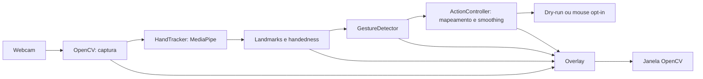

# Plano de implementação — HGI

## 1. Escopo e autorização

Fonte de requisitos: [AGENTS.md](../AGENTS.md). O HGI será uma aplicação local
de visão computacional para uma mão, com cursor suavizado, clique por pinça e
overlay de debug. Usará um detector pronto e regras geométricas explicáveis.

Esta entrega executa **somente a Fase 0** e cria apenas este documento. As fases
seguintes são propostas, não iniciadas nem autorizadas por este plano. Não há
instalação, download de modelo, abertura de webcam, automação ou publicação nesta
fase. Nenhuma funcionalidade está marcada como concluída.

O MVP inclui dry-run padrão, controle real opt-in, landmarks, handedness quando
disponível, dedos estendidos, movimento, pinça, histerese, confirmação, cooldown
e encerramento limpo. Volume, mídia, calibração, FPS e persistência ficam para
depois da validação do MVP. Não haverá treinamento, backend, banco ou API OpenAI.

## 2. Inspeção inicial

Evidências coletadas em 29/09/2026:

| Item | Estado observado |
|---|---|
| Arquivos do projeto | `AGENTS.md` e `.gitignore`; sem código, testes ou manifestos |
| Orientações locais | `AGENTS.md` lido; estrutura, segurança e fases já definidas |
| Diretórios auxiliares | `.agents/` e `.codex/` vazios; `.aws/` e `.git/` presentes |
| Git | Branch `mais`, sem commits; arquivos existentes ainda não versionados |
| Python | 3.11.16; ambiente Conda `hgi` |
| Interpretador | `/home/syl/miniconda3/envs/hgi/bin/python` |
| Sistema | Linux x86_64, kernel 6.8.0-90-generic; sessão X11 |
| Webcam | Nenhum `/dev/video*` visível nesta sessão; acesso real não testado |
| ECC | Bundle 2.2.2 disponível; nenhuma instalação adicional necessária |

Metadados de pacotes instalados: `opencv-python` e `opencv-contrib-python`
5.0.0.93; `mediapipe` 1.0.1; `numpy` 2.4.6; `PyAutoGUI` 0.9.54;
`pytest` 9.1.1; `pytest-cov` 7.1.0; `ruff` 0.16.9.
`python -B -m pip check` passou, mas não prova compatibilidade binária, importação
das bibliotecas, GUI ou funcionamento do hardware. Essas versões são inventário,
não a seleção final de dependências. Conteúdo de credenciais não foi inspecionado.

Não existem convenções de código ou histórico para reutilizar. A proposta segue
o `AGENTS.md`: módulos pequenos, nomes explícitos, type hints e funções puras.

## 3. Arquitetura proposta



| Módulo previsto em `src/hgi/` | Responsabilidade |
|---|---|
| `__init__.py`, `__main__.py` | Importação sem efeitos colaterais; entrypoint `python -m hgi` |
| `app.py` | CLI argparse, recursos, loop e encerramento; nenhuma regra geométrica |
| `config.py` | Parâmetros centralizados e validados; dry-run como padrão |
| `landmarks.py` | Representação simples dos 21 pontos, índices nomeados e handedness opcional |
| `geometry.py` | Distâncias, normalização por escala, mapeamento e clipping |
| `hand_tracker.py` | Adaptar frames e resultados MediaPipe; nunca executar ações |
| `gesture_detector.py` | Dedos, MOVE/IDLE/PINCH, confirmação e histerese |
| `smoothing.py` | Média exponencial e reset, sem dependência de hardware |
| `action_controller.py` | Alvo virtual, backend de mouse injetável e cooldown |
| `overlay.py` | Landmarks, mão, gesto, modo, alvo virtual e feedback de pinça |

`landmarks.py` é a única extensão estrutural proposta: evita índices mágicos e
acoplamento das regras à API externa. O backend PyAutoGUI poderá permanecer
pequeno no controlador, sem hierarquia de plugins. Imports de automação serão
adiados até `--control`; testes e dry-run usarão um backend sem efeitos reais.
Sem display, testes e imports devem funcionar; a janela exige uma sessão gráfica.

### Decisões para os primeiros incrementos

- Preferir Python 3.11 e validar instalação limpa antes de fixar versões.
  `pyproject.toml` será a referência; `requirements.txt` deverá ser consistente.
  Desenvolvimento terá pytest, pytest-cov e Ruff, sem ferramentas redundantes.
- Preferir Hand Landmarker da API Tasks, CPU, uma mão e modo VIDEO síncrono para
  manter o fluxo simples. Validar a API na versão escolhida antes da Fase 3.
  O modo VIDEO aceita frames de webcam com timestamps estritamente crescentes.
  Exige modelo local compatível; obtê-lo durante preparação, nunca no loop.
  Registrar origem, versão, licença e checksum real quando for adquirido.
- Não copiar exemplos de `mp.solutions.hands` sem comprovar compatibilidade.
  Handedness descreve lateralidade, não identidade persistente de uma mão.
- Converter BGR para RGB na fronteira do tracker. Preservar coordenadas
  normalizadas e corrigir a proporção largura/altura no cálculo de distâncias
  2D, para não distorcer a pinça em frames retangulares.
- Avaliar extensão dos dedos por ângulos e relações articulares; tratar o polegar
  separadamente. Validar rotações no plano e ambas as mãos; oclusão e rotação
  fora do plano continuam limitações a documentar.
- Propor referência de palma entre wrist e middle MCP. Rejeitar escala degenerada
  e pontos não finitos; não substituir resultados inválidos por gestos válidos.
- Mapear indicador da área útil da câmera para `0..largura-1` e `0..altura-1` da
  tela primária, com margem configurável e clipping. No dry-run, usar dimensões
  virtuais explícitas, sem depender do PyAutoGUI.
- Aplicar `previous + alpha * (current - previous)`, com `0 < alpha <= 1`;
  primeiro ponto inicializa o filtro. Resetar na perda de tracking/inatividade.
- MOVE exige indicador estendido, demais dedos longos recolhidos e ausência de
  pinça. Pinça tem prioridade. Usar thresholds `close < open`, confirmação de
  frames e relógio monotônico; emitir clique somente em OPEN → PINCHED confirmado.
- Pinça mantida não repete clique; gesto descartado por cooldown não é enfileirado.
  Após perda/troca de mão, bloquear cliques até abertura confirmada e iniciar
  novamente o smoothing, evitando cliques e saltos na reaquisição.
- Manter `FAILSAFE` e pausas de segurança. Fail-safe ou erro conhecido do backend
  desarma controle e mantém detecção em dry-run, com aviso; não rearmar sozinho.
  Erros inesperados encerram com limpeza, sem `except` genérico que os esconda.

## 4. Milestones e ordem de implementação

Ordem: **0 → 1 → 2 → 3 → 4 → 5 → 6 → 7 → gate da 8 → 9 → 10**.
A Fase 8 é adiada durante a entrega do MVP; só poderá iniciar depois da Fase 10
e dos testes manuais obrigatórios. Documentação acompanha cada fase, além do
fechamento na Fase 9. Não marcar milestone concluído com aceite manual pendente.

| Fase | Incremento e arquivos principais | Testes e verificações | Hardware e critério de aceite |
|---|---|---|---|
| 0 — plano | Somente `docs/IMPLEMENTATION_PLAN.md` | Revisar requisitos, fontes, riscos, escopo e diff; sem teste de aplicação | Sem hardware. Plano contém arquitetura, ordem, testes e aceites; demais arquivos preservados |
| 1 — bootstrap | Pacote/entrypoint, `config.py`, `pyproject.toml`, requirements, README inicial, licença, assets e ajustes de ignore | `test_bootstrap.py` e `test_config.py`: import e `--help` sem câmera/mouse; CLI segura; configuração inválida. Compileall, pytest, Ruff e instalação limpa | Sem webcam. Pacote importável/instalável, teste mínimo passa; nenhuma captura automática |
| 2 — geometria e smoothing | `landmarks.py`, `geometry.py`, `smoothing.py` | RED/GREEN: zero, 3-4-5, escala zero, valores não finitos, proporção do frame, limites, clipping, margens inválidas, alpha inválido/limite 1, sequência previsível e reset | Sem hardware. Resultados determinísticos e cobertura ≥80% em cada módulo de lógica pura implementado |
| 3 — tracker e diagnóstico | `hand_tracker.py`, captura em `app.py`, desenho mínimo em `overlay.py`; preparação do modelo | `test_hand_tracker.py`/`test_app.py`: resultados sem mão/com mão, handedness ausente, BGR/RGB, timestamps, modelo ausente/inválido, câmera indisponível, leitura interrompida e limpeza com mocks. Manual: landmarks e saída com q/Esc | Webcam, modelo local e GUI. Mão/landmarks estáveis; câmera/tracker/janelas liberados em saída e exceção; falha de captura termina sem loop silencioso |
| 4 — dedos e gestos | `gesture_detector.py` e debug básico | Fixtures sintéticas: dedos, polegar, ambas as mãos, rotações, pinça invariável por escala, limiares inclusivos, faixa de histerese, ruído, N frames, abertura, prioridade e ausência de mão | Lógica sem webcam; validação visual exige câmera. Estados e transições previsíveis, sem usar coordenada vertical isolada como regra geral |
| 5 — cursor virtual | `action_controller.py` em dry-run, mapa/smoothing e alvo no overlay | `test_action_controller.py`: bordas, centro, clipping, margem, suavização, reset e ausência total de chamadas reais; simular tamanho de tela | Webcam/GUI para ergonomia. Alvo virtual suave e limitado; dry-run funciona sem carregar automação |
| 6 — mouse opt-in | Backend PyAutoGUI, `--control`, clique e cooldown | Backend falso/spy e relógio injetado: clique único mantido por muitos frames, reabertura/novo clique, cooldown antes/no limite/depois, evento descartado, perda/reaquisição, backend indisponível, fail-safe e nenhuma reativação automática | Webcam, display e permissões. Manual: MOVE, pinça única, novo clique após abertura, parada pelo fail-safe e q/Esc; fallback seguro verificável |
| 7 — overlay e ergonomia | Completar `overlay.py`, informações do modo/gesto/mão | Testar dados apresentados e modo efetivo após fallback com mocks; manual para legibilidade, feedback de pinça e instruções | Webcam/GUI. Uma pessoa entende o modo e a ação; sem excesso de métricas. FPS permanece opcional posterior |
| 8 — gate de extras | Volume/mídia e demais extras adiados | Nenhum teste ou código de extras durante o MVP; futura fase precisará de plano próprio e testes de backend degradável | Aceite do MVP é pré-requisito; indisponibilidade de mídia não poderá afetar mouse/detecção |
| 9 — documentação | README completo, arquitetura, testes, plano atualizado e instruções de demo | Reproduzir instalação em ambiente isolado e comandos do README; revisar links, gestos, matemática, histerese, segurança e limites por SO | Instalação sem câmera; execução completa exige hardware. Outra pessoa consegue instalar/executar seguindo só o README |
| 10 — QA do MVP | Correções necessárias, revisão final e evidências | Ruff, pytest, cobertura, compileall, revisão Python/segurança/diff e quality-gate estrito se disponível no harness; roteiro manual completo | MVP só pronto com verificações automatizadas e manuais aprovadas. Pendências de hardware serão registradas, nunca tratadas como PASS |

## 5. Processo ECC e estratégia de testes

Cada incremento seguirá planejar → teste RED → implementação mínima → GREEN →
revisão → verificação → documentação. Aplicar `tdd-workflow` à lógica testável;
a falha inicial deve provar comportamento ausente, não dependência quebrada.
Usar fixtures sintéticas próprias, spies e relógio injetado, sem `sleep` nos testes.
Registrar tarefa → teste → evidência RED/GREEN e cobertura no relatório da fase.
Quando Git estiver configurado para commits, preservar checkpoints locais
pequenos de teste/fix/refactor; não publicar ou alterar arquivos alheios à tarefa.

Aplicar as orientações de `python-reviewer` aos arquivos Python alterados:
interfaces tipadas, nomes/índices explícitos, recursos liberados, erros específicos,
funções pequenas e ausência de acoplamento entre visão e automação. Corrigir
CRITICAL/HIGH antes de avançar. Na Fase 0, não há Python para revisar ou testar.

`security-review` cobre entradas/configuração, origem do modelo, permissões,
privacidade e automação. A aplicação deverá operar localmente, sem salvar ou
transmitir frames e sem segredos; os testes nunca moverão mouse ou abrirão webcam
real por padrão. Não aplicar checklists de web/autenticação ao projeto local.

`verification-loop` será adaptado à stack Python. Comandos previstos após bootstrap:

```bash
python -m pip check
python -m compileall src
python -m ruff check .
python -m ruff format --check .
python -m pytest -q
python -m pytest --cov=hgi --cov-report=term-missing
git diff --check
git status --short
```

Cobertura total será informativa; exigir ≥80% por módulo de lógica pura
(`geometry`, `smoothing`, regras de gesto e lógica do controlador), sem cobertura
artificial de hardware. Selecionar esses módulos no pytest-cov para o gate,
ajustando a lista ao que já existe. Type checker adicional só será configurado
se houver necessidade concreta; Ruff não substitui checagem de tipos.
Usar `/quality-gate . --strict` no fechamento se disponível no harness atual;
a presença do comando no bundle não comprova sua exposição ao Codex.

Após cada milestone, relatar arquivos alterados, testes adicionados, comandos e
resultados reais, cobertura, limitações manuais e próxima fase permitida pela
autorização vigente. Verificar também arquivos novos: `git diff` não os inclui
enquanto não forem versionados. Na Fase 0, build/lint/testes de código são N/A.

## 6. Dependências externas e riscos técnicos

| Risco | Impacto e mitigação proposta |
|---|---|
| Webcam ausente/inacessível | Alto: nenhum dispositivo visível aqui. Validar no computador de demo na Fase 3; não afirmar que tracking foi aprovado com mocks |
| OpenCV duplicado | Alto: duas distribuições instaladas compartilham `cv2`. Preparar ambiente isolado com apenas uma distribuição com GUI; considerar dependência transitiva do MediaPipe antes de escolher python ou contrib |
| API/wheels MediaPipe e NumPy | Alto: versões do ambiente ainda não homologadas. Consultar fonte oficial, validar imports e modelo em instalação limpa; escolher versões compatíveis, não fixar por memória |
| Modelo externo | Alto: Tasks necessita arquivo compatível. Preparar download separado, origem oficial, licença/checksum e erro claro se ausente; execução offline após instalação |
| Linux Wayland/macOS/permissões | Alto: controle depende do SO; X11 atual não prova permissão. Dry-run deve continuar disponível; sem contornar proteção do sistema |
| Display ausente e monitor/DPI | Médio: janela precisa de GUI; PyAutoGUI orienta tela primária. Documentar limite, validar escala no host e não prometer múltiplos monitores |
| Pinça ruidosa/cliques acidentais | Alto: normalização, confirmação, histerese, clique por transição, cooldown e bloqueio até abertura após tracking perdido |
| Rotação, oclusão e espelhamento | Médio: testar ambas as mãos e proporção do frame; mostrar estado inválido/IDLE. Espelhamento deverá ser coerente com mão exibida e direção do cursor |
| Travamento de captura/encerramento | Alto: falha de leitura encerra; recursos em finally/context managers. Validar q/Esc com foco na janela e comportamento de exceções |
| Latência do detector/automação | Médio: CPU, uma mão, objetos reutilizados e resolução moderada; medir no host. Manter pausas/fail-safe e ajustar frequência de movimento se necessário, sem hacks |
| Instalação pouco reproduzível | Médio: ambiente Conda atual não é prova de portabilidade. Documentar caminho de venv, dependências consistentes e instalação limpa; não instalar globalmente |
| Escopo além do MVP | Médio: adiar extras até QA e evidências manuais; sem serviços remotos, captura persistente ou treinamento |

Webcam, display e permissões são dependências de integração, não dos testes de
lógica. O modelo poderá ser validado sem webcam com imagem sintética em memória;
isso comprova inicialização/inferência, não qualidade de tracking humano.
Falhas ou gates de hardware pendentes devem ficar explícitos; trabalho independente
de lógica pode ser preparado, sem declarar a fase de integração concluída.

## 7. Aceite final e próximos passos

- Instalação documentada reproduzida; pacote importável sem abrir hardware.
- Webcam e landmarks/handedness aprovados manualmente, com encerramento limpo.
- Dedos/gestos testados; movimento virtual suave e mapeamento limitado.
- Controle somente com `--control`; fail-safe preservado e falhas desarmam ações.
- Uma pinça mantida gera um clique; debounce, histerese, cooldown e reaquisição
  cobertos por testes determinísticos.
- Ruff e pytest passam; cobertura de lógica atende à meta; sem CRITICAL/HIGH.
- README explica arquitetura, matemática, limites de plataforma e demonstração.
- Sem segredos, chamadas OpenAI, transmissão ou gravação automática de webcam.
- Todos os itens da Definition of Done do `AGENTS.md` revisados com evidência.

Para esta entrega, aceite restrito à Fase 0: documento revisado, plano consistente
e nenhuma mudança nos arquivos existentes. A próxima fase proposta é **Fase 1 —
bootstrap**, que aguardará instrução do usuário. O plano não libera testes reais
de controle do computador nem gravação de demo por conta própria.

## 8. Fontes consultadas e limites da pesquisa

- [Hand Landmarker — guia Python oficial](https://developers.google.cn/edge/mediapipe/solutions/vision/hand_landmarker/python): modelo local e modos de execução.
- [Hand Landmarker — implementação oficial](https://github.com/google-ai-edge/mediapipe/blob/master/mediapipe/tasks/python/vision/hand_landmarker.py): timestamps crescentes em VIDEO; referência de API, não validação da versão instalada.
- [OpenCV — instruções dos mantenedores](https://pypi.org/project/opencv-python/): instalar apenas uma distribuição no namespace `cv2`; GUI para a janela.
- [PyAutoGUI — documentação oficial](https://pyautogui.readthedocs.io/en/latest/index.html): tela primária, fail-safe e pausas de segurança.

As URLs diretas de guia/setup em `ai.google.dev` falharam na ferramenta de
consulta; foram usadas fontes oficiais alternativas para o Hand Landmarker.
Não foi homologada nesta fase uma matriz de versões/plataformas. Revalidar fontes
e APIs da versão selecionada durante bootstrap e integração, antes de implementar.
